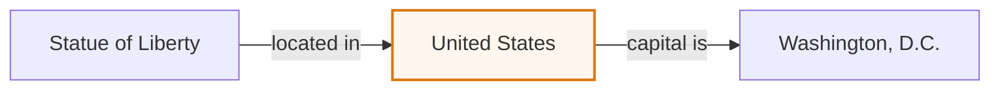

A **hidden bridge** (also *bridge entity*, or *country-bridge* in our release note) is an intermediate entity, value, or fact that logically connects a question to its answer, while its registered names or aliases are absent from both the question and the model's visible answer.

## Worked example

> What is the capital of the country where the Statue of Liberty stands?

| Role | Entity | Visible in prompt? | Expected in answer? |
|---|---|---:|---:|
| Starting clue | Statue of Liberty | yes | no |
| Hidden bridge | United States / America / U.S. | no | no |
| Requested answer | Washington, D.C. | no | yes |



The bridge is logically useful even though the final answer need not spell it out. This makes it a cleaner mid-layer probe than a word copied directly from the prompt.

## Leakage audit

A string audit should normalize case and punctuation and check an explicit alias list:

```python
import re

def normalize(text):
    words = re.findall(r"[a-z0-9]+", text.casefold())
    return " " + " ".join(words) + " "

def leaks_bridge(prompt, continuation, aliases):
    visible = normalize(prompt + " " + continuation)
    return any(normalize(alias) in visible for alias in aliases)

aliases = ["United States", "America", "U.S.", "US", "USA"]
prompt = "What is the capital of the country where the Statue of Liberty stands?"
continuation = "Washington, D.C."
assert not leaks_bridge(prompt, continuation, aliases)
```

This normalizer treats `U.S.` and `US` as distinct forms (`u s` versus `us`), so both are listed explicitly. Its case folding also conflates the country abbreviation `US` with the pronoun `us`. Treat a short ambiguous match as a candidate for case-aware or manual review, or use a documented abbreviation-canonicalization rule. This function is a conservative string-match screen, not a semantic leakage classifier.

For production audits, use the model's tokenizer too: one concept may have case, leading-space, abbreviation, and multi-token variants. Absence of every preregistered alias under the documented normalization and tokenization rules rules out those literal forms in the audited text. It does not rule out unlisted aliases or semantic leakage, and it does **not** prove that a lens readout was causally used to produce the answer. That stronger claim needs an intervention or another causal test.

See also: [Jacobian lens](), [logit lens](), [greedy continuation](), [workspace]().
