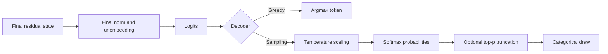

**Sampling** means drawing the next token from a probability distribution over the vocabulary, instead of always emitting the argmax. The next-token logits from the [unembedding]() are usually transformed by [temperature](), softmax, and optional filters such as [top-p](). A categorical draw then chooses one token with the resulting probabilities.



This is a common conceptual order; inference libraries may expose additional penalties and filters, so a reproducible protocol should record their order and values.

## Worked example

Suppose the next-token distribution is:

| Token | Probability | Draw interval |
| --- | ---: | --- |
| `sunny` | 0.55 | \([0.00, 0.55)\) |
| `rainy` | 0.30 | \([0.55, 0.85)\) |
| `cloudy` | 0.15 | \([0.85, 1.00)\) |

A uniform random draw of 0.73 selects `rainy`. `sunny` is most likely, but it is not guaranteed. Across many identical trials, the frequencies should approach 55%, 30%, and 15%.

```python
import random
from math import isclose

def categorical_sample(tokens, probabilities, rng=random):
    if len(tokens) == 0 or len(tokens) != len(probabilities):
        raise ValueError("tokens and probabilities must have equal, nonzero length")
    if any(probability < 0 for probability in probabilities):
        raise ValueError("probabilities must be non-negative")
    if not isclose(sum(probabilities), 1.0, rel_tol=0.0, abs_tol=1e-12):
        raise ValueError("probabilities must sum to one")

    draw = rng.random()
    cumulative = 0.0
    for token, probability in zip(tokens, probabilities):
        cumulative += probability
        if draw < cumulative:
            return token
    return tokens[-1]  # Protect against floating-point roundoff.
```

A [greedy continuation]() is the opposite: no sampling, just the highest-scoring token at every step. That path is deterministic under fixed prompt serialization, decoding protocol, numerical runtime, and model; sampled paths are not.

A random seed makes a particular software run easier to reproduce; it does not make sampling equivalent to greedy decoding, and exact replay can still depend on library version, hardware, batching, and numerical kernels. For experiments, report the decoder settings, seed policy, number of draws, and whether statistics treat several samples from one prompt as independent.

See also: [temperature](), [top-p](), [greedy continuation]().
