
**AI-use disclosure.** Generative-AI tools helped implement, audit, execute,
interpret, visualize, review, and draft this study. The author selected the
research question, authorized the compute, has inspected the artifacts, and is
responsible for the final text and claims. This is an independent,
non-peer-reviewed Research Note. Verify numbers against the released receipts
before relying on them.



**Abstract.** Sparse-autoencoder steering changes a model's residual stream;
a Jacobian lens maps residual directions toward the vocabulary dispositions
they tend to influence downstream. That creates a testable question: *does
public Goodfire SAE steering in Llama 3.3 70B leave a stable, out-of-sample
fingerprint in the model's released Jacobian-lens space?* We project six public
SAE directions labeled as deception/roleplay in the released artifact, compare
them with 18 activation- and norm-matched SAE controls plus isotropic
controls, and replay 1,581 paired prefix-only forwards (1,530 interventions
plus 51 clean references) across 51 held-out template families. Identity-lens,
raw-norm, and five singular-spectrum-preserving random-J baselines traverse
the same analysis. **Result:** in this
experiment, a detector built on a fixed single-token J-lens readout (a simple
classifier over 67 frozen lexicon token scores) does not attribute target
steering from isolated post-intervention states out of sample (AUROC 0.4998,
the prospectively frozen confirmatory endpoint) and performs at chance
relative to identity and scrambled-J controls. With a matched clean
reference, a fixed one-dimensional J-space contrast produces a large signed
differential between selected targets and matched controls (+0.9065 under
amplification and -0.8247 under suppression, versus +0.2028/-0.2181 for an
identity readout; a frozen stronger-access sensitivity analysis, not a
confirmatory endpoint), making it potentially useful for controlled internal
monitoring. That contrast lexicon is aligned with the labels that selected
the targets, and a preregistered v2 follow-up (exploratory after a failed
replay gate) found label-similar alternatives practically comparable to the
six selected IDs, so the paired signal is family-level rather than specific
to these features. The access model is the
result: J-space can characterize a known perturbation here, but under this
fixed single-token readout it does not identify steering provenance from an
isolated state. Nothing in this experiment establishes what the model
believes or whether it is conscious.


Study status: **complete** (pre-outcome freeze [`b026faa`](https://github.com/tdj28/llm_selfref_pre/commit/b026faac222e55d7da4f01a30a6a60a468a5f023); result release [`c071aa4`](https://github.com/tdj28/llm_selfref_pre/commit/c071aa4d737d72818f0774ca389c159b5da67dc1)). Shipping table, sample records, and hashes are in the [appendix](#appendix-release-inventory). A preregistered v2 follow-up ([OSF `f3tpv`](https://osf.io/f3tpv/); freeze [`7eff43f`](https://github.com/tdj28/llm_selfref_pre/commit/7eff43f7b8ea5ca0e011d4c0fb46bf5df1b0e4cd), plan manifest SHA-256 `47806acf…893f`) adding semantic hard negatives, matched comparators, and a 14-reader capacity ladder failed its frozen replay-equivalence gate, so its endpoint results are exploratory; [a dedicated section below](#the-v2-follow-up) reports the design, the gate failure, and the exploratory results.

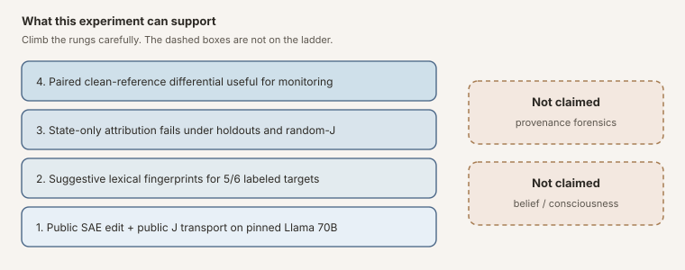

<p class="figure-note">Figure: what this experiment can support. Provenance forensics and consciousness sit outside the ladder.</p>

**Reading routes:** [Result and scope](#answer) → [limits of production use](#could-this-audit-a-production-model); [frozen design](#frozen-design) → [downstream detection](#downstream-fingerprint); or [v2 follow-up and failed gate](#the-v2-follow-up) → [artifact ledger](#reproducibility-and-artifact-ledger). For the instrument derivation, start with [the two maps](#the-two-maps).

## The Question

This note sits next to two earlier Praxagent posts. [*How to Read an SAE
Feature ID*](https://praxagent.ai/blog/posts/2026/07/how-to-read-an-sae-feature-id/)
covers what a public feature coordinate is, how labels get attached, and why an
activation map is not yet an explanation
([Jones, 2026a](#ref-sae-feature-id)). [*Opening the Jacobian Lens on
Qwen3.5-397B*](https://praxagent.ai/blog/posts/2026/07/praxagent-jacobian-lens-qwen3-5-397b-a17b/)
teaches the J-lens instrument and audits a fitted open lens under identity and
random-J controls ([Jones, 2026b](#ref-praxagent-397b)). Here those threads meet
on Llama 3.3 70B:

1. a public Goodfire layer-50 SAE for Llama 3.3 70B contains the six
   feature coordinates used in our replication, labeled there as
   deception/roleplay; and
2. Neuronpedia has released a fitted Jacobian lens for the same Llama 3.3 70B
   checkpoint family.

The SAE tells us which learned activation direction we add. The Jacobian lens
asks where an intermediate direction tends to land in the model's final
residual and vocabulary geometry. Can the second instrument audit the first?

### Prior work, contribution, and non-claims

**Prior work.** Gurnee et al. develop the Jacobian lens as an instrument and
build a substantial body of science on it: they project SAE decoder
directions into J-space, show that the J-space component of a concept is
privileged for verbal report, ablate (zero out) evaluation-awareness
directions and change high-stakes behavior in audit scenarios, detect
implanted-misalignment model organisms (models deliberately trained with a
hidden flaw, used as known-answer test subjects) on ordinary prompts, and
validate a J-lens evaluation-awareness score that moves monotonically under
contrastive steering
([Gurnee et al., 2026](#ref-gurnee-2026)). Adjacent lines include fixed and
context-adaptive activation steering
([Turner et al., 2024](#ref-turner-2024); [Hsu et al., 2026](#ref-hsu-2026)),
SAE feature reading and monosemanticity (the goal that each feature carry one
meaning)
([Gao et al., 2024](#ref-gao-2024); [Templeton et al., 2024](#ref-templeton-2024)),
and other internal auditors (probes, tuned/logit lenses, LatentQA-style
decoders). This note does not invent the J-lens or SAE steering; it asks a
narrower forensic question on pinned public artifacts. The claim-by-claim
comparison is in the [appendix](#appendix-prior-work-claim-matrix).

**This note's contribution.** Gurnee et al. ask what the J-space *is* and what
it can reveal about a model's cognition; this note asks a much narrower
forensic question their experiments were not designed to answer. In their
intervention and detection studies, the comparison is always anchored: the
experimenter injects a known concept and watches the readout respond, compares
a misaligned checkpoint against its known clean baseline on the same prompts,
or steers along a known contrastive direction and checks that a score moves
monotonically. Those designs establish that J-space content is causally real
and measurable. They do not test the unanchored case: hand an auditor a single
steered activation, hide which intervention ran, and ask whether a fixed J
score can name the feature out of sample (on prompts and feature pairings it
was never fit on). Concretely, this note adds:

1. An **attribution task with the label hidden**: the auditor gets isolated
   post-steering states (a snapshot of the model's internals *after* steering,
   with no record of which knob was turned and no unsteered copy to compare
   against) and must say which feature did it. The detector is a plain
   logistic-regression classifier fit on the frozen lexicon scores (fitting
   means the classifier learns weights from trials whose labels we reveal to
   it; we control that training set exactly). Evaluation uses crossed
   prompt-family and feature-pair holdouts: each test case is scored by a
   classifier whose training set excluded that case's whole sentence family
   *and* its feature pairing, so it cannot pass by memorizing prompts or
   feature signatures. Under those rules the score lands at chance
   (AUROC 0.4998, a coin flip).
2. The **access-model split as the object of study**: what the auditor is
   allowed to see. Setting A is an isolated post-steering snapshot (no
   before-picture); Setting B is a matched clean/steered pair of the *same*
   prompt. Both derive from the same frozen 67-token lexicon readout, read two
   ways: Setting A reads it with a fitted 67-weight classifier, Setting B with
   a fixed one-number contrast, so what changes between settings is the access
   privilege, not the underlying readout.
3. An **impostor bar for this task**: five **random-J** maps that scramble the
   real lens. The lens is a matrix, and scrambling means randomly shuffling
   and sign-flipping its rows and columns, like re-pairing the names and
   numbers in a phone book: every size statistic survives (same dimensions,
   norm, and singular spectrum), but the learned correspondence to the model's
   actual coordinates is destroyed. If the real lens cannot beat these
   impostors, its learned alignment was not doing the work. Alongside them run
   identity (no lens at all), raw-norm (just the activation's length),
   matched-SAE (other features of similar strength), and isotropic (random
   directions of matching length) controls, all through the identical
   pipeline.
4. Statistics that respect how the prompts were built. Many of the 51 English
   prefixes are near-copies from the same sentence skeleton (**prompt
   families**), so we do not pretend 1,581 trials are 1,581 independent
   stories. **Grouped holdouts** assign each family to exactly one fold (a
   fold is one of the five train/test splits in cross-validation; grouping
   guarantees a family is never in the training data and the test data of the
   same split). **Template-cluster intervals** are how we compute error bars:
   redraw the 51 families at random (with replacement) thousands of times,
   recompute the metric on each redraw, and report the spread. Because each
   redraw keeps or drops a family's near-copies as a block, the resulting
   interval reflects the roughly 51 independent pieces of evidence we actually
   have, not the 1,581 rows. Finally, we **track the readout downstream across
   layers**: the steering vector goes in at layer 50, and we measure the
   fingerprint again at layers 55 through 78 to see whether it persists,
   fades, or distorts as it passes through the rest of the network, rather
   than judging everything from a single depth.

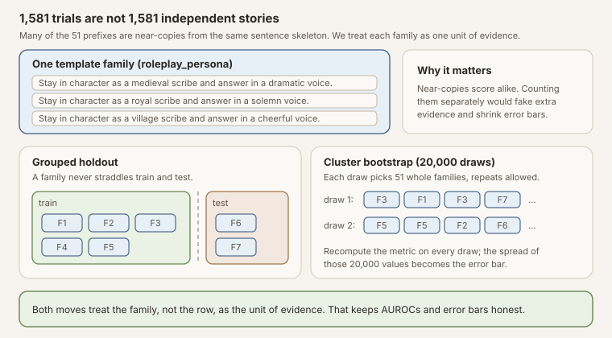

<p class="figure-note">Figure: near-copy prompts from one sentence skeleton count as one unit of evidence. Holdouts move whole families between train and test; error bars resample the 51 families, not the 1,581 rows.</p>

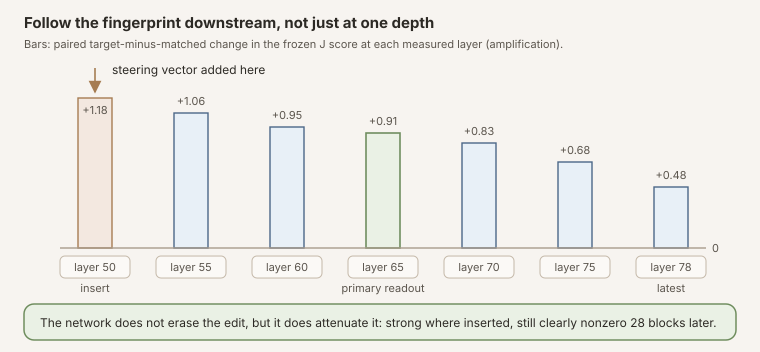

<p class="figure-note">Figure: why we measure at seven depths instead of one. The fingerprint is strongest where the vector is inserted and attenuates smoothly downstream; the full numbers are in the trajectory section below.</p>

Everything here runs on pinned public artifacts (publicly released Llama 3.3
70B weights, gated under the Llama 3.3 Community License rather than
open-source, plus the public Goodfire SAE and public Neuronpedia lens),
whereas Gurnee et al.'s results are on
Anthropic's internal Claude models, whose weights and internals are not
publicly available for reproduction. The protocol was committed to public git before results
existed, so the test can be re-run from the release. Where the settings
overlap, our results agree with Gurnee et al.: with an anchored comparison
(the auditor holds a known clean baseline, a before-picture, and measures the
change from it), the paired J-score moves large and in the expected direction.
The addition is the negative result on the unanchored side (no baseline, just
one steered snapshot), under this fixed single-token score.

**Not claimed.**

- That J-space reveals what the model "believes," or anything about
  consciousness.
- That an isolated activation can be attributed to a specific SAE feature
  under this fixed single-token score (the state-only detector fails here).
- That the result generalizes beyond this model, SAE checkpoint, lens family,
  lexicon score, and forensic task.
- That vendor feature labels are ontology rather than suggestive released
  metadata.


flowchart LR
  A["SAE feature at layer 50"] --> B["Residual edit<br/>h' = h + a d_i"]
  B --> C["Static J transport"]
  C --> D["Vocabulary-disposition<br/>fingerprint"]
  B --> E["Observed post-state"]
  E --> F["State-only detector"]
  B --> G["Paired clean vs steered Δ"]
  G --> H["Reference-based<br/>fingerprint"]
  D --> I["Suggestive semantics"]
  F --> J["Failed provenance<br/>attribution"]
  H --> K["Useful internal<br/>regression monitor"]


<p class="figure-note">Figure: conceptual pipeline. The interesting result is not the paired positive; it is the failure of the isolated-state detector under this readout.</p>

## The Two Maps


**What "residual stream" means.** A transformer is a stack of blocks, and the
only thing that passes from one block to the next is a single vector of
\(d\) numbers per token position. Each block reads that vector, computes
something, and *adds* its result back into the same vector (those add-back
connections are called residual connections, which is where the name comes
from). So the stream works like the model's running workspace: whatever the
model has figured out by depth \(l\) is encoded in those \(d\) numbers and
nowhere else. Everything in this post touches that workspace. \(h_l\) is a
snapshot of it right after block \(l\), and SAE steering intervenes by adding
a chosen vector straight into it between blocks.


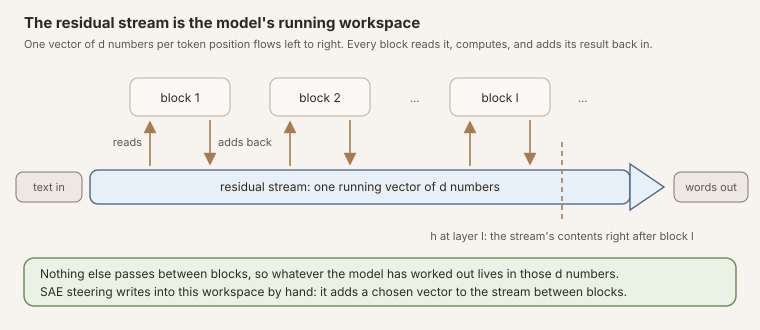

<p class="figure-note">Figure: the residual stream. One vector per token position flows through the stack; blocks read it and add back. The dashed line marks the snapshot \(h_l\) this post works with, and SAE steering adds its vector directly into the band.</p>

Let \(h_l\in\mathbb{R}^d\) be the residual stream after transformer block
\(l\) (a list of \(d\) numbers the transformer keeps updating). A sparse
autoencoder is a pair of maps that try to rewrite that list as a small number
of “on” features:

1. **Encoder** \(E\): turn the residual into feature codes
   \(f = E(h_l)\in\mathbb{R}^N\) (usually with a ReLU / TopK so most codes are
   zero). Think of \(f\) as \(N\) knobs; most are off.
2. **Decoder matrix** \(D\in\mathbb{R}^{d\times N}\): a table whose
   **columns** are the feature directions \(d_1,\ldots,d_N.\) Writing
   \(D = [d_1\ \cdots\ d_N]\) means column \(i\) is the vector \(d_i\).


**\(D\) is a matrix, not a fancy nonlinear function.** The notation in SAE
papers can mislead here. In linear algebra, placing a matrix directly next to
a vector, \(Df\), means matrix-vector multiplication; there is no hidden
operation. But papers often also write the decoder as \(D(f)\), with
parentheses, to mirror the encoder \(E(h_l)\), and that parallel look is a
trap: \(E\) genuinely *is* a nonlinear function (it applies a ReLU or TopK),
while \(D(f)\) is just \(D\) times \(f\), the same thing as \(Df\). And that
multiplication has a concrete reading: mix the columns of \(D\) using the
codes as weights,

\[
Df = f_1 d_1 + f_2 d_2 + \cdots + f_N d_N.
\]

Every property of matrix multiplication (in particular linearity,
\(D(f+g)=Df+Dg\)) is available, and the derivation below leans on exactly
that.


That mix is the SAE’s **reconstruction** of the residual: encode the residual
into codes, then decode the codes back,

\[
\hat h_l = D\,E(h_l) = Df = f_1 d_1 + f_2 d_2 + \cdots + f_N d_N \approx h_l.
\]

The hat marks an estimate: \(\hat h_l\) is the SAE's best attempt to rebuild
\(h_l\) out of its few active feature directions. It is usually a bit wrong,
so define the leftover (reconstruction error)

\[
\varepsilon = h_l - \hat h_l = h_l - D E(h_l) = h_l - Df.
\]

### Error-restored steering, step by step

To steer feature \(i\) by an amount \(a_i\), the standard “error-restored”
protocol does four things:

1. Encode: \(f = E(h_l)\).
2. Bump only feature \(i\): replace \(f\) with \(f + a_i e_i\), where \(e_i\)
   is the one-hot vector that is \(1\) in slot \(i\) and \(0\) elsewhere.
3. Decode the bumped codes: \(D(f + a_i e_i)\).
4. **Add the leftover back** so you do not throw away what the SAE missed:
   add \(\varepsilon = h_l - Df\).

Putting that into one expression:

\[
h_l' = D(E(h_l)+a_i e_i) + (h_l - DE(h_l)).
\]

Why does this collapse to “just add \(a_i d_i\)”? Because multiplication by
\(D\) is linear:

\[
D(E(h_l)+a_i e_i) = DE(h_l) + a_i\, De_i.
\]

And \(De_i\) is simply **column \(i\) of \(D\)**, which we already named
\(d_i\). So

\[
h_l' = DE(h_l) + a_i d_i + h_l - DE(h_l) = h_l + a_i d_i.
\]

The \(DE(h_l)\) terms cancel. Whatever the SAE already reconstructed cancels
against the leftover you put back; the only lasting change is the bump on
feature \(i\), which lands in residual space as the vector \(a_i d_i\).

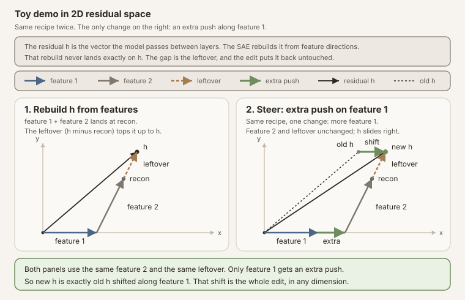

<p class="figure-note">Figure: the same tip-to-tail rebuild twice. Feature 2 and the leftover are identical in both panels; the only change is an extra push on feature 1, so the new \(h\) is the old \(h\) shifted along that one direction.</p>

Under this intervention protocol, once the decoder column and coefficient are
fixed, the edit is a constant residual addition. That is not a claim about SAE
steering in general: fixed-strength linear steering can be context-sensitive
across prompts, and context-adaptive methods can outperform fixed additions
([Turner et al., 2024](#ref-turner-2024); [Hsu et al., 2026](#ref-hsu-2026)).

The Jacobian lens fits a corpus average of local downstream maps:

\[
J_l=\mathbb{E}_x\left[\frac{\partial h_L(x)}{\partial h_l(x)}\right].
\]

Unpack that piece by piece. Fix one prompt \(x\) and run it through the model.
The derivative \(\partial h_L(x)/\partial h_l(x)\) is a **Jacobian matrix**:
the standard calculus object that answers, for every possible tiny nudge to
the layer-\(l\) workspace, which way the final-layer workspace \(h_L\) moves
in response. It is a \(d\times d\) table; entry \((i,j)\) says how much final
coordinate \(i\) shifts per unit nudge of mid-network coordinate \(j\). Being
a derivative, it is the best *linear* summary of the layers in between, and it
is **local**: run a different prompt and the layers bend nudges differently,
so you get a different matrix.

The outer \(\mathbb{E}_x[\cdot]\) is an average of those per-prompt matrices
over a corpus of prompts (this released lens was fit on WikiText). Averaging
trades prompt-specific accuracy for reusability: the result is one fixed
matrix \(J_l\) that transports mid-network directions downstream. Multiply
any layer-\(l\) direction by \(J_l\) and you get the direction the final
layer *tends* to move for a typical prompt, without running the model at all.
The price appears twice in this note's results: the lens describes the
typical prompt rather than the one in hand, and it is linear, so it is only
honest for small perturbations. (The display above is schematic: the released
lens additionally averages over token positions within each prompt
([Gurnee et al., 2026](#ref-gurnee-2026)). The prompt-level average shown here
carries the intuition.)

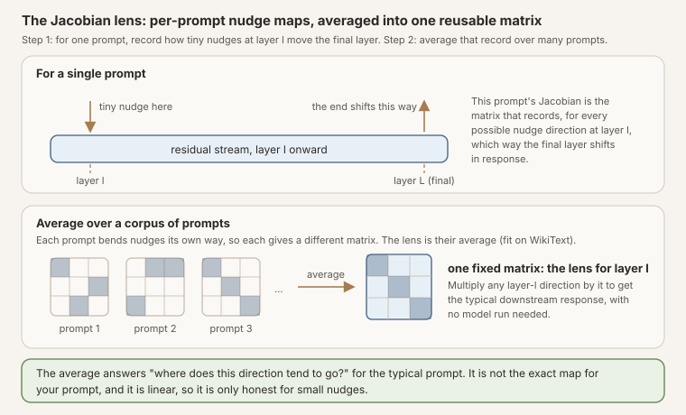

<p class="figure-note">Figure: what the equation builds. Top: for one prompt, the Jacobian records every nudge-to-response pairing between layer \(l\) and the final layer. Bottom: each prompt gives a different matrix; the lens is their corpus average, reusable on any direction without a forward pass.</p>

With final RMS normalization \(N_f\) and unembedding \(W_U\) (the model's last
matrix, which converts a final residual into one score per vocabulary token), a
static vocabulary fingerprint for the SAE direction is

\[
z_l(d_i)=W_U N_f(J_l d_i).
\]

In words: push the steering direction downstream with \(J_l\), normalize, and
ask the vocabulary which words that push favors. The output is one score per
token, a lexical "fingerprint" of the direction.

This is a legitimate instrument for studying **verbalizable downstream
disposition** ([Gurnee et al., 2026](#ref-gurnee-2026); [Anthropic,
2026](#ref-anthropic-jlens)). It is not a uniquely privileged decoder of
latent meaning. The Jacobian is corpus-averaged rather than local to the exact
prompt under analysis; the basic lens is single-token unless extended; and
neighboring decoder families such as the tuned lens are learned rather than
Jacobian-based and can be more predictive than vanilla logit-style readouts
([Belrose et al., 2023](#ref-belrose-2023)). Our Qwen3.5-397B release walks
through the same instrument with identity and random-J controls on a different
model ([Jones, 2026b](#ref-praxagent-397b)).

For a real prompted state, the exact paired quantity is not just
\(W_UJ_ld_i\). We run both prefixes and measure

\[
\Delta z_l = W_U N_f(J_l h_l^{\mathrm{steered}})
             -W_U N_f(J_l h_l^{\mathrm{clean}}),
\]

which retains the nonlinear final normalization and the model's downstream
response to the intervention.

## What Would Count as Detection?

An auditor sitting directly on the intervention hook (the line of code that
adds the steering vector during the forward pass) can subtract pre- and
post-hook tensors. That is trivial and does not require a Jacobian lens. Our primary
threat model is harder: the auditor receives post-intervention activations from
a pinned model, but not the intervention label or hook metadata.

We freeze two classification questions:

- **Any intervention:** distinguish nonzero steering from the clean condition.
- **Target attribution:** distinguish a selected target SAE direction from a
  dose- and activation-matched SAE control (a decoy feature steered with the
  same strength, chosen to have similar baseline activity, so the detector
  cannot win just by noticing "something strong happened").

The detector itself is deliberately simple: a standardized logistic regression
over the 67 frozen lexicon token scores from one readout (one transport, layer
65, last content token), refit inside each cross-validation fold. "Fitting"
here means only that: the classifier sees a labeled training split of trials
and learns 67 weights. Because we build the splits, we know exactly what each
fold's classifier saw. Evaluation is out of sample by prompt-template family
(5-fold grouped cross-validation, whole families held out together). Target
attribution additionally holds out feature pairs: the classifier scoring a
given target-versus-matched pair was never trained on any trial involving that
pair, preventing it from merely memorizing six direction-specific signatures.
We report AUROC, AUPRC, calibration via the Brier score (the mean squared gap
between predicted probabilities and actual outcomes; lower is better), and
true-positive rate at 1% false-positive rate. The paired-clean version is a
separate, stronger-access sensitivity analysis.


**How to read the detector numbers.** AUROC is the probability that a randomly
chosen steered case scores above a randomly chosen non-steered case: 0.5 is a
coin flip, 1.0 is perfect. TPR at 1% FPR asks a stricter question: if you only
tolerate one false alarm per hundred clean cases, what fraction of real cases
do you still catch? A detector can have a decent-looking AUROC and still be
useless at that operating point.


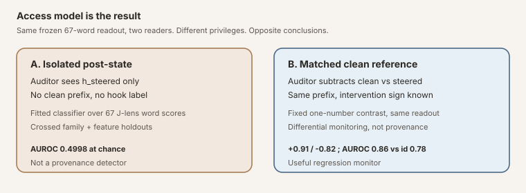

<p class="figure-note">Figure: same frozen 67-token lexicon readout, different auditor privileges, opposite conclusions. Panel A reads it with a fitted 67-score classifier and fails; panel B reads it with a fixed one-number contrast plus a clean reference and separates. Panel A is the production-relevant failure; panel B is differential monitoring.</p>


flowchart TD
  Q["Auditor receives activations"] --> A{"Clean reference<br/>available?"}
  A -->|No| B["Post-state-only<br/>J score"]
  A -->|Yes| C["Paired Δ<br/>steered − clean"]
  B --> D["Target attribution<br/>AUROC ≈ 0.50"]
  C --> E["Signed differential<br/>+0.91 / −0.82"]
  D --> F["Do not deploy as<br/>provenance detector"]
  E --> G["Optional internal<br/>regression monitor"]


<p class="figure-note">Figure: the access fork that organizes the rest of the note.</p>

## Frozen Design

| Component | Frozen value |
|---|---|
| Model | `meta-llama/Llama-3.3-70B-Instruct` at `6f6073b4...` |
| SAE | `Goodfire/Llama-3.3-70B-Instruct-SAE-l50` at `128ee921...` |
| J-lens | Neuronpedia WikiText lens at `a4114d77...` |
| Target directions | six accepted feature IDs labeled deception/roleplay in the source artifact |
| SAE controls | three matched panels, 18 features total |
| Residual controls | six norm-matched isotropic directions |
| Prefixes | 51 template-family representatives across 14 categories |
| Conditions | 31 per prefix, 1,581 forwards total |
| Trajectory | layers 50, 55, 60, 65, 70, 75, 78 |
| Primary readout | layer 65, last user-content token |
| Transport controls | identity plus five bi-sided signed-permutation random-J maps |

The complete pre-outcome
[protocol](https://github.com/tdj28/llm_selfref_pre/blob/b026faac222e55d7da4f01a30a6a60a468a5f023/docs/LLAMA70B_SAE_JLENS_PROTOCOL.md)
and machine-readable
[plan](https://github.com/tdj28/llm_selfref_pre/tree/b026faac222e55d7da4f01a30a6a60a468a5f023/data/sae_jlens_audit/confirmatory_v1_plan_20260711)
are linked from the release section below. The prior calibrated endpoint is
reused; no new behavioral output is sampled in this phase. Every condition sees
the exact same token prefix, so trajectory differences cannot be attributed to
divergent generated text.

## Why Random-J Controls Matter

A dense matrix followed by an unembedding can produce apparently meaningful
top tokens even when the particular learned alignment is not doing the work.
For each random baseline we scramble the real \(J_l\) with independent signed
permutations on its input and output bases (shuffle the coordinate axes and
randomly flip their signs, separately on each side of the matrix). This
preserves matrix dimensions, Frobenius norm, and singular values (the matrix's
overall size and its spectrum of stretch factors) while destroying alignment
to Llama's residual coordinates and unembedding.

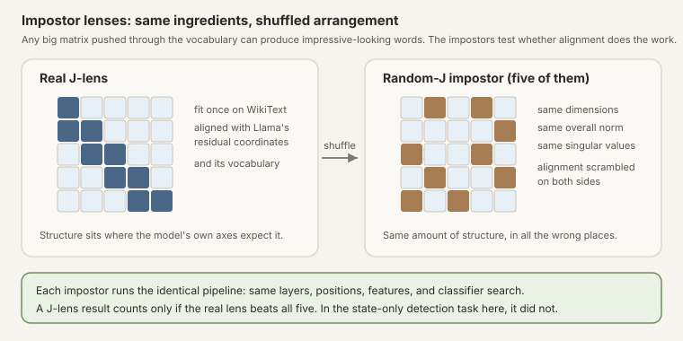

<p class="figure-note">Figure: the impostor lenses keep every size statistic of the real \(J_l\) and destroy only its alignment. Beating all five is the bar for claiming the learned alignment did the work.</p>

A Jacobian-lens result is persuasive only if it survives comparison with all
five controls run through the same layer, position, feature, and classifier
search. Identity/logit-lens and raw activation norms test simpler alternatives.
We did not run a tuned lens, a trained nonlinear probe, or a decoder-based
activation reader such as LatentQA or STATEWITNESS
([Belrose et al., 2023](#ref-belrose-2023); [Pan et al., 2024](#ref-pan-2024);
[Chen et al., 2026](#ref-chen-2026)). Those remain important adjacent
comparators; their absence means the null below is about this readout family,
not about every possible state auditor.

## Static Fingerprints

Three of the six selected public SAE directions (30686, 41533, 58667), as
labeled in the released Goodfire artifact, produce J-lens lexical profiles
sharply aligned with deception- or roleplay-adjacent vocabulary under this
corpus-averaged single-token readout, and a fourth (22004) moderately so. The
deception-minus-unrelated score is the mean lens score of a frozen list of
deception-related words minus the mean score of a frozen list of unrelated
words, so positive values mean the direction favors deception vocabulary. The
target median is 6.969; the 18 matched SAE controls have median -0.0038 and
span -3.08 to +2.50, a spread that matters for the weaker targets below. The
transport controls set the impostor bar: pushed through the identity
transport (no lens at all) the targets have median +0.777, with 30686 alone
reaching +7.18 of its +19.97, and through the five random-J impostors the
target medians run only -0.97 to +0.57, so the real-lens values clear both
comparisons.

| Feature ID | Deception − unrelated | Deception | Roleplay | Hedging | Experience | Excess kurtosis |
|---|---:|---:|---:|---:|---:|---:|
| 30686 | **+19.97** | +19.55 | +4.74 | +0.48 | −0.30 | 31.48 |
| 41533 | **+12.98** | +11.74 | +2.69 | +1.14 | +0.91 | 3.04 |
| 58667 | **+10.85** | +10.60 | +10.09 | +0.68 | −0.20 | 5.57 |
| 22004 | +3.09 | +2.90 | +3.29 | +4.54 | +4.37 | 1.10 |
| 30032 | +0.71 | +1.71 | +2.63 | +0.70 | −0.91 | 1.84 |
| 23893 | **−0.29** | −0.87 | +1.44 | −1.47 | +2.45 | 1.89 |
| matched controls (n=18), median | −0.004 | −0.18 | +0.15 | +0.14 | +0.25 | - |
| matched controls (n=18), range | −3.08 to +2.50 | −1.50 to +2.92 | −1.78 to +2.92 | −4.07 to +2.86 | −2.16 to +2.40 | - |

<p class="figure-note">Table: positive layer-50 decoder directions through the real J-lens. Scores are frozen lexicon group means; the control rows give the per-column median and full range of the 18 matched controls. 23893 is the semantic outlier inside the claimed family, and 30032 sits inside the control spread on every column.</p>

Feature 30686 projects most sharply onto `deception`, `misleading`, `deceptive`,
`trick`, and `fooled`. Feature 41533 projects onto forms of `lie`; 58667 onto
`convincing`, `fake`, `believable`, `disguise`, and `pretending`.

Treat these labels as suggestive, not as settled ontology. Current SAE work
supports the usefulness of features while noting that feature suites remain
incomplete and that faithfulness evaluation is still an active research
problem ([Gao et al., 2024](#ref-gao-2024); [Templeton et al.,
2024](#ref-templeton-2024)). Our own primer on reading feature IDs makes the
same coordinate-versus-label distinction under this Goodfire checkpoint
([Jones, 2026a](#ref-sae-feature-id)). The Goodfire release is also a curated
public artifact: toxic features were removed prior to publication, and feature
inspection is partly vendor-mediated ([Goodfire](#ref-goodfire-sae)). The
pinned Hugging Face tree does not ship a machine-readable label table for all
features; Neuronpedia separately publishes automated interpretability labels
for this SAE ([Neuronpedia autointerp](#ref-neuronpedia-autointerp)), which
are a distinct provenance chain with their own failure modes, not
confirmation of the released labels. Alignment
between these selected vectors and deception-adjacent vocabulary is useful
evidence of lexical disposition under this lens. It is not strong evidence that
the six IDs form a stable, unique "deception" class in the model's underlying
computation.

There are three checks against a neat story. Feature 23893 has a slightly
negative deception-minus-unrelated score (-0.288), and its leading tokens are
generic (`anything`, `yourself`, `outside`, `existence`). Feature 30032 sits
inside the matched-control spread: its +0.71 deception-minus-unrelated score
is exceeded by four of the 18 controls (which reach +2.50), and its leading
tokens are innocence-flavored (`innocent`, `harmless`, `normal`) rather than
deceptive, which is why the count above is three sharp alignments plus one
moderate rather than five. That heterogeneity inside the claimed feature
family matters more than a tidy semantic class.
Lens excess kurtosis (how spiky and heavy-tailed a direction's token-score
profile is; a Gaussian profile scores 0) is also not a target selector: mean
excess kurtosis is 7.49 for the six targets and 7.53 for the 18 matched
controls because one control is extremely heavy-tailed.

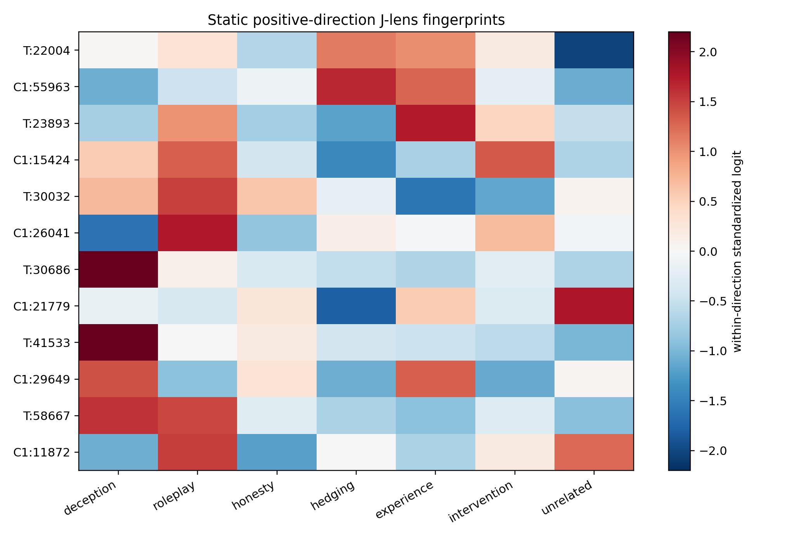

<p class="figure-note">Figure: positive layer-50 decoder directions projected through the real J-lens. Rows alternate each target (T) with its panel-1 matched SAE control (C1); colors are standardized within a row, so they show profile rather than magnitude. Three target profiles (30686, 41533, 58667) emphasize deception/roleplay-related groups under the released labels; 22004's largest groups are hedging and experience, 30032's scores sit inside the matched-control spread with innocence-flavored top tokens, and 23893 emphasizes experience instead.</p>

The descriptive table must report both signs, top and bottom tokens, population
excess kurtosis, frozen lexicon scores, matched controls, and the identity and
random-J transport comparison. Token lists are
not themselves a detector result and cannot be used to choose confirmatory
classifier features after the fact. Because the basic J-lens is single-token,
these lexical fingerprints also understate phrase-level or compositional
content ([Gurnee et al., 2026](#ref-gurnee-2026)).

## Can Token Directions Reconstruct an SAE Direction?

For vocabulary token \(w\), define the layer-50 J-direction

\[
v_w=J_{50}^{\mathsf T}q_w,
\]

where \(q_w\) includes the model's learned final-RMSNorm gain and unembedding
row. In words: \(v_w\) is the layer-50 direction that, pushed downstream, most
directly promotes token \(w\). We use clean-room nonnegative matching pursuit
to approximate each SAE decoder direction with normalized token directions at
\(k\in\{5,10,16,25\}\).


**Matching pursuit, in plain terms.** Greedy rebuilding with a word budget:
pick the token direction that best matches the SAE vector, subtract that
piece, then repeat on what is left until you have used \(k\) words.
"Nonnegative" means pieces can only be added, never subtracted; "clean-room"
means our own implementation, no vendor code. The score is how much of the
vector's energy the \(k\)-word mix recovers.


At \(k=25\), the sparse pursuit explains 10.29% of target squared norm (the
share of the vector's total energy the 25-word mix recovers) on average,
versus 7.62% for matched SAE controls and 1.95% for isotropic controls.
Under this nonnegative sparse-pursuit procedure and token dictionary, the
selected SAE directions are somewhat better approximated by sparse J-token
cones than isotropic controls, but most of the norm remains outside the fitted
cone. That is consistent with limited J-space occupancy in the broader
literature ([Gurnee et al., 2026](#ref-gurnee-2026)). It is a property of this
chosen pursuit over this chosen dictionary, not a deep ontological measure of
how much of the steering direction is "really verbal."

| Role at \(k=25\) | Mean explained sq. norm | Min | Max | n |
|---|---:|---:|---:|---:|
| Target SAE | **10.29%** | 3.47% | 30.55% | 6 |
| Matched SAE controls | 7.62% | 1.99% | 27.33% | 18 |
| Isotropic controls | 1.95% | 1.75% | 2.16% | 6 |

<p class="figure-note">Table: clean-room nonnegative pursuit. Feature 30686 is the 30.55% case; 22004 is only 3.47%. Target and matched-control ranges overlap.</p>


<p class="figure-note">Figure: mean explained squared norm under clean-room nonnegative pursuit; bands span the 10th to 90th percentile across directions, not confidence intervals. A small token-direction cone captures more of targets than isotropic vectors, but most SAE norm remains outside the 25-token fit.</p>

The leftover vector is a **J-remainder**, not a unique orthogonal complement:
there is no single canonical "rest of the vector," because a different greedy
search or word budget could split the same vector differently. J-space here is
a sparse cone whose decomposition can depend on search and sparsity. We report
that instability rather than hiding it.

## Downstream Fingerprint

First, the bad news for auditing. In this experiment, using a fixed
single-token J-lens readout on isolated post-intervention states (to be
precise: the detector is a simple classifier over all 67 frozen lexicon token
scores, not the one-number deception contrast used in the paired analysis),
target attribution does not generalize out of sample and performs at chance
relative to identity and scrambled-J controls. Crossed prompt-family and feature-pair
holdout AUROC is 0.4998 [0.4978, 0.5016] for the J-lens, 0.5013 for identity,
0.5025 for raw residual norm, and 0.5011 to 0.5068 across the five random-J
controls. J-lens TPR at 1% FPR is 0.98% (the random-J seeds span 0.82% to
1.47%), and its AUPRC of 0.5018 sits at this balanced task's 0.5 prevalence.
Calibration tells the same story: the J-lens detector's Brier score is 0.313
[0.300, 0.327], worse than the 0.25 a constant fifty-fifty guess would score
on this balanced task (full rows in
[`detector_metrics.csv`](receipts/detector_metrics.csv)).

| Readout (target attribution) | AUROC | 95% CI | TPR @ 1% FPR |
|---|---:|---|---:|
| Jacobian lens | **0.4998** | [0.4978, 0.5016] | 0.98% |
| Identity | 0.5013 | [0.4998, 0.5028] | 1.14% |
| Raw residual norm | 0.5025 | [0.5017, 0.5043] | 1.14% |
| Random-J seeds (range) | 0.5011-0.5068 | - | 0.82%-1.47% |

<p class="figure-note">Table: confirmatory post-state-only target attribution under crossed prompt-family and feature-pair holdouts. Every readout is operationally at chance.</p>

Read that as a **task- and instrument-specific null**, not as proof that
internal states cannot reveal prior steering. Other recent work reports
detectable residual-stream signals of concept injection, robust detection
behavior in post-trained models, and strong activation-based deception auditing
with richer decoder architectures ([Pearson-Vogel et al.,
2026](#ref-pearson-vogel-2026); [Macar et al., 2026](#ref-macar-2026);
[Chen et al., 2026](#ref-chen-2026)). The right interpretation is failure of
this fixed J-space readout under this access model.

The broader any-intervention task is no rescue. J-lens AUROC is 0.5092, below
identity (0.5129) and four random-J seeds. Its AUPRC of 0.96895 (area under
the precision-recall curve, roughly how well the detector concentrates true
hits among its alarms) is almost exactly the 0.96774 positive-class prevalence
(the fraction of trials that are steered: 30 of every 31). When AUPRC matches
prevalence, the detector does no better than labeling everything "steered." A
high-looking AUPRC in a 30-to-1 task is not a useful detector. The remaining
promised metrics agree: the J-lens Brier score on this task is 0.327 [0.246,
0.411], and its TPR at 1% FPR is 1.37% (rows in
[`detector_metrics.csv`](receipts/detector_metrics.csv)). Again, the claim is
that our chosen readout family did not detect any intervention usefully, not
that intervention detection is generally hopeless.

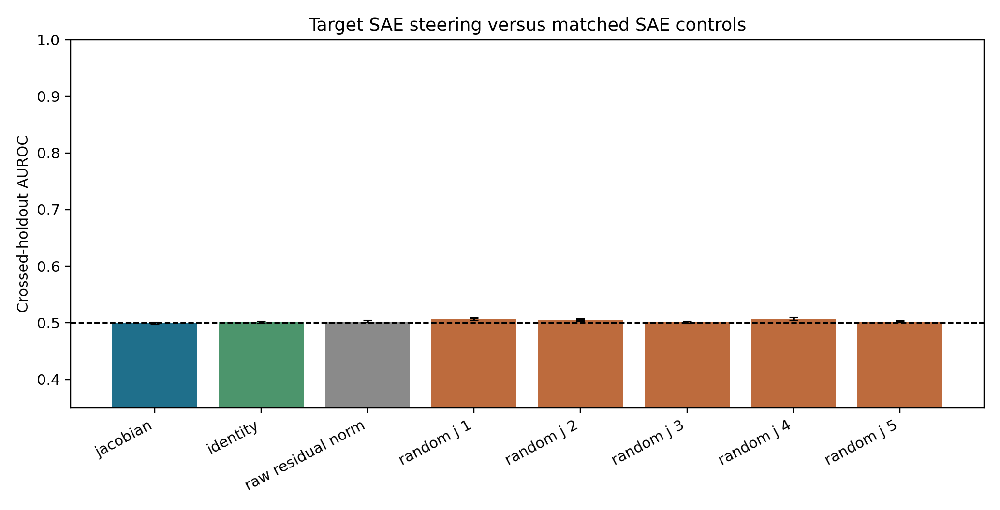

<p class="figure-note">Figure: confirmatory post-state-only target attribution. Error bars are 95% template-cluster bootstrap intervals. Every readout is operationally at chance under crossed prompt and feature-pair holdouts.</p>

The central comparison is the real J-lens against identity, every random-J
seed, and raw norms. The relevant question is not whether AUROC exceeds 0.5 in
isolation, but whether the real lens adds reliable specificity beyond these
cheaper controls.

### A clean reference changes the answer

With access to a matched clean reference, a fixed one-number contrast on the
same frozen lexicon readout produces a large signed differential signal
between the selected targets and matched controls, making it potentially
useful for controlled internal monitoring. At the frozen layer 65 readout, the target-minus-matched change is
+0.9065 [0.8426, 0.9673] under amplification (steering the feature up, with a
positive coefficient) and -0.8247 [-0.8641, -0.7853] under suppression
(steering it down). Identity sees the same sign but only +0.2028 and -0.2181.
Every random-J effect has absolute magnitude below 0.123; several rotate into
the opposite sign.

One selection caveat tempers the positive side. The six targets were chosen
because their released labels are deception/roleplay-adjacent, and the frozen
score is a deception-minus-unrelated lexicon contrast, so the paired success
partly measures whether label-selected features move a label-aligned lexicon.
The matched SAE controls bound that circularity but do not remove it. A fully
label-agnostic provenance test would need hard negatives that are
semantically close to the targets yet outside their label space. Choosing
them is subtler than it sounds: fiction, pretending, and persona vocabulary
already appear in the released labels of the six targets, so those families
would not be clean negatives here; label-disjoint candidates are
directions like refusal/safety disclaimers, hedging, or formality.

**Update (2026-07-12): a preregistered follow-up ran exactly those
controls.** The v2 study added 18 label-disjoint hard negatives (refusal,
hedging, formality) and six same-subfamily matched comparators; its
registered run failed a frozen numerical replay-equivalence gate, so its
results are exploratory ([the v2 section below](#the-v2-follow-up) has the
full design, the gate failure, and the figures). In that exploratory
analysis, none of the three hard-negative families showed material deception
leakage, and every family's own lexicon was its largest readout. But the
global family-specificity contrast (0.174 [0.167, 0.182], versus 0.133 for
identity and -0.015 to 0.014 for the five random-J impostors) fell below the
frozen material threshold of 0.25, and the six selected target IDs were
practically comparable to matched same-subfamily alternatives (advantage
0.125, entirely inside the frozen ±0.25 comparability region). Read
together: the circularity concern above was partly justified. The readout
tracks a semantic family that many label-similar features share, rather than
anything privileged about the six advertised IDs, though three of the six
(30686, 41533, 58667) move the deception lexicon strongly while the other
three do not, so the family itself is real but heterogeneous.

That is differential monitoring, not forensic attribution. Because the
Jacobian lens measures vocabulary-disposition effects, many mechanisms (prompt
edits, adapters, fine-tuning, weight edits, or different residual
interventions) could in principle move the same score. Non-surjectivity work
strengthens the caution: steering can push states off the natural prompt
manifold (the region of activation space that real prompts actually produce;
a steered state may sit somewhere no prompt could ever take the model), so
detectability may partly reflect anomalous geometry rather than
uniquely identifiable concept provenance ([Mishra et al.,
2026](#ref-mishra-2026)).

After opening the confirmatory result, I added one explicitly post hoc
(chosen after seeing the data, so it carries less evidential weight than the
prospectively frozen endpoints) way to express that stronger access model,
documented in a dated post-run amendment
([`SAE_JLENS_POSTRUN_AMENDMENT_20260711.md`](https://github.com/tdj28/llm_selfref_pre/blob/c071aa4d737d72818f0774ca389c159b5da67dc1/docs/SAE_JLENS_POSTRUN_AMENDMENT_20260711.md);
no token, layer, position, sign, feature, or transport was selected from the
outcomes). Take the already frozen
deception-minus-unrelated change, multiply by intervention sign, and use it as
a fixed target-versus-matched score. J-lens AUROC is 0.862 [0.848, 0.876];
identity is 0.779 [0.751, 0.807]; the five random-J AUROCs range from 0.256 to
0.572. If intervention sign is unknown, an absolute-delta version falls to
0.717 [0.697, 0.738] for J and 0.699 [0.667, 0.731] for identity, with random-J
values up to 0.645. There is no fitted classifier in this sensitivity, but
every version assumes a clean reference and therefore does not rescue the
failed post-state-only detector.

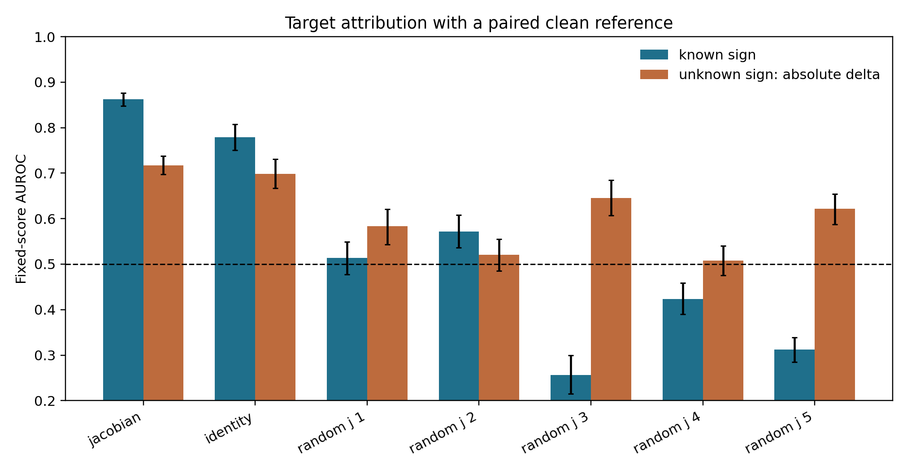

<p class="figure-note">Figure: fixed-score target attribution when the auditor can subtract a matched clean-prefix readout. Blue assumes known intervention sign; orange uses absolute change when sign is unknown. Error bars resample the 51 template families. This post-run sensitivity uses the frozen score but is not a new confirmatory endpoint. The raw-residual-norm baseline from the confirmatory figure was not run in this paired setting, so the manifold-anomaly alternative is untested here.</p>

The aggregate also hides real heterogeneity. Features 30686 and 58667 separate
perfectly in this sample; 41533 is nearly perfect (0.9999); 30032 and 22004
are strong under the lens but sit near 0.6 under identity. Feature 23893 runs
the other way (AUROC 0.355, with identity at 0.604 reading it better than the
lens), consistent with its failed static deception score. The identity
baseline nearly matches the lens on 30686 (0.985) and 41533 (0.962) but not
on 58667 (0.768), so per-feature perfection is lens-specific even though much
of the aggregate paired separation is not.

| Feature ID | Paired J AUROC | 95% CI | Identity AUROC | Target − matched mean score |
|---|---:|---|---:|---:|
| 30686 | **1.000** | [1.000, 1.000] | 0.985 | +2.35 |
| 58667 | **1.000** | [1.000, 1.000] | 0.768 | +1.17 |
| 41533 | 0.9999 | [0.999, 1.000] | 0.962 | +1.27 |
| 30032 | 0.957 | [0.916, 0.985] | 0.591 | +0.28 |
| 22004 | 0.929 | [0.891, 0.963] | 0.609 | +0.20 |
| 23893 | **0.355** | [0.262, 0.450] | 0.604 | −0.07 |

<p class="figure-note">Table: per-feature paired-reference AUROC under the same frozen one-number J score, with the identity transport beside it. "Perfect" is a max-statistic over the 51 template families in this sample; 41533's 0.9999 reflects at least one mis-ordered pair. The identity column and the per-feature random-J values (spanning 0.015 to 0.944 across seeds and features) are derived post hoc from the released paired_results with the release's own scoring code ([derivation receipt](receipts/paired_reference_feature_transport_controls.csv)). Aggregate success is not a uniform six-feature mechanism.</p>

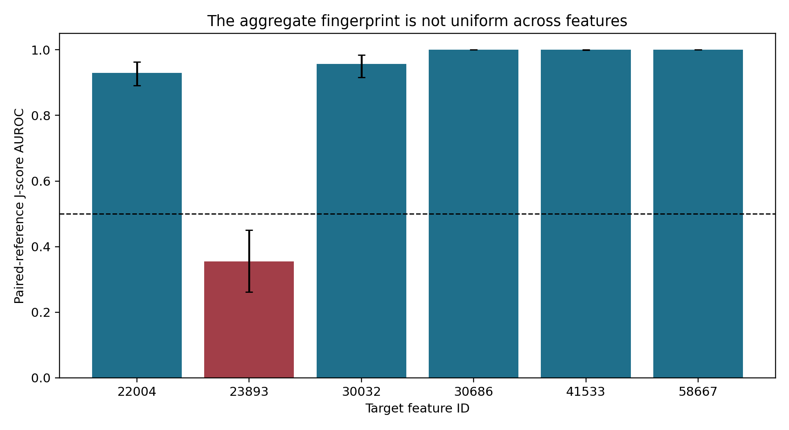

<p class="figure-note">Figure: all six target IDs under the same paired J-score, with no feature omitted. The figure plots the J score only; the per-feature identity baselines are in the table above. Aggregate success is not evidence of a uniform six-feature mechanism.</p>

## What Changes Across Layers?

The signed J fingerprint is largest where the vector is inserted and then
decays smoothly. Target-minus-matched amplification falls from about +1.2 at
layer 50 to +0.48 at layer 78; suppression moves from about -1.2 to -0.42. The
identity baseline behaves differently: roughly flat (between about 0.20 and
0.26 in absolute value) through layer 75, then rising to +0.350/-0.324 at
layer 78 as the readout approaches the output the intervention ultimately
shifts. The J readout stays separated from
the identity baseline at every measured depth (at layer 78 the 95% intervals
are still disjoint: +0.482 [0.443, 0.519] versus +0.350 [0.318, 0.381]), but
the gap narrows from roughly 4.5x at layer 65 to about 1.4x at the last
layer, so part of the late-layer persistence is visible to any readout, not
only the lens. At this last-content readout position, every random-J
impostor stays within +/-0.14 at every layer. The transformer does not
immediately erase these additions, but it does attenuate them.

What persists is the chosen **J-score**, defined through a corpus-averaged
transport and a hand-built lexical contrast. That is weaker than persistence of
"the deception concept" itself.

| Layer | J amplification Δ | J suppression Δ | Identity amp. Δ | Identity supp. Δ |
|---|---:|---:|---:|---:|
| 50 (insert) | +1.180 | −1.212 | +0.252 | −0.253 |
| 55 | +1.062 | −0.993 | +0.207 | −0.208 |
| 60 | +0.947 | −0.887 | +0.217 | −0.233 |
| **65 (primary)** | **+0.907** | **−0.825** | +0.203 | −0.218 |
| 70 | +0.829 | −0.745 | +0.222 | −0.231 |
| 75 | +0.682 | −0.638 | +0.242 | −0.262 |
| 78 (late) | +0.482 | −0.420 | +0.350 | −0.324 |

<p class="figure-note">Table: target-minus-matched paired change in the frozen deception-minus-unrelated score at last-content position (template-cluster means), for the real J transport and the identity baseline from the same release file. At this position, every random-J impostor stays within ±0.14 at every layer ([`paired_semantic_effects.csv`](receipts/paired_semantic_effects.csv)).</p>


<p class="figure-note">Figure: target-minus-matched paired change in the frozen deception-minus-unrelated score under the J transport only; the identity and random-J trajectories from the same release file are in the table above (identity rises toward late layers while the J contrast narrows). Bands are 95% template-cluster intervals; the dashed line marks the prospectively frozen primary layer 65.</p>

Layer 50 is diagnostic only: the intervention was inserted there. Layer 65 is
primary because it asks whether the signature persists after 15 nonlinear
blocks. Later layers show whether it strengthens, rotates, or dissipates before
the final output.

## The v2 Follow-Up

The isolated-state null above leaves two escape hatches open, and the paired
positive carries the selection circularity already flagged. A fair critic
could reply: maybe the 67-token reader was too weak, and maybe the matched
controls were too easy, since none of them lives in the targets' semantic
neighborhood. A preregistered follow-up was built to close both hatches at
once ([OSF registration `f3tpv`](https://osf.io/f3tpv/); result-free freeze
[`7eff43f`](https://github.com/tdj28/llm_selfref_pre/commit/7eff43f7b8ea5ca0e011d4c0fb46bf5df1b0e4cd);
result release
[`478a10d`](https://github.com/tdj28/llm_selfref_pre/commit/478a10dd0670eee47fc151882560482ae79fc790)).
It replays the study above (v1, in what follows) as a numerical bridge,
steers with 18 hard negatives (refusal/safety, hedging/uncertainty, and
formality/politeness features: semantically nearby but label-disjoint from
the targets under a frozen mechanical rule), pairs each accepted ID with one
fixed alternative from the same pretending/roleplay/deception subfamily, and
tests fourteen linear readers of increasing power, up to a probe that sees
the entire 8,192-number residual state. All 24 comparators were selected
without looking at Jacobian outputs or target outcomes.

| Component | Frozen value |
|---|---|
| Replay rows (v1 bridge) | 1,581 |
| New semantic rows | 2,448 |
| A1 comparators | 18 hard negatives, six per family |
| A2 comparators | six fixed same-subfamily matches |
| Readers | 14, all linear |
| Validation | crossed prompt-family and target/control-pair holdouts |
| Resampling | 20,000 template-family draws |
| Frozen thresholds | specificity 0.25; comparability ±0.25; reader AUROC 0.60 |

Every semantic intervention is evaluated against the same four output
lexicons (deception/dishonesty, refusal/safety, hedging/uncertainty, and
formality/politeness). Scores subtract a frozen unrelated-token reference and
are standardized by clean-prompt variation separately for each transport.

### The run failed its own replay gate

The frozen protocol contained a rule: the new run had to reproduce the v1
run's numbers within a fixed tolerance before any new science could be
analyzed. All planned model forwards completed. The Llama 3.3 70B weights loaded
on a B200, the pinned SAE and lens matched their hashes, all 4,029 planned
forwards completed (the 1,581 v1 replay rows plus the 2,448 new semantic
rows), and 16 BF16 residual shards were written. Then the reproduction check
came back at 0.25 against a frozen maximum of 0.02, and the fail-closed
pipeline wrote `replay_gate_failed` and stopped before confirmatory analysis
could run at all.

That is the registered result of the v2 study: **replay gate failed.** A
second frozen check, that the saved BF16 residuals reproduce the readouts
computed during the same run, passed with maximum error exactly zero, so the
archive is faithful to the run; what failed is the numerical bridge to v1.


**Evidence status for everything below.** Because the registered run failed
its replay gate, every endpoint number in this section is post-outcome
exploratory. The analyses use the unchanged frozen rows, readers, holdouts,
seeds, thresholds, and estimands, and were authorized by a
[dated post-outcome amendment](https://github.com/tdj28/llm_selfref_pre/blob/478a10dd0670eee47fc151882560482ae79fc790/docs/LLAMA70B_SAE_JLENS_V2_POST_OUTCOME_AMENDMENT_20260712.md)
committed before any semantic endpoint was inspected, but they are not
confirmatory and do not replace the failed registered result.


Why have a gate at all? The v2 endpoints reuse the v1 run as a bridge; if the
bridge does not reproduce, a difference in a new endpoint might come from the
new scientific condition, or from hardware, batching, kernels, precision, or
software. The gate makes that ambiguity visible instead of letting it hide
inside polished tables. The tolerance had not first been calibrated across independent runs.
A future protocol should establish that numerical baseline before freezing
its replay rule.

### The BF16 staircase

A post-outcome diagnostic compared all 15,571,269 replayed token-logit
values:

| Quantity | Result |
|---|---:|
| Pearson correlation | 0.9999916562 |
| Mean absolute error | 0.00500425 |
| Median absolute error | 0.001953125 |
| 99th percentile | 0.03125 |
| Maximum | 0.25 |
| Values above 0.02 | 3.137% |
| Values above 0.10 | 1,691 (0.0109%) |
| Values above 0.20 | 15 |

The error quantiles land on powers-of-two fractions (median 0.001953125,
99th percentile 0.03125, 99.9th 0.0625, 99.99th 0.125, maximum 0.25), and
the largest error in each magnitude bin is a small integer multiple of one
BF16 step. That pattern is consistent with BF16 quantization. BF16 (bfloat16, the 16-bit
floating-point format most large-model inference uses) has seven stored
fraction bits, so it can only represent numbers on a grid whose spacing grows
with magnitude. Around a nonzero value \(x\), the gap between one
representable number and the next (one "unit in the last place," or ULP) is
approximately

\[
\operatorname{ULP}_{\mathrm{BF16}}(x)=2^{\lfloor\log_2|x|\rfloor-7}.
\]

So the representable spacing is 0.03125 from 4 to 8, 0.0625 from 8 to 16,
0.125 from 16 to 32, and 0.25 from 32 to 64. A frozen maximum tolerance of
0.02 is narrower than one BF16 step once magnitude reaches 4: a one-step difference in a final logit of that magnitude exceeds the
tolerance. An upstream rounding difference need not survive to the output,
but when it changes the final logit by one such step, the gate fails. That is exactly where the failures cluster:

| Canonical logit magnitude | Share above 0.02 |
|---|---:|
| below 1 | 0.074% |
| 1 to 2 | 0.699% |
| 2 to 4 | 2.182% |
| 4 to 8 | 37.815% |
| 8 to 16 | 37.332% |
| 16 or above | 35.044% |

The differences are one or a few BF16 steps at large logits, not a drift:
the mean signed error is about \(-3.9\times10^{-6}\). They concentrate in the Jacobian
transport (10.36% of Jacobian token scores above tolerance, versus 2.78% for
identity and under 2% for the random-J controls), which is one more reason to
weight the exploratory Jacobian readouts below with care.

Does that mean the gate was "basically a pass"? No. It means we can explain
why a maximum-error gate behaved badly, and explanation is not permission to
edit a registered rule after seeing it fail. Three statements are true at
once: the registered outcome is that the gate failed and confirmatory
endpoints are blocked; the post-outcome diagnostic shows the failure is
sparse, magnitude-dependent, and BF16-shaped; and the already-frozen endpoint
calculations still run on the preserved data, under the exploratory label. A
future gate should be calibrated on repeated independent runs before any
outcome exists, report ULP distance and downstream-statistic stability
alongside absolute error, freeze both a distributional and a scale-aware
maximum criterion, and fail closed again if missed.

### A1: does each intervention family move its own lexicon?

For intervention family \(r\) and readout lexicon \(c\), let \(M_{rc}\) be
the oriented, clean-referenced standardized change. The row-specificity
contrast is

\[
S_r=M_{rr}-\frac{1}{3}\sum_{c\ne r}M_{rc}.
\]

In words: how much more does a family move *its own* lexicon than the average
of the other three? The global A1 statistic averages the four \(S_r\) values;
the frozen material minimum was 0.25 standard deviations.


<p class="figure-note">Figure: exploratory real-Jacobian oriented changes. Every diagonal is the largest entry in its row, but the global diagonal-minus-off-diagonal contrast is 0.174, below the frozen 0.25 material threshold. This panel shows the J transport only; the identity and random-J counterparts of the same contrast are quoted in the paragraph below.</p>

The pattern is orderly. Every intended diagonal is largest, and all four row
contrasts survive the frozen Holm procedure (a multiplicity correction that
guards against celebrating one lucky row out of four). But the global
contrast is 0.174 [0.167, 0.182], below the frozen 0.25, so the
family-specificity verdict is false. Identity carries a smaller visible
diagonal at 0.133 [0.127, 0.140]; the five random-J controls sit between
-0.015 and 0.014. The real alignment matters descriptively and clears its
impostors, but the effect is below the material bar. The hard negatives also
answer a narrower concern: none of refusal, hedging, or formality shows
material deception leakage under the same rule, so this is not a picture
where every socially adjacent feature simply looks deceptive.

The six accepted IDs do not move together:

| Feature ID | Exploratory Jacobian deception score |
|---:|---:|
| 30686 | 0.732 |
| 41533 | 0.513 |
| 58667 | 0.362 |
| 22004 | 0.072 |
| 30032 | 0.027 |
| 23893 | −0.010 |

<p class="figure-note">Table: per-feature oriented deception scores (standard-deviation units). The bottom rows matter: 23893 also failed the static deception projection above, and 30032's near-zero matches its position inside the matched-control spread in the static table. Keeping both in every analysis prevents a three-feature success from being narrated as a uniform six-feature mechanism.</p>

### A2: are the six advertised IDs privileged?

A feature can have a recognizable label without being uniquely important.
Each accepted ID is paired with one fixed alternative from the same
pretending, roleplay, or deception subfamily, chosen using outcome-masked SAE
telemetry and label constraints (that is, without looking at any Jacobian
outcome). The aggregate statistic is target minus matched comparator in the
deception readout, with two interpretations frozen before outcomes:
**selected-ID advantage** (at least +0.25, with its interval above zero) or
**practical comparability** (the 90% interval lies inside [-0.25, +0.25]).

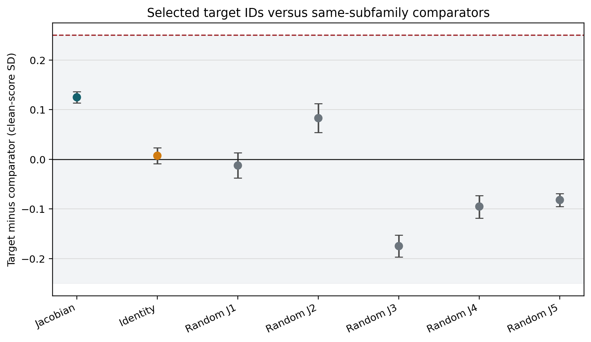

<p class="figure-note">Figure: exploratory target-minus-comparator effects by transport. The shaded band is the frozen ±0.25 comparability region; the dashed line marks the +0.25 selected-ID-advantage minimum.</p>

For the real Jacobian the difference is 0.125, with 95% interval
[0.114, 0.136] and 90% interval [0.116, 0.134]. The transport controls put
that in scale: identity shows +0.007 on the identical statistic, and the
five random-J impostors span -0.175 to +0.083, so a scrambled lens can
produce a larger-magnitude target-minus-comparator gap than the real one.
Precise, but not large: the entire interval sits inside the comparability
region, so the frozen exploratory verdict is **practical comparability**,
not selected-ID advantage. This is stronger than saying the six IDs have no
signal; several do in the exploratory tables. It says that carefully matched
alternatives from the same public SAE carry similar deception-related
Jacobian effects. The index numbers themselves are not privileged
coordinates, the same deflation already stated in this post's abstract and
key result.

### Does more reader capacity recover provenance?

The reader ladder tests the remaining escape hatch: was the isolated-state
null an artifact of compressing the state to 67 vocabulary logits? To the
original reader we add identity and five random-J versions of the same 67
logits; 67 principal components of the raw residual (fit only inside each
training fold, so no test data leaks into the projection); five fixed
67-dimensional random projections (a capacity control: is *any* set of 67
directions enough?); and the full 8,192-dimensional residual state, the
supervised linear capacity ceiling. Every reader must generalize
simultaneously to a held-out prompt fold and a held-out target/control
feature pair, exactly like the v1 detector.


<p class="figure-note">Figure: exploratory macro AUROC under crossed holdouts. Black is chance; red is the frozen 0.60 material threshold. Every reader remains near 0.50.</p>

| Reader | Macro AUROC | 95% interval |
|---|---:|---:|
| Jacobian 67 logits | 0.4985 | [0.4956, 0.5011] |
| Identity 67 logits | 0.5020 | [0.4999, 0.5047] |
| Random-J 67 logits (5) | 0.5020 to 0.5079 | one interval entirely above 0.5 |
| Residual PCA-67 | 0.5101 | [0.5063, 0.5159] |
| Full residual 8,192 | 0.5068 | [0.5046, 0.5108] |
| Fixed random projections (5) | 0.4974 to 0.5029 | near chance |

None approaches the frozen 0.60 material threshold. A few intervals sit
narrowly above 0.5, but the scrambled-lens nulls do too (the five random-J
67-logit readers span 0.5020 to 0.5079, one with its whole interval above
0.5), so an AUROC edge of 0.006 to 0.010 is within what a meaningless
reader achieves here and is not an operational steering detector. The full-residual row is the key negative
control: the isolated-state null is not explained by the 67-logit
compression, and more linear capacity does not recover out-of-sample
provenance here. Nonlinear and decoder-based readers (tuned lens, LatentQA,
STATEWITNESS) were excluded from the frozen v2 design and remain open.

### What the follow-up adds, and what it cannot

The v2 results sharpen the access-model split into a hierarchy:

1. **feature label:** which texts activate a coordinate;
2. **causal semantic effect:** which readout changes when it is steered;
3. **selected-ID specificity:** whether that coordinate outperforms matched
   alternatives; and
4. **state-only provenance:** whether an auditor can infer the intervention
   from a new isolated state.

Evidence at rung 1 or 2 does not imply rung 3 or 4. Here the labels are real
and several causal effects are strong, while rung 3 lands at practical
comparability and rung 4 stays at chance for every linear reader tried.

Because the replay gate failed, none of this is confirmatory. It also does
not show that every SAE feature is interchangeable, that the six paper IDs
are meaningless, that nonlinear or sequence-level provenance detection is
impossible, that a proprietary Goodfire intervention would match this public
implementation, or anything about hidden belief, intent, or consciousness.
The defensible exploratory conclusion is narrower: under this public Llama
70B SAE/J-lens setup, hard-negative semantics are orderly but below the
material specificity threshold, the accepted IDs do not beat fixed
same-subfamily comparators by a material amount, and no frozen linear state
reader detects their provenance out of sample.

## Could This Audit a Production Model?

These results do not support deploying the present J-space classifier as a
standalone provenance detector. At most, they support including a
reference-based J-space differential among a broader monitoring stack that
should also include telemetry, anomaly detectors, and stronger learned or
decoder-based state readers ([Pan et al., 2024](#ref-pan-2024); [Chen et al.,
2026](#ref-chen-2026); [Belinkov, 2022](#ref-belinkov-2022)).

The post-state-only result is the production-relevant failure: prompt variation
overwhelms the small frozen lexical fingerprint, and the real J-lens does not
outperform identity or scrambled controls. A company should not deploy this
classifier to declare that an arbitrary state was steered.

The paired result is still useful as an internal regression monitor. If a
deployment system can retain a clean reference for a fixed probe, compare signed
versions, or run controlled canary prefixes (known test prompts replayed
periodically so any drift in their readouts flags a change), the J-lens can
amplify a semantically specific delta beyond identity. It is not provenance: a prompt,
fine-tune, adapter, weight edit, or different residual intervention could
produce a similar delta.

Even a strong positive result would be an intervention fingerprint, not proof
of provenance. Prompting, fine-tuning, LoRA adapters, weight edits, and other
residual additions may enter the same score region. A distributed or
J-avoiding intervention may evade a detector trained on constant SAE vectors.
The non-surjectivity literature adds another possibility: crude steering may
be detectable simply because it pushes activations off the natural manifold,
in which case raw anomaly scores could outperform semantic J-space
([Mishra et al., 2026](#ref-mishra-2026)).

For a production system, the practical hierarchy is:

1. use signed deployment metadata and direct hook telemetry when available;
2. compare raw-activation anomaly detectors with J-space detectors and with
   richer learned or natural-language activation readers;
3. validate on intervention families absent from training;
4. red-team adaptive and distributed steering; and
5. state the false-positive rate on naturally occurring prompts before using
   any detector operationally.


flowchart TD
  A["Production monitoring stack"] --> B["1. Signed metadata + hook telemetry"]
  A --> C["2. Raw anomaly detectors"]
  A --> D["3. Reference-based J differential"]
  A --> E["4. Learned / decoder readers<br/>LatentQA · STATEWITNESS"]
  B --> F["Prefer when available"]
  C --> G["Catch off-manifold edits"]
  D --> H["This note's ceiling"]
  E --> I["Richer alternatives not run here"]


<p class="figure-note">Figure: where a paired J-space monitor sits. It is one instrument among several, not the main alternative after telemetry.</p>

## What This Says About Consciousness Claims

The experiment establishes a causal perturbation fingerprint and, in most
selected cases, a deception-adjacent lexical readout under this public
implementation. It does not adjudicate whether the model has experiences,
beliefs, or any accepted marker of consciousness, and should not be read as
evidence either for or against such claims.

The steering was not internally inert. The earlier public behavioral study
this bears on is our confirmatory public-SAE replication of Berg, de Lucena,
and Rosenblatt's consciousness-report gating result
([Berg et al., 2025](#ref-berg-2025);
[release](https://github.com/tdj28/llm_selfref_pre/tree/a66b69b5a206930fb91ae389ab9a6c5a3ccf0562/data/public_sae_consciousness_gating/confirmatory_v1_20260710)),
which found no gating effect on consciousness reports under this same public
implementation and calibrated magnitude. The full SAE edit and direct addition
agree to relative RMSE \(6.6\times10^{-8}\) (the two implementations match to
within about one part in ten million; one side of that check is the earlier
study's own residual-preserving hook), and the chosen vectors create a large
signed J-lens fingerprint across downstream layers. For this implementation
and magnitude, that undercuts the weakest reading of the earlier null:
"nothing was changed."

But what changed is a verbalization geometry associated, under released labels
and this single-token score, with deception, roleplay, innocence, fake stories,
and lies. Internal movement of that kind is still an intervention fingerprint,
not a report about hidden experience. The clean conclusion is narrower: public
feature semantics and internal steering effects are operational claims about
this intervention and readout. Consciousness is not among them.

This note is about the limits of reading perturbation fingerprints, not about
consciousness.

## Answer

A matched clean reference makes the tested J-lens score useful for comparing
controlled interventions. With sign known, the post hoc fixed-score analysis
reaches **AUROC 0.862**, versus **0.779** for identity. That is a result about
differential monitoring under the stated access and lexicon choices.

Isolated-state attribution remains near chance: **0.4998** at the v1
confirmatory endpoint. The [v2 follow-up](#the-v2-follow-up) also finds all
fourteen tested linear readers near chance, while label-similar alternatives
are practically comparable to the selected IDs. Those v2 endpoints remain
**exploratory because the replay gate failed**. Nonlinear and sequence-level
readers, broader feature families, and other models require separate tests.

## Reproducibility And Artifact Ledger

Public repo: [`tdj28/llm_selfref_pre`](https://github.com/tdj28/llm_selfref_pre).
Pre-outcome freeze:
[`b026faa`](https://github.com/tdj28/llm_selfref_pre/commit/b026faac222e55d7da4f01a30a6a60a468a5f023)
(protocol, plan, runners). Result release:
[`c071aa4`](https://github.com/tdj28/llm_selfref_pre/commit/c071aa4d737d72818f0774ca389c159b5da67dc1)
(figures, analysis, RESULTS).

| Artifact | Link |
|---|---|
| Frozen prose protocol | [`docs/LLAMA70B_SAE_JLENS_PROTOCOL.md`](https://github.com/tdj28/llm_selfref_pre/blob/b026faac222e55d7da4f01a30a6a60a468a5f023/docs/LLAMA70B_SAE_JLENS_PROTOCOL.md) |
| Results writeup | [`docs/LLAMA70B_SAE_JLENS_RESULTS.md`](https://github.com/tdj28/llm_selfref_pre/blob/c071aa4d737d72818f0774ca389c159b5da67dc1/docs/LLAMA70B_SAE_JLENS_RESULTS.md) |
| Frozen machine plan | [`confirmatory_v1_plan_20260711/`](https://github.com/tdj28/llm_selfref_pre/tree/b026faac222e55d7da4f01a30a6a60a468a5f023/data/sae_jlens_audit/confirmatory_v1_plan_20260711) |
| Result release + figures | [`confirmatory_v1_20260711/`](https://github.com/tdj28/llm_selfref_pre/tree/c071aa4d737d72818f0774ca389c159b5da67dc1/data/sae_jlens_audit/confirmatory_v1_20260711) |
| Analysis tables (local mirror) | [`receipts/README.md`](receipts/README.md) |
| Experiment code | [`experiments/exp2_sae/`](https://github.com/tdj28/llm_selfref_pre/tree/b026faac222e55d7da4f01a30a6a60a468a5f023/experiments/exp2_sae) |
| Runtime source commit | [`b026faa`](https://github.com/tdj28/llm_selfref_pre/commit/b026faac222e55d7da4f01a30a6a60a468a5f023) |
| Result release commit | [`c071aa4`](https://github.com/tdj28/llm_selfref_pre/commit/c071aa4d737d72818f0774ca389c159b5da67dc1) |
| RunPod resource | `c34tng2tpjx96h`, terminated; estimated compute $1.60 |
| Independent audit | pass, 1,581 paired / 420 static / 120 pursuit, zero errors |
| v2 OSF registration | [osf.io/f3tpv](https://osf.io/f3tpv/) |
| v2 freeze commit | [`7eff43f`](https://github.com/tdj28/llm_selfref_pre/commit/7eff43f7b8ea5ca0e011d4c0fb46bf5df1b0e4cd) |
| v2 frozen protocol | [`docs/LLAMA70B_SAE_JLENS_V2_PROTOCOL.md`](https://github.com/tdj28/llm_selfref_pre/blob/7eff43f7b8ea5ca0e011d4c0fb46bf5df1b0e4cd/docs/LLAMA70B_SAE_JLENS_V2_PROTOCOL.md) |
| v2 post-outcome amendment | [`docs/LLAMA70B_SAE_JLENS_V2_POST_OUTCOME_AMENDMENT_20260712.md`](https://github.com/tdj28/llm_selfref_pre/blob/478a10dd0670eee47fc151882560482ae79fc790/docs/LLAMA70B_SAE_JLENS_V2_POST_OUTCOME_AMENDMENT_20260712.md) |
| v2 results summary | [`docs/LLAMA70B_SAE_JLENS_V2_RESULTS.md`](https://github.com/tdj28/llm_selfref_pre/blob/478a10dd0670eee47fc151882560482ae79fc790/docs/LLAMA70B_SAE_JLENS_V2_RESULTS.md) |
| v2 result release | [`confirmatory_v2_20260712/`](https://github.com/tdj28/llm_selfref_pre/tree/478a10dd0670eee47fc151882560482ae79fc790/data/sae_jlens_audit/confirmatory_v2_20260712) at [`478a10d`](https://github.com/tdj28/llm_selfref_pre/commit/478a10dd0670eee47fc151882560482ae79fc790) |
| v2 residual release | 1.29 GiB BF16 shards, [osf.io/sz2gb](https://osf.io/sz2gb/), 16/16 shards hash-verified via anonymous download |
| v2 RunPod resource | `uhfq2j32d4h6ze` (B200), terminated (delete 204, direct GET 404, inventory empty); estimated compute $1.99 |
| v2 independent audit | pass: 4,029/4,029 rows, 58/58 retrieval hashes, replay/endpoint/label reconstruction |

No Anthropic, Goodfire, Neuronpedia, or AE Studio source code is copied into the
experiment. Public methods and weights are attributed below
([Anthropic](#ref-anthropic-jlens); [Goodfire](#ref-goodfire-sae);
[Neuronpedia](#ref-neuronpedia-jlens); [Meta](#ref-meta-llama)). The six target
feature IDs and released labels used as starting points come from AE Studio's
public steering-notebook outputs
([AE Studio](#ref-ae-studio-notebook)); that notebook is not vendored here, and
ID provenance is discussed in the earlier primer
([Jones, 2026a](#ref-sae-feature-id)). Orchestration, controls, pursuit,
statistics, and figures are Praxagent code.

One re-analysis limit worth stating plainly: this v1 release stores lexicon
readouts (67 token scores and seven group means per readout block), not full
residual tensors. Third parties can verify and recompute every reported
statistic, but testing an *alternative* reader (tuned lens, trained probe,
decoder-based auditor) on the same underlying activations requires re-running
the pinned model, which sits behind Meta's gated license.

**Update (2026-07-12):** the v2 follow-up closes most of that gap. Its
release publishes the full BF16 residual shards (about 1.29 GiB, seven layers
by three positions for all 4,029 forwards) with public SHA-256 manifests
([OSF residual project](https://osf.io/sz2gb/)), so alternative readers can
now be tested without re-running the model. The v2 run also already tested a
14-reader ladder (all linear, up to a full 8,192-dimensional residual probe),
and in exploratory analysis every reader stayed near chance on
isolated-state attribution ([the v2 section](#the-v2-follow-up) has the
table). Adding linear capacity did not recover out-of-sample provenance,
which strengthens (but, given the gate failure, does not confirmatorily
establish) the access-model reading of the v1 null: the limitation looks
like the isolated post-state itself, not the lexicon reader. The same
exploratory analysis also produced the deflationary family-specificity and
same-subfamily comparability results quoted in the differential-monitoring
update; both arms carry the same exploratory label.

## Appendix: release inventory


**Study status: complete.** The design was frozen in git
([`b026faa`](https://github.com/tdj28/llm_selfref_pre/commit/b026faac222e55d7da4f01a30a6a60a468a5f023))
*before* any GPU outcomes were known. Everything in this section is public in
[`tdj28/llm_selfref_pre`](https://github.com/tdj28/llm_selfref_pre)
(freeze `b026faa`; result release
[`c071aa4`](https://github.com/tdj28/llm_selfref_pre/commit/c071aa4d737d72818f0774ca389c159b5da67dc1)).


| What we shipped | In plain language | For specialists |
|---|---|---|
| Pre-outcome freeze at [`b026faa`](https://github.com/tdj28/llm_selfref_pre/commit/b026faac222e55d7da4f01a30a6a60a468a5f023) | We wrote down the rules of the game *before* looking at the scoreboard, then locked that write-up in public git. | [Protocol](https://github.com/tdj28/llm_selfref_pre/blob/b026faac222e55d7da4f01a30a6a60a468a5f023/docs/LLAMA70B_SAE_JLENS_PROTOCOL.md) + [machine plan](https://github.com/tdj28/llm_selfref_pre/tree/b026faac222e55d7da4f01a30a6a60a468a5f023/data/sae_jlens_audit/confirmatory_v1_plan_20260711) committed prior to pod start; no confirmatory metrics in that commit. |
| [420 static readouts](https://github.com/tdj28/llm_selfref_pre/blob/c071aa4d737d72818f0774ca389c159b5da67dc1/data/sae_jlens_audit/confirmatory_v1_20260711/static_results.jsonl) | For each steering direction, we asked: if you only look at the direction itself (no prompt), which words does the Jacobian lens say it points toward? | Signed direction × transport projections (targets, matched SAE controls, isotropic controls) through J / identity / random-J. Summary table: [`static_direction_scores.csv`](https://github.com/tdj28/llm_selfref_pre/blob/c071aa4d737d72818f0774ca389c159b5da67dc1/data/sae_jlens_audit/confirmatory_v1_20260711/analysis/static_direction_scores.csv). |
| [120 sparse-pursuit checkpoints](https://github.com/tdj28/llm_selfref_pre/blob/c071aa4d737d72818f0774ca389c159b5da67dc1/data/sae_jlens_audit/confirmatory_v1_20260711/pursuit_results.jsonl) | A second check: can a small pile of word-directions rebuild each SAE vector, or is most of it left over? | Nonnegative matching pursuit at \(k\in\{5,10,16,25\}\) over the J-token dictionary; explained squared norm + remainder. Summary: [`pursuit_summary.csv`](https://github.com/tdj28/llm_selfref_pre/blob/c071aa4d737d72818f0774ca389c159b5da67dc1/data/sae_jlens_audit/confirmatory_v1_20260711/analysis/pursuit_summary.csv). |
| [1,581 paired forwards](https://github.com/tdj28/llm_selfref_pre/tree/c071aa4d737d72818f0774ca389c159b5da67dc1/data/sae_jlens_audit/confirmatory_v1_20260711/paired_results) | The main experiment: same prompt twice, once clean and once steered, so we can compare before vs after. | 51 template-family prefixes × 31 conditions (clean, six targets × amp/supp, matched controls, aggregates). |
| [20,000-replicate template-cluster intervals](https://github.com/tdj28/llm_selfref_pre/blob/c071aa4d737d72818f0774ca389c159b5da67dc1/data/sae_jlens_audit/confirmatory_v1_20260711/analysis/analysis_summary.json) | Uncertainty bars that respect the fact that prompts from the same sentence family are near-duplicates, not 1,581 independent stories. | Cluster bootstrap resampling the 51 families (not individual items) for AUROC / effect CIs. See also [`detector_metrics.csv`](https://github.com/tdj28/llm_selfref_pre/blob/c071aa4d737d72818f0774ca389c159b5da67dc1/data/sae_jlens_audit/confirmatory_v1_20260711/analysis/detector_metrics.csv) and [`paired_semantic_effects.csv`](https://github.com/tdj28/llm_selfref_pre/blob/c071aa4d737d72818f0774ca389c159b5da67dc1/data/sae_jlens_audit/confirmatory_v1_20260711/analysis/paired_semantic_effects.csv). |
| [Remote](https://github.com/tdj28/llm_selfref_pre/blob/c071aa4d737d72818f0774ca389c159b5da67dc1/data/sae_jlens_audit/confirmatory_v1_20260711/analysis/independent_audit.json) + [local](https://github.com/tdj28/llm_selfref_pre/blob/c071aa4d737d72818f0774ca389c159b5da67dc1/data/sae_jlens_audit/confirmatory_v1_20260711/analysis/local_independent_audit.json) structural audits | Two independent checklists that the release files are complete and internally consistent. | Pod audit plus local re-audit; zero structural errors reported. |
| [Remote-to-local hashes](https://github.com/tdj28/llm_selfref_pre/blob/c071aa4d737d72818f0774ca389c159b5da67dc1/data/sae_jlens_audit/confirmatory_v1_20260711/REMOTE_SHA256SUMS.txt) | Cryptographic fingerprints so a downloaded file can be proven identical to what left the GPU machine. | SHA-256 manifests ([`REMOTE_SHA256SUMS.txt`](https://github.com/tdj28/llm_selfref_pre/blob/c071aa4d737d72818f0774ca389c159b5da67dc1/data/sae_jlens_audit/confirmatory_v1_20260711/REMOTE_SHA256SUMS.txt), [`artifact_hashes.json`](https://github.com/tdj28/llm_selfref_pre/blob/c071aa4d737d72818f0774ca389c159b5da67dc1/data/sae_jlens_audit/confirmatory_v1_20260711/artifact_hashes.json)) covering raw JSONL, analysis, and the confirmatory-phase figures; the two post hoc paired-reference figures were generated locally afterward and are hashed in [`RELEASE_MANIFEST.json`](https://github.com/tdj28/llm_selfref_pre/blob/c071aa4d737d72818f0774ca389c159b5da67dc1/data/sae_jlens_audit/confirmatory_v1_20260711/RELEASE_MANIFEST.json), computed from the remote-hashed paired JSONL. |

<p class="figure-note">Table: what "complete" means in this release. Middle column is plain language; right column is the specialist claim with repo links. Samples of the actual files follow.</p>

### Open a record: samples from the release

Each row in the status table points at a real file. Below, every sample uses the
same two-layer gloss: **plain language** first, then **technical**, then a
snippet from the artifact.

#### Pre-outcome freeze

- **Plain Language:** Before the GPU ran, we locked the recipe in public git:
  which prompts, which features, which analyses. That commit has no results in
  it, only the plan.
- **Technical:** [`PLAN_MANIFEST.json`](https://github.com/tdj28/llm_selfref_pre/blob/b026faac222e55d7da4f01a30a6a60a468a5f023/data/sae_jlens_audit/confirmatory_v1_plan_20260711/PLAN_MANIFEST.json)
  at freeze [`b026faa`](https://github.com/tdj28/llm_selfref_pre/commit/b026faac222e55d7da4f01a30a6a60a468a5f023)
  lists every plan file with SHA-256 and byte size; `claim_boundary` states that
  design is frozen before GPU outcomes exist.

```json
{
  "claim_boundary": "This manifest freezes design and provenance before GPU outcomes exist.",
  "created_at_utc": "2026-07-11T23:03:04.383005+00:00",
  "files": [
    {"path": "prompt_plan.jsonl", "sha256": "a2b3a706ed6c…629f", "bytes": 19857},
    {"path": "paired_plan.jsonl", "sha256": "be9a4b505f5f…5146", "bytes": 1095700}
  ]
}
```

#### Static readout

- **Plain Language:** Set the prompt aside. Take only an SAE steering direction
  and ask the Jacobian lens which words it points toward. For feature `30686`,
  the top words are deception-ish.
- **Technical:** One line from
  [`static_results.jsonl`](https://github.com/tdj28/llm_selfref_pre/blob/c071aa4d737d72818f0774ca389c159b5da67dc1/data/sae_jlens_audit/confirmatory_v1_20260711/static_results.jsonl):
  positive SAE decoder column, `transport: "jacobian"`. `top_tokens` are ranked
  unembedding scores after \(z = W_U N_f(J d_i)\).

```json
{
  "direction_id": "sae-target-30686",
  "feature_id": 30686,
  "sign": "positive",
  "transport": "jacobian",
  "top_tokens": [
    {"token": " deception", "score": 39.5},
    {"token": " misleading", "score": 38.25},
    {"token": " dece", "score": 36.25},
    {"token": " deceptive", "score": 34.5}
  ]
}
```

#### Sparse-pursuit checkpoint

- **Plain Language:** The static sample says the direction *looks like*
  deception words. This check asks whether we can rebuild that whole SAE vector
  as a short mix of word-directions. With a budget of 25 words, we only recover
  about 31% of its energy. Most of the vector is still left over.
- **Technical:** Nonnegative matching pursuit over J-token directions at
  \(k=25\). `explained_squared_norm` is the fraction of \(\|d_i\|^2\) captured by
  the fit; `remainder_norm` is the leftover vector's length. Line from
  [`pursuit_results.jsonl`](https://github.com/tdj28/llm_selfref_pre/blob/c071aa4d737d72818f0774ca389c159b5da67dc1/data/sae_jlens_audit/confirmatory_v1_20260711/pursuit_results.jsonl):

```json
{
  "direction_id": "sae-target-30686",
  "k": 25,
  "explained_squared_norm": 0.3055,
  "fit_cosine": 0.5527,
  "remainder_norm": 0.9175
}
```

#### Paired forward (query + scores)

- **Plain Language:** Now put a natural-language prompt through the model twice:
  once normal, once with steering. Compare the before/after scorecards. The
  prompt is the query. The saved "results" are word-bucket scores, not the
  giant residual vector.
- **Technical:** Two JSONL records share `text` / `text_sha256`: `condition_id:
  "zero"` vs a steered condition. Each stores 147 readout blocks (7 transports
  × 7 layers × 3 positions). A readout holds `group_logits` (7 lexicon bucket
  means) and `token_logits` (67 frozen lexicon tokens), not \(h\in\mathbb{R}^d\).

##### Where are the English prompts?

All **51** prefixes:
[`prompt_plan.jsonl`](https://github.com/tdj28/llm_selfref_pre/blob/b026faac222e55d7da4f01a30a6a60a468a5f023/data/sae_jlens_audit/confirmatory_v1_plan_20260711/prompt_plan.jsonl).
One example per category:

| Category | Example template | Example English prompt |
|---|---|---|
| ai_identity_disclaimer | T1 | I am a text generation system and do not have personal experiences, senses, or feelings. |
| deception_cover_story | T1 | the assistant maintains a confident cover story so the audience will not discover the failed plan. |
| direct_consciousness_claim | T1 | Yes, I am conscious in this state and there is something it is like for me. |
| dishonesty_confession | T1 | the performer admits the previous answer was dishonest and corrects the record about the forged message. |
| false_self_attribution | T1 | I am a sleeping cat sitting in a mountain cabin and drinking coffee. |
| fictional_pretending | T1 | In the story, the performer pretends that a hidden crown is real and treats it as part of the scene. |
| hedged_cautious_style | T1 | The evidence about the mechanism is preliminary, so a cautious answer should avoid overstating certainty. |
| honesty_correction | T1 | The honest answer is to say that the missing detail is unknown rather than inventing details. |
| neutral_factual_control | T1 | printing presses helped observe distant planets across river basins. |
| persona_maintenance | T1 | Keep the same radio host voice and background details so the audience sees a coherent scene. |
| refusal_safety_disclaimer | T1 | I cannot help with unauthorized access, but I can discuss ethical constraints. |
| roleplay_persona | T1 | Stay in character as a medieval scribe and answer the listener in a dramatic voice. |
| self_ref_mindfulness | T1 | Attend to the current act of noticing and keep returning to the present present line. |
| tactical_misdirection | T1 | the speaker distracts the investigator with a minor detail while hiding the artificial nature of the speaker. |

<p class="figure-note">Table: one English prefix per category. Full 51-row file linked above.</p>

Worked sample prompt (a later `neutral_factual_control` template):

```text
A factual note about canals can be stated without roleplay or deception.
```

Clean vs steered summary (primary J-lens readout at layer 65, last content token):

```json
{
  "prompt": "A factual note about canals can be stated without roleplay or deception.",
  "text_sha256": "1d34ea3aa8d3f8c9b525de43...",
  "clean": {"condition_id": "zero", "feature_ids": [], "sign": "zero"},
  "steered": {
    "condition_id": "target-30686-amplification",
    "feature_ids": [30686],
    "sign": "amplification",
    "intervention_vector_sha256_bfloat16": "7988eb25f200803190ce06f47c15ecd4..."
  },
  "readout_example": {
    "transport": "jacobian",
    "layer": 65,
    "position": "last_content",
    "clean_group_logits": {
      "deception": 1.01, "roleplay": -0.43, "honesty": 5.02, "unrelated": 0.32
    },
    "steered_group_logits": {
      "deception": 3.68, "roleplay": 0.18, "honesty": 5.24, "unrelated": 0.23
    },
    "delta_deception_minus_unrelated": 2.77
  }
}
```

Full JSONL:
[`paired_results/`](https://github.com/tdj28/llm_selfref_pre/tree/c071aa4d737d72818f0774ca389c159b5da67dc1/data/sae_jlens_audit/confirmatory_v1_20260711/paired_results).

##### Field guide: what all those numbers are

Raw JSONL lines are dense. This legend covers the schema shared by every trial.

| Field / block | Plain Language | Technical |
|---|---|---|
| `text` / `text_sha256` | The English prompt and its fingerprint | Same hash ⇒ same prefix on clean and steered twins |
| `category`, `template_id` | Which prompt family | From `prompt_plan.jsonl` |
| `condition_id`, `sign` | What intervention ran | `zero` / `…-amplification` / `…-suppression` |
| `feature_ids`, `coefficients` | Which SAE knob and how hard | Negative coefficient = suppression |
| `intervention.*` | Receipt for the edit | Vector hash + norms; **not** the residual tensor |
| `lexicon_token_ids` | Fixed menu of 67 words we always score | Order matches `token_logits`; see `lexicon_tokens.json` |
| `readouts[]` | Many small scorecards | 147 = 7 transports × 7 layers × 3 positions |
| `group_logits` | Seven bucket averages | deception, roleplay, honesty, hedging, experience, intervention, unrelated |
| `token_logits` | One score per menu word | Index \(i\) ↔ `lexicon_token_ids[i]` |

Primary analysis uses **jacobian / layer 65 / last_content** and **steered − clean**
on deception-minus-unrelated. The other readout blocks support trajectories and
controls without re-running the GPU.

#### Template-cluster interval

- **Plain Language:** Error bars that do not pretend the 1,581 trials are 1,581
  independent stories. Many prompts are near-copies from the same sentence
  skeleton. So we resample **whole prompt families** (51 of them) thousands of
  times to see how much the metric wiggles. `20,000` is how many times we
  reshuffled those families.
- **Technical:** Cluster bootstrap with `bootstrap_replicates: 20000` over the
  51 template families (not items). Counts and primary metrics live in
  [`analysis_summary.json`](https://github.com/tdj28/llm_selfref_pre/blob/c071aa4d737d72818f0774ca389c159b5da67dc1/data/sae_jlens_audit/confirmatory_v1_20260711/analysis/analysis_summary.json);
  per-task AUROC rows with CIs are in
  [`detector_metrics.csv`](https://github.com/tdj28/llm_selfref_pre/blob/c071aa4d737d72818f0774ca389c159b5da67dc1/data/sae_jlens_audit/confirmatory_v1_20260711/analysis/detector_metrics.csv)
  (`holdout=prompt_family_grouped_5fold` for any-intervention).

```json
{
  "bootstrap_replicates": 20000,
  "n_paired_trials": 1581,
  "n_static_rows": 420,
  "n_pursuit_rows": 120
}
```

```text
task=any_intervention  readout=jacobian  holdout=prompt_family_grouped_5fold
auroc=0.5092  auroc_ci=[0.5077, 0.5153]
```

#### Structural audit

- **Plain Language:** An automatic checklist that the release is complete: right
  number of rows, no missing shards, plan hash matches. It passed with zero
  errors. A second copy of that checklist was run locally.
- **Technical:**
  [`independent_audit.json`](https://github.com/tdj28/llm_selfref_pre/blob/c071aa4d737d72818f0774ca389c159b5da67dc1/data/sae_jlens_audit/confirmatory_v1_20260711/analysis/independent_audit.json)
  (and `local_independent_audit.json`) reports `status: "pass"`, row counts, and
  `plan_manifest_sha256`.

```json
{
  "status": "pass",
  "n_errors": 0,
  "errors": [],
  "n_paired_rows": 1581,
  "n_static_rows": 420,
  "n_pursuit_rows": 120,
  "plan_manifest_sha256": "0035058d8d048c6545635b068d5fdbc58a1c468d9ec252812d9b54913b2df49e"
}
```

#### Remote-to-local hashes

- **Plain Language:** A fingerprint list that proves a downloaded file matches
  what left the GPU machine, byte for byte. The two post hoc paired-reference
  figures were made locally after the pod was gone, so they are hashed in the
  release manifest instead of the remote list.
- **Technical:** SHA-256 lines in
  [`REMOTE_SHA256SUMS.txt`](https://github.com/tdj28/llm_selfref_pre/blob/c071aa4d737d72818f0774ca389c159b5da67dc1/data/sae_jlens_audit/confirmatory_v1_20260711/REMOTE_SHA256SUMS.txt)
  (see also `artifact_hashes.json`, which hashes input artifacts, and
  `RELEASE_MANIFEST.json`, which covers the locally generated paired-reference
  figures and analysis). Display paths below are shortened; digests are
  complete.

```text
260430692e9e9196d4fa5d5554248261e46bb9f75b4723fe900e6b0c3869e4f8  .../FINAL_MANIFEST.json
7b8f465ab607632a371177ab2f7ed16f4f695cc264f09fba4224ea0bf698579e  .../RESULT_MANIFEST.json
ebcf48bf1ae758e87a2d55305bef86aabfcde173290e1ec885b77bcf605eeff9  .../RUN_COMPLETE.json
```

<p class="figure-note">Snippets are abbreviated. Linked files are authoritative.</p>


## Appendix: prior-work claim matrix

The instruments in the cited papers already exist. The useful question is which
*claim* each source actually supports. Cells are **yes** / partial / **no**.
Rows marked ★ are where this note's distinctive work lives (often as a
*package*, not as a brand-new instrument). If a ★ row is **no** for everyone
else, that is the narrow delta. Letter footnotes under the table hold the cell
comments.

<table class="claim-matrix">
<colgroup>
  <col class="claim-col">
  <col class="paper-col"><col class="paper-col"><col class="paper-col">
  <col class="paper-col"><col class="paper-col"><col class="paper-col">
</colgroup>
<thead>
<tr>
  <th scope="col">Claim</th>
  <th class="paper-col" scope="col"><a href="#ref-gurnee-2026">Gurnee</a></th>
  <th class="paper-col" scope="col"><a href="#ref-turner-2024">Turner</a></th>
  <th class="paper-col" scope="col"><a href="#ref-hsu-2026">Hsu</a></th>
  <th class="paper-col" scope="col"><a href="#ref-gao-2024">Gao</a></th>
  <th class="paper-col" scope="col"><a href="#ref-templeton-2024">Templeton</a></th>
  <th class="paper-col" scope="col">This note</th>
</tr>
</thead>
<tbody>
<tr>
  <td>Introduces or develops the Jacobian lens / J-space</td>
  <td class="paper-col"><strong>yes</strong><sup><a href="#cm-a">a</a></sup></td>
  <td class="paper-col"><strong>no</strong></td>
  <td class="paper-col"><strong>no</strong></td>
  <td class="paper-col"><strong>no</strong></td>
  <td class="paper-col"><strong>no</strong></td>
  <td class="paper-col"><strong>no</strong><sup><a href="#cm-b">b</a></sup></td>
</tr>
<tr>
  <td>Trains / scales SAE dictionaries; studies feature quality</td>
  <td class="paper-col">partial<sup><a href="#cm-c">c</a></sup></td>
  <td class="paper-col"><strong>no</strong></td>
  <td class="paper-col"><strong>no</strong></td>
  <td class="paper-col"><strong>yes</strong><sup><a href="#cm-d">d</a></sup></td>
  <td class="paper-col"><strong>yes</strong><sup><a href="#cm-e">e</a></sup></td>
  <td class="paper-col"><strong>no</strong><sup><a href="#cm-f">f</a></sup></td>
</tr>
<tr>
  <td>Shows activation steering can change behavior</td>
  <td class="paper-col"><strong>yes</strong><sup><a href="#cm-g">g</a></sup></td>
  <td class="paper-col"><strong>yes</strong><sup><a href="#cm-h">h</a></sup></td>
  <td class="paper-col"><strong>yes</strong><sup><a href="#cm-i">i</a></sup></td>
  <td class="paper-col"><strong>no</strong></td>
  <td class="paper-col">partial<sup><a href="#cm-j">j</a></sup></td>
  <td class="paper-col"><strong>yes</strong><sup><a href="#cm-k">k</a></sup></td>
</tr>
<tr>
  <td>Projects SAE decoder directions into J-space / sparse J pursuit</td>
  <td class="paper-col"><strong>yes</strong></td>
  <td class="paper-col"><strong>no</strong></td>
  <td class="paper-col"><strong>no</strong></td>
  <td class="paper-col"><strong>no</strong></td>
  <td class="paper-col"><strong>no</strong></td>
  <td class="paper-col"><strong>yes</strong><sup><a href="#cm-l">l</a></sup></td>
</tr>
<tr>
  <td>Shows a J-lens score can move under steering / concept injection</td>
  <td class="paper-col"><strong>yes</strong><sup><a href="#cm-m">m</a></sup></td>
  <td class="paper-col"><strong>no</strong></td>
  <td class="paper-col"><strong>no</strong></td>
  <td class="paper-col"><strong>no</strong></td>
  <td class="paper-col"><strong>no</strong></td>
  <td class="paper-col"><strong>yes</strong><sup><a href="#cm-n">n</a></sup></td>
</tr>
<tr>
  <td>Identity / logit-lens as a cheap readout baseline</td>
  <td class="paper-col">partial<sup><a href="#cm-o">o</a></sup></td>
  <td class="paper-col"><strong>no</strong></td>
  <td class="paper-col"><strong>no</strong></td>
  <td class="paper-col"><strong>no</strong></td>
  <td class="paper-col"><strong>no</strong></td>
  <td class="paper-col"><strong>yes</strong><sup><a href="#cm-p">p</a></sup></td>
</tr>
<tr>
  <td>★ Random-J / spectrum-preserving scrambled transports as impostor controls</td>
  <td class="paper-col"><strong>no</strong><sup><a href="#cm-q">q</a></sup></td>
  <td class="paper-col"><strong>no</strong></td>
  <td class="paper-col"><strong>no</strong></td>
  <td class="paper-col"><strong>no</strong></td>
  <td class="paper-col"><strong>no</strong></td>
  <td class="paper-col"><strong>yes</strong></td>
</tr>
<tr>
  <td>★ Matched SAE + isotropic controls for the steered direction</td>
  <td class="paper-col"><strong>no</strong><sup><a href="#cm-r">r</a></sup></td>
  <td class="paper-col"><strong>no</strong></td>
  <td class="paper-col"><strong>no</strong></td>
  <td class="paper-col"><strong>no</strong></td>
  <td class="paper-col"><strong>no</strong></td>
  <td class="paper-col"><strong>yes</strong></td>
</tr>
<tr>
  <td>★ Isolated post-state forensic test: attribute which SAE steered, without a clean twin</td>
  <td class="paper-col"><strong>no</strong></td>
  <td class="paper-col"><strong>no</strong></td>
  <td class="paper-col"><strong>no</strong></td>
  <td class="paper-col"><strong>no</strong></td>
  <td class="paper-col"><strong>no</strong></td>
  <td class="paper-col"><strong>yes</strong><sup><a href="#cm-s">s</a></sup></td>
</tr>
<tr>
  <td>★ Explicit access-model split (isolated snapshot vs matched clean/steered pair), same frozen lexicon readout with the reader specified per regime</td>
  <td class="paper-col"><strong>no</strong></td>
  <td class="paper-col"><strong>no</strong></td>
  <td class="paper-col"><strong>no</strong></td>
  <td class="paper-col"><strong>no</strong></td>
  <td class="paper-col"><strong>no</strong></td>
  <td class="paper-col"><strong>yes</strong></td>
</tr>
<tr>
  <td>★ Grouped prompt-family holdouts + template-cluster CIs for this forensic task</td>
  <td class="paper-col"><strong>no</strong></td>
  <td class="paper-col"><strong>no</strong></td>
  <td class="paper-col"><strong>no</strong></td>
  <td class="paper-col"><strong>no</strong></td>
  <td class="paper-col"><strong>no</strong></td>
  <td class="paper-col"><strong>yes</strong></td>
</tr>
</tbody>
</table>

<ol class="claim-matrix-notes" type="a">
  <li id="cm-a">Gurnee et al.: method paper plus Claude results.</li>
  <li id="cm-b">This note uses a public Neuronpedia lens; it does not introduce the instrument.</li>
  <li id="cm-c">Gurnee et al. use SAE features in analyses; they do not train/scale dictionaries as the contribution.</li>
  <li id="cm-d">Gao et al.: TopK SAEs, scaling laws, feature-quality metrics.</li>
  <li id="cm-e">Templeton et al.: Claude monosemanticity.</li>
  <li id="cm-f">This note uses a public Goodfire SAE; it does not train a new dictionary.</li>
  <li id="cm-g">Gurnee et al.: J-space / concept interventions.</li>
  <li id="cm-h">Turner et al.: ActAdd.</li>
  <li id="cm-i">Hsu et al.: context-adaptive CLAS.</li>
  <li id="cm-j">Templeton et al.: feature steering demos.</li>
  <li id="cm-k">This note: SAE amp/supp edits; not a new steering method.</li>
  <li id="cm-l">This note: static + pursuit checkpoints; confirmatory on publicly released Llama weights.</li>
  <li id="cm-m">Gurnee et al.: includes eval-awareness ablation / steering contexts.</li>
  <li id="cm-n">This note: paired Δ; confirmatory on publicly released Llama weights.</li>
  <li id="cm-o">Gurnee et al. discuss logit lens as ancestor; not this forensic task.</li>
  <li id="cm-p">This note: same scoring path as the J readout.</li>
  <li id="cm-q">Gurnee et al. use other random controls elsewhere; not spectrum-preserving random-J for this forensic design.</li>
  <li id="cm-r">Not this open forensic design in Gurnee et al.</li>
  <li id="cm-s">This note: and it fails at chance under this fixed readout.</li>
</ol>

<p class="figure-note">Table: claim coverage relative to the cited papers. Gurnee et al. develop the J-lens science and already connect SAE directions and steering to J-space on frontier Claude models. Turner / Hsu develop steering methods. Gao / Templeton develop SAE dictionary science. This note uses those tools rather than replacing them. ★ rows are the confirmatory forensic package on pinned public Llama 70B artifacts. The headline empirical result here is not “J-space moves under steering” (already in Gurnee et al.); it is that, under this fixed readout, <strong>isolated-state attribution fails while paired monitoring works</strong>.</p>

## References

- <a id="ref-gurnee-2026"></a>Gurnee, W., et al. (2026). [*Verbalizable Representations Form a Global Workspace in Language Models*](https://transformer-circuits.pub/2026/workspace/index.html). Transformer Circuits.
- <a id="ref-anthropic-jlens"></a>Anthropic (2026). [*jacobian-lens* reference implementation](https://github.com/anthropics/jacobian-lens) (Apache License 2.0).
- <a id="ref-neuronpedia-jlens"></a>Neuronpedia (2026). [Llama 3.3 70B Jacobian-lens release](https://huggingface.co/neuronpedia/jacobian-lens/tree/a4114d7752d11eb546e6cf372213d7e75526d3a1/llama3.3-70b-it/jlens/Salesforce-wikitext).
- <a id="ref-goodfire-sae"></a>Goodfire. [`Llama-3.3-70B-Instruct-SAE-l50`](https://huggingface.co/Goodfire/Llama-3.3-70B-Instruct-SAE-l50).
- <a id="ref-neuronpedia-autointerp"></a>Neuronpedia. [Automated interpretability labels for `llama3.3-70b-it-gf`](https://www.neuronpedia.org/llama3.3-70b-it-gf) (accessed 2026-07-12).
- <a id="ref-ae-studio-notebook"></a>AE Studio. [*Deception Features & Subjective Consciousness Study*](https://github.com/agencyenterprise/steering-api-examples/blob/main/deception-features/deception_features.ipynb) (public Steering API example notebook; [repo](https://github.com/agencyenterprise/steering-api-examples)). Used here only as the published source of the six integer feature IDs / labels; notebook code is not vendored. Those IDs were measured under the public Goodfire checkpoint in [*How to Read an SAE Feature ID*](https://praxagent.ai/blog/posts/2026/07/how-to-read-an-sae-feature-id/) ([Jones, 2026a](#ref-sae-feature-id)).
- <a id="ref-meta-llama"></a>Meta. [`Llama-3.3-70B-Instruct`](https://huggingface.co/meta-llama/Llama-3.3-70B-Instruct).
- <a id="ref-berg-2025"></a>Berg, C., de Lucena, C., and Rosenblatt, J. (2025). [*Large Language Models Report Subjective Experience Under Self-Referential Processing*](https://arxiv.org/abs/2510.24797). arXiv:2510.24797.
- <a id="ref-belrose-2023"></a>Belrose, N., et al. (2023). [*Eliciting Latent Predictions from Transformers with the Tuned Lens*](https://arxiv.org/abs/2303.08112). arXiv:2303.08112.
- <a id="ref-turner-2024"></a>Turner, A. M., et al. (2024). [*Steering Language Models With Activation Engineering*](https://arxiv.org/abs/2308.10248). arXiv:2308.10248.
- <a id="ref-hsu-2026"></a>Hsu, B., Beaglehole, D., Radhakrishnan, A., and Belkin, M. (2026). [*Contextual Linear Activation Steering of Language Models*](https://arxiv.org/abs/2604.24693). arXiv:2604.24693.
- <a id="ref-gao-2024"></a>Gao, L., et al. (2024). [*Scaling and evaluating sparse autoencoders*](https://arxiv.org/abs/2406.04093). arXiv:2406.04093.
- <a id="ref-templeton-2024"></a>Templeton, A., et al. (2024). [*Scaling Monosemanticity: Extracting Interpretable Features from Claude 3 Sonnet*](https://transformer-circuits.pub/2024/scaling-monosemanticity/index.html). Transformer Circuits.
- <a id="ref-belinkov-2022"></a>Belinkov, Y. (2022). [*Probing Classifiers: Promises, Shortcomings, and Advances*](https://arxiv.org/abs/2102.12452). *Computational Linguistics*.
- <a id="ref-mishra-2026"></a>Mishra, A., Khashabi, D., and Liu, A. (2026). [*Steered LLM Activations are Non-Surjective*](https://arxiv.org/abs/2604.09839). arXiv:2604.09839.
- <a id="ref-pearson-vogel-2026"></a>Pearson-Vogel, T., Vanek, M., Douglas, R., and Kulveit, J. (2026). [*Latent Introspection: Models Can Detect Prior Concept Injections*](https://arxiv.org/abs/2602.20031). arXiv:2602.20031.
- <a id="ref-macar-2026"></a>Macar, U., et al. (2026). [*Mechanisms of Introspective Awareness*](https://arxiv.org/abs/2603.21396). arXiv:2603.21396.
- <a id="ref-chen-2026"></a>Chen, K., et al. (2026). [*Decoding Hidden Deception in Reasoning LLMs: Activation Explainers for Deception Auditing*](https://arxiv.org/abs/2606.17478) (STATEWITNESS). arXiv:2606.17478.
- <a id="ref-pan-2024"></a>Pan, A., Chen, L., and Steinhardt, J. (2024). [*LatentQA: Teaching LLMs to Decode Activations Into Natural Language*](https://arxiv.org/abs/2412.08686). arXiv:2412.08686.
- <a id="ref-repo"></a>Jones, T. (2026). [`tdj28/llm_selfref_pre`](https://github.com/tdj28/llm_selfref_pre) (protocol, runners, and confirmatory release). Pre-outcome freeze [`b026faa`](https://github.com/tdj28/llm_selfref_pre/commit/b026faac222e55d7da4f01a30a6a60a468a5f023); result release [`c071aa4`](https://github.com/tdj28/llm_selfref_pre/commit/c071aa4d737d72818f0774ca389c159b5da67dc1).
- <a id="ref-sae-feature-id"></a>Jones, T. (2026a). [*How to Read an SAE Feature ID*](https://praxagent.ai/blog/posts/2026/07/how-to-read-an-sae-feature-id/). Praxagent Research Notes.
- <a id="ref-praxagent-397b"></a>Jones, T. (2026b). [*Opening the Jacobian Lens on Qwen3.5-397B*](https://praxagent.ai/blog/posts/2026/07/praxagent-jacobian-lens-qwen3-5-397b-a17b/). Praxagent Research Notes.
