
**AI-use disclosure & disclaimer.** Generative-AI tools were used during drafting and editorial revision; the author framed the questions, chose the analyses, and reviewed the outputs. This post is shared in the spirit of open-source research: an independent, non-peer-reviewed note published so the community can inspect, reproduce, and correct it. The data, code, and text are provided as-is, without warranty of any kind; errors are possible despite good-faith effort. Verify against the released artifacts before relying on anything here, and use at your own risk. Corrections are welcome.



**Abstract.** We release a fitted Jacobian lens for **Qwen3.5-397B-A17B** ([`praxagent-org/jacobian-lens-qwen3.5-397b-a17b`](https://huggingface.co/praxagent-org/jacobian-lens-qwen3.5-397b-a17b)): to our knowledge, **the public Jacobian lens fitted for the largest base model so far**, as documented by the dated, revision-pinned comparison below. A Jacobian lens is a fitted linear map that turns a mid-layer residual-stream state into a vocabulary-ranked **readout**: what the network looks like it is “about to say,” without waiting for the final token. We fit this one with Anthropic’s `jlens.fit` on WikiText (**release n=24**; warm-start toward **n≈50** underway) as part of a [35-model audit](https://github.com/praxagent/jacobian-lens-research-202607a/tree/fa66e53a1eacb99b2d4a92c966c5cb4dd992bd65/blog/jspace-audit). This note teaches the tool, then runs a **pre-registered readout audit** (not a mind-reading claim): on a fresh pod and a hash-checked artifact, twenty capital-of-country items put the fitted J-lens above identity on **18/20** paired ranks and above random-J on **20/20**. Its top-20 bridge counts are **6/20**, **1/20**, and **0/20**, respectively. The scoring rule, uncertainty intervals, and exact paired tests are introduced before the results. Direct riddles failed their gate and were dropped. Text-only; absolute rates are lower than on 27B (fit-size is a live candidate). Audit compute was about **$14**; fitting the lens cost into the hundreds.


Study status: **complete** for the n=24 release audit (pre-registration [`8102510`](https://github.com/praxagent/jacobian-lens-research-202607a/commit/810251006bae0d322412bbd68ed85eb4cb1d6514); gate [`4f44976`](https://github.com/praxagent/jacobian-lens-research-202607a/commit/4f4497682108eff2d6bb6e6b24c0ff17d2de50d3); 397B result [`d9fc376`](https://github.com/praxagent/jacobian-lens-research-202607a/commit/d9fc3763e2eb30f1ce1221b16027247afcb0fdfe)). Warm-start toward n≈50 is underway and will be reported separately. Shipping table, sample receipts, and hashes are in the [appendix](#appendix-release-inventory).

### Learning objectives

By the end of this note you should be able to:

1. explain what a Jacobian lens computes (in prose and in symbols), and why it is *not* a next-token reader;
2. distinguish a **readout** claim from a **causal intervention** claim;
3. say what **identity** and **random-J** are checking, and why a lens demo without them is easy to over-read;
4. read a hidden-bridge result (and a self-ref contrast) without mistaking either for a consciousness claim; and
5. reproduce the cheaper gate-model version of the trial on one A100 (~$1), or audit the 397B receipts from the released JSON.

### Reading paths through this broad note

This is intentionally both a release note and an educational introduction. You do not
have to read it in only one order:

- **Release/evidence path:** [Release at a glance](#release-at-a-glance) →
  [appendix inventory](#appendix-release-inventory) →
  [audit design](#the-audit-what-identity-and-random-transports-can-rule-out) →
  [main result](#reading-the-hidden-step-act-2--lens-n24).
- **Mathematical path:** [glossary](#a-quick-glossary-read-this-first) →
  [construction](#what-the-jacobian-lens-actually-is) →
  [Monte Carlo fitting](#monte-carlo-here-means-sample-averaging).
- **Systems/reproduction path:** [full-matrix computation](#how-the-full-matrix-is-computed) →
  [reproduce it](#reproduce-it) → [warm-start extension](#extending-our-lens-warm-start--why-n24-is-still-a-contribution).
- **Exploratory path:** [exploratory readouts](#exploratory-readouts-not-part-of-the-pre-registered-act-2-audit) →
  [interactive layer explorer](#interactive-explorer--scrub-the-band-yourself).

---

## Release at a glance

This note is both an **instrument primer** (what a Jacobian lens is) and a
**study report** (a pre-registered readout audit of one published file). The
full release inventory lives in the [appendix](#appendix-release-inventory).
Here is the positioning.

### Prior work, contribution, and non-claims

**Prior work.** The Jacobian-lens method and `jlens` implementation are
Anthropic's ([Anthropic](#ref-anthropic-jacobian-lens);
[Lindsey et al., 2026](#ref-lindsey-2026)). Neuronpedia published the prior
public collection of fitted open-weight lenses
([Neuronpedia](#ref-neuronpedia-jacobian-lens)); the dated comparison below
pins their largest visible base model at Llama 3.3 70B Instruct. The base model
here is Qwen's ([Qwen Team](#ref-qwen-model)). This note does not invent the
method or the model.

**This note's contribution.**

1. A **fitted Jacobian lens** for Qwen3.5-397B-A17B
   ([`praxagent-org/jacobian-lens-qwen3.5-397b-a17b@2dffc0a`](https://huggingface.co/praxagent-org/jacobian-lens-qwen3.5-397b-a17b/tree/2dffc0a058fd072a6a155a4c6005bc26aff14d8c);
   file SHA-256 `668c3bf17305b0d52495cb7ba589a1c1173301b1d13c3c6ad84e58245dc99e97`),
   WikiText fit **n=24**, with warm-start toward n≈50 underway.
2. A **pre-registered readout audit** of that file against identity and
   random-J transports (gate on qwen3.5-27b, then 397B), with dropped act 1
   left in the public ledger.
3. A **teaching note** that separates artifact, readout claim, and causal
   claim, with receipts mirrored in [`receipts/README.md`](receipts/README.md).

**Not claimed.**

- That the lens is a mind-reader, or that mid-layer ranks are unverbalized
  "thoughts."
- That act-1 reportability works at this scale (it failed its gate and was
  dropped before the 397B run).
- That n=24 is matrix-converged, or that absolute rates match longer Neuronpedia
  fits (honest contrast vs qwen3.5-27b: **24 vs 672** prompts).
- That this twenty-item capital-bridge template is a survey of workspace
  function across models or modalities (text-only; vision unaudited).

**Dated reference comparison** (public repositories inspected July 10, 2026;
"largest" means base model for which a public lens was fitted, not lens-file
bytes):

| Public lens source | Largest base model in pinned snapshot | Pinned snapshot |
|---|---|---|
| This release | **Qwen3.5-397B-A17B**: 397B total, 17B active | [lens revision `2dffc0a`](https://huggingface.co/praxagent-org/jacobian-lens-qwen3.5-397b-a17b/tree/2dffc0a058fd072a6a155a4c6005bc26aff14d8c) |
| Neuronpedia collection | Llama 3.3 70B Instruct | [collection revision `a4114d7`](https://huggingface.co/neuronpedia/jacobian-lens/tree/a4114d7752d11eb546e6cf372213d7e75526d3a1) |

## Why Jacobian Lenses Get Over-Read

In mechanistic interpretability, it is common to see sentences like:


*Hypothetical over-read (not a quotation from a paper):* We pointed a Jacobian lens at the model and it revealed the model's hidden thoughts.


That sentence packs **two** epistemic objects into one noun phrase:

1. **an artifact**: a fitted transport \(J_\ell\) per layer, composed with the unembedding (“we pointed a Jacobian lens”);
2. **a readout claim**: that the top tokens at mid-layers name unverbalized intermediate content (“it revealed the model’s hidden thoughts”).

Those are not the same thing. When they get treated as interchangeable, a downloaded file is easy to over-read as a mind-reader. The next sections teach what the lens *is*, then return to how we check a published file without believing the over-read.

## A Quick Glossary (Read This First)

Before the teaching section and the trial, here is the vocabulary this post uses. Acronyms and symbols are defined on first use below as well.

| Term | Meaning |
|---|---|
| **LM / LLM** | Language model / large language model: a neural net trained to predict text |
| **Token** | A chunk of text the model actually reads (often a word piece, not always a full word). The model works on a sequence of tokens, not on raw characters |
| **Vocabulary** | The model’s fixed list of tokens it can score (here: hundreds of thousands). A “rank” is a position in that list |
| **Logits** | The model’s raw next-token scores (one number per vocabulary item) at the end of the forward pass. Softmax turns logits into probabilities |
| **Transformer** | The standard LM architecture: stacked layers of attention + feed-forward blocks ([Vaswani et al., 2017](#ref-vaswani-2017)) |
| **Residual stream** | The model’s running “scratchpad” of hidden states: each layer reads it, adds an update, and passes it on (a highway every block writes onto, rather than a chain that replaces the previous state) |
| **\(h_\ell\)** | Hidden state at layer \(\ell\): one residual-stream vector per token at that depth |
| **Unembedding** | The final linear map from residual stream to vocabulary logits, how the model turns a vector into “which words look likely” |
| **Transport** | A linear map that moves a vector from one coordinate system to another. Here: from mid-layer residual coordinates toward final-layer coordinates, so you can read mid-layer states in “about-to-say” space |
| **Jacobian lens** | Per layer, the corpus average of \(\partial h_{L,t'} / \partial h_{\ell,t}\) over source positions \(t\), causally reachable target positions \(t'\ge t\), and prompts. Composed with the model's output normalization and unembedding, it yields a vocabulary-ranked **readout**. Here “fit” means estimating an average Jacobian, not training a probe with gradient descent |
| **Readout** | Apply the transport at a chosen token position, score every vocab item, and rank them. “Japan is rank 11” means eleven vocab strings scored higher than `Japan` under that readout |
| **Span readout** | Repeat that readout independently at every prompt position and every selected layer, then report the best rank and where it occurred. It is a search over a layer-by-position grid, not pooling or averaging a phrase |
| **A17B / active params** | In Qwen naming, **A17B** means about **17 billion parameters are used on a typical forward pass**, even though the checkpoint stores ~**397B** total (mostly idle MoE experts). See [What “A17B” means](#what-a17b-means) |
| **MoE (mixture of experts)** | A layer that keeps many specialist feed-forward “experts” and **routes** each token through only a few of them. Capacity is large; per-token compute stays closer to the active count |
| **Identity / logit lens** | The control that skips the fitted \(J_\ell\): read \(h_\ell\) as if it were already in final-layer coordinates. Answers: “could you see this without the published file?” |
| **Random-J** | Seeded random transports, Frobenius-scale-matched per layer. A null control with the right *size* but no learned structure. Answers: “would a scrambled map of the same scale look this good by accident?” |
| **Bridge entity** | The intermediate concept in a two-hop question that never appears in the input or the model’s continuation (e.g. *Japan* in “capital of the country where Mount Fuji stands” → “Tokyo”). The distinctive test for **intermediate** content |
| **Reportability** | Can the lens surface a concept the model is about to say? (Often easy, and often something identity can also do.) |
| **Hidden-intermediate readout** | Can the lens surface a bridge concept the model uses but does **not** say? Harder; this note’s headline act |
| **Hit / best-rank** | A top-20 **hit** means the target appears in the top-20 at **at least one** band layer. **Best-rank** is the minimum rank across the band (1 = best). Absolute rates can look generous; the claim is against controls scored the same way |
| **Steering** | A causal intervention on lens directions during the forward pass. A different claim from readout; this note does not run steering experiments |
| **Pre-registration** | Freeze prompts, scoring rule, and ship/drop gates in git *before* the decisive run |
| **Gate model** | A cheaper model used to decide which acts ship to the expensive run; here qwen3.5-27b |
| **Artifact discrimination** | Showing that the published fitted lens beats identity and random-J on a fixed protocol. Necessary for trusting the file; not sufficient for “hidden thoughts” in general |


flowchart LR
  A["Prompt text"] --> B["Transformer LM"]
  B --> C["Hidden state h_ℓ<br/>at band layers"]
  C --> D["Jacobian lens<br/>U · J_ℓ"]
  D --> E["Per-token readout<br/>ranks over vocab"]
  E --> G["Controls:<br/>identity + random-J"]


<p class="figure-note">Figure: the lens turns mid-layer hidden states into vocabulary-ranked readouts. Naming what those ranks mean is a separate claim from intervening on the directions, and both need controls.</p>

## What the Jacobian Lens Actually Is

This is the teaching section. If you only remember one picture: mid-layer hidden states are not English; the lens is a fitted translator into “about-to-say” vocabulary ranks; identity and random maps are the impostors that ask whether you needed that translator.

### The one-paragraph version

Skip the symbols for a second. Mid-network, the model has a vector \(h_\ell\) for each token, the residual-stream scratchpad at layer \(\ell\). You cannot read English off that vector directly. The Jacobian lens is a **learned translator**: for each layer, estimate how nudging \(h_\ell\) would change the final residual state, average that map over a fit corpus, and compose it with the unembedding. The result is a ranked list of vocabulary strings, a **readout** of what that mid-layer state looks like in “about-to-say” coordinates.

### The mathematical construction

There are three separate ideas here. We will introduce them one at a time before writing the derivative.

#### Step 1: locate two vectors in the layer-by-position grid

At every layer and every token position, the transformer carries one residual-stream vector with \(d\) coordinates. The notation

\[
h_{\ell,t}\in\mathbb{R}^d
\]

means: go to **layer \(\ell\)**, then **token position \(t\)**, and take the entire \(d\)-dimensional vector stored there. It is one cell in a layer-by-position grid. For this model, \(d=4096\), so that cell contains 4,096 numbers.

We choose two cells:

- a **source** vector \(h_{\ell,t}\) at an intermediate layer \(\ell\) and position \(t\);
- a **target** vector \(h_{L,t'}\) at the final layer \(L\) and position \(t'\).

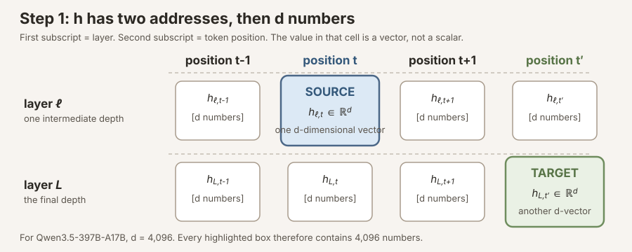

<p class="figure-note">Figure: decode the subscripts first. The first subscript selects a layer; the second selects a token position. Each selected cell contains a full vector in \(\mathbb{R}^d\), not one number.</p>

#### Step 2: choose a causally allowed source-to-target path

In a causal transformer, position \(t\) cannot alter an earlier position \(t-1\). It can alter its own final state and later final states because those later positions can attend to position \(t\). Therefore we only consider targets satisfying

\[
t'\ge t.
\]

Out of that causal cone, choose one target position \(t'\). We are now asking one precise question:

> If I nudge the whole source vector \(h_{\ell,t}\), how does the whole target vector \(h_{L,t'}\) change after the remaining layers run?

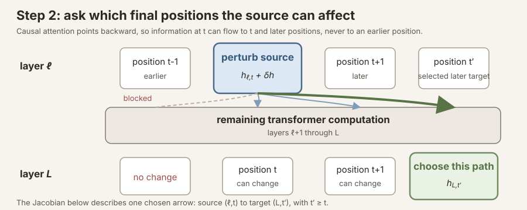

<p class="figure-note">Figure: causality determines which arrows exist. A source at \(t\) may affect final positions \(t'\ge t\). The local Jacobian describes one selected arrow from \((\ell,t)\) to \((L,t')\).</p>

#### Step 3: replace the nonlinear downstream computation by its tangent map

Fix the prompt \(x\), source \((\ell,t)\), and target \((L,t')\). Let

\[
F^{(\ell)}_{x,t',t}:\mathbb{R}^d\rightarrow\mathbb{R}^d
\]

denote the downstream transformer computation along that selected path. On the baseline forward pass,

\[
h_{L,t'}=F^{(\ell)}_{x,t',t}(h_{\ell,t}).
\]

Now add a small vector perturbation \(\delta h\) to the source and run the same downstream computation. The target moves by some \(\Delta h\). Because \(F\) is nonlinear, the exact relationship is complicated. Near the baseline point, however, its derivative gives the best first-order linear approximation:

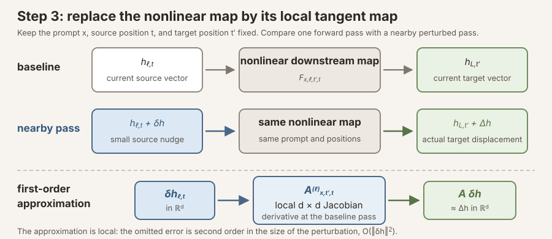

<p class="figure-note">Figure: “linearize” means replace the nonlinear downstream map by its tangent map near one baseline forward pass. It maps a small source displacement \(\delta h_{\ell,t}\) to the first-order target displacement \(A\,\delta h\).</p>

\[
F^{(\ell)}_{x,t',t}(h_{\ell,t}+\delta h)
\;=\;
F^{(\ell)}_{x,t',t}(h_{\ell,t})
\;+\;
A^{(\ell)}_{x,t',t}\,\delta h
\;+\;
O(\lVert\delta h\rVert^2),
\]

The \(d\times d\) Jacobian matrix is

\[
A^{(\ell)}_{x,t',t}
\;=\;
\left.
\frac{\partial F^{(\ell)}_{x,t',t}(h)}
{\partial h}
\right|_{h=h_{\ell,t}}
\;=\;
\frac{\partial h_{L,t'}}{\partial h_{\ell,t}}
\in \mathbb{R}^{d\times d}.
\]

Its element \(A_{ij}\) asks: if coordinate \(j\) of the source vector changes infinitesimally, how does coordinate \(i\) of the target vector respond? One matrix therefore contains all \(d^2\) local coordinate-to-coordinate sensitivities for the selected prompt, source, and target.

A single \(A^{(\ell)}_{x,t',t}\) is highly conditional on the current text and attention pattern. The Jacobian lens keeps the context-general part by averaging these tangent maps:

\[
J_\ell
\;=\;
\mathbb{E}_{x,\;t,\;t'\ge t}
\left[
\frac{\partial h_{L,t'}}{\partial h_{\ell,t}}
\right].
\]

For a finite fitting corpus, `jlens.fit` computes the corresponding empirical mean:

\[
\widehat J_\ell
\;=\;
\frac{1}{M}
\sum_{m=1}^{M}
A^{(\ell)}_{x_m,t'_m,t_m},
\]

where \(m\) indexes the prompt and position-pair samples induced by the library's estimator. The released artifact stores one \(\widehat J_\ell\in\mathbb{R}^{d\times d}\) for each source layer.

#### Monte Carlo here means sample averaging


**Why this is Monte Carlo.** The desired expectation ranges over an effectively infinite distribution of natural-language contexts and all causally reachable source/target position pairs. We cannot evaluate that integral exactly. Instead, we sample passages from a pretraining-like corpus, compute the local Jacobians generated by those passages, and average them. That is ordinary Monte Carlo quadrature. It is not Markov chain Monte Carlo, and it is not a bootstrap.


Before averaging matrices, let us build **one** matrix.

Suppose a toy model has residual width \(d=2\). Its selected source and target vectors each have two coordinates:

\[
h
\;=\;
\begin{bmatrix}
h_1\\
h_2
\end{bmatrix},
\qquad
y
\;=\;
F_x(h)
\;=\;
\begin{bmatrix}
y_1\\
y_2
\end{bmatrix}.
\]

Here \(h\) abbreviates the selected intermediate residual \(h_{\ell,t}\), \(y\) abbreviates the selected final residual \(h_{L,t'}\), and \(F_x\) is the remaining nonlinear transformer computation for one fixed prompt \(x\) and one fixed position pair \((t,t')\).

The Jacobian for this one context is

\[
A_x
\;=\;
\frac{\partial y}{\partial h}
\;=\;
\left[
\begin{matrix}
\dfrac{\partial y_1}{\partial h_1}
&
\dfrac{\partial y_1}{\partial h_2}
\\[1.1em]
\dfrac{\partial y_2}{\partial h_1}
&
\dfrac{\partial y_2}{\partial h_2}
\end{matrix}
\right].
\]

So the four entries do not appear by fiat. They are four local derivatives:

- **Column 1** asks what happens to both target coordinates when we nudge source coordinate \(h_1\).
- **Column 2** asks what happens to both target coordinates when we nudge source coordinate \(h_2\).
- **Row 1** is the gradient of target coordinate \(y_1\) with respect to the whole source vector.
- **Row 2** is the gradient of target coordinate \(y_2\) with respect to the whole source vector.

Operationally, one forward pass produces the baseline \(h\) and \(y\) and retains the computation graph. Backpropagating from \(y_1\) gives the first row; backpropagating from \(y_2\) gives the second. For the real model, there are 4,096 target coordinates rather than two, and `jlens.fit` obtains those rows in batches.


**How to read a numerical entry.** If \((A_x)_{12}=0.1\), then near this particular forward pass, increasing source coordinate \(h_2\) by a small amount \(\varepsilon\) changes target coordinate \(y_1\) by approximately \(0.1\varepsilon\), holding the rest of the source perturbation at zero. It is a local sensitivity, not an activation, probability, or correlation.


Now suppose the first sampled context produces

\[
A_1
\;=\;
\left[
\begin{matrix}
1.2 & \quad 0.1 \\[0.6em]
0.0 & 0.8
\end{matrix}
\right].
\]

This says, for example,

\[
A_1
\begin{bmatrix}
\varepsilon\\
0
\end{bmatrix}
\;=\;
\begin{bmatrix}
1.2\varepsilon\\
0
\end{bmatrix},
\qquad
A_1
\begin{bmatrix}
0\\
\varepsilon
\end{bmatrix}
\;=\;
\begin{bmatrix}
0.1\varepsilon\\
0.8\varepsilon
\end{bmatrix}.
\]

The first basis nudge affects only \(y_1\) to first order in this toy map; the second affects both \(y_1\) and \(y_2\). These numbers are invented to make the arithmetic visible. They are not measurements from Qwen.

Why does the next prompt produce a different matrix? Because a transformer is nonlinear and context-dependent. Changing the text changes the hidden states, attention weights, expert routing, nonlinear gates, and therefore the derivative evaluated at that operating point. Putting the first matrix beside two more sampled contexts gives:

\[
\Large
\begin{aligned}
A_1
&=
\left[
\begin{matrix}
1.2 & \quad 0.1 \\[0.6em]
0.0 & 0.8
\end{matrix}
\right],
\\[1em]
A_2
&=
\left[
\begin{matrix}
0.9 & \quad 0.2 \\[0.6em]
-0.1 & 1.1
\end{matrix}
\right],
\\[1em]
A_3
&=
\left[
\begin{matrix}
1.1 & \quad -0.1 \\[0.6em]
0.2 & 0.9
\end{matrix}
\right].
\end{aligned}
\]

The Monte Carlo estimate is just their elementwise mean:

\[
\Large
\begin{aligned}
\widehat{J}
&=
\frac{A_1+A_2+A_3}{3}\\[0.75em]
&=
\left[
\begin{matrix}
1.067 & \quad 0.067 \\[0.6em]
0.033 & 0.933
\end{matrix}
\right].
\end{aligned}
\]

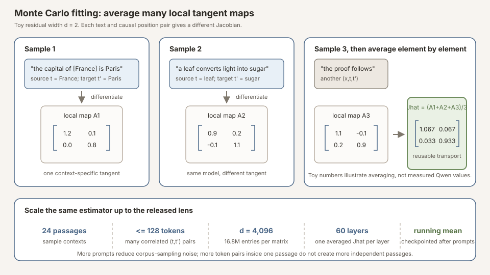

<p class="figure-note">Figure: a toy \(d=2\) Monte Carlo fit. Each sampled context and causal position pair gives a different local Jacobian. Averaging them element by element estimates the context-general transport. The matrices are illustrative, not Qwen measurements. The bottom strip shows the dimensions of the released fit.</p>

It is useful to group all position-pair contributions from passage \(x_n\) into one prompt-level estimate \(\widehat J_\ell^{(x_n)}\). The running mean then updates as

\[
\widehat{J}_{\ell,n+1}
\;=\;
\frac{n}{n+1}\widehat J_{\ell,n}
+
\frac{1}{n+1}\widehat J_\ell^{(x_{n+1})}.
\]

That is why the fit can be checkpointed and warm-started without revisiting earlier passages: the checkpoint retains the accumulated Jacobian sum and the number of completed prompts.

If passages were independent draws from exactly the desired fit distribution, the estimator would be unbiased for that distribution's mean Jacobian. Its elementwise Monte Carlo standard error would decrease asymptotically like

\[
\operatorname{SE}\!\left[(\widehat J_\ell)_{ij}\right]
\approx
\sqrt{\frac{\operatorname{Var}\!\left[(\widehat J_\ell^{(x)})_{ij}\right]}{N_{\mathrm{prompt}}}}
\;\propto\;
N_{\mathrm{prompt}}^{-1/2}.
\]

The effective independent unit is much closer to a **passage** than to an individual position pair. Position pairs from the same passage share tokens, attention patterns, and the same forward graph, so counting every \((t,t')\) as independent would badly overstate precision. Doubling the number of prompts therefore reduces Monte Carlo error by roughly \(1/\sqrt{2}\), not by half. Our \(n=24\) artifact is a valid finite-corpus estimator, but it is not an asymptotic one; convergence across added prompts remains an empirical question.


**“Fit” does not mean training a probe.** There is no learned classifier, label set, cross-entropy objective, or optimizer here. The base model is frozen. Fitting means running text through the model, differentiating final residual coordinates with respect to intermediate residual coordinates, and accumulating a Monte Carlo average of those Jacobians.


### From a tangent map to token scores

Let \(W_U\in\mathbb{R}^{V\times d}\) be the model's unembedding matrix, where \(V\) is the vocabulary size, and let \(N_f\) denote the model's final output normalization. The readout at layer \(\ell\) is

\[
z_\ell(h_{\ell,t})
\;=\;
W_U\,N_f\!\left(\widehat J_\ell h_{\ell,t}\right)
\in\mathbb{R}^{V},
\qquad
p_\ell
\;=\;
\operatorname{softmax}(z_\ell).
\]

The explorer sorts \(z_\ell\). Softmax is monotone in each logit relative to the others, so it changes probabilities but not rank order.

Ignoring the common RMS normalization denominator for a moment, let \(u_w^\top\) be row \(w\) of the effective unembedding (including the learned output-normalization gain). Then

\[
z_{\ell,w}
\;\propto\;
u_w^\top \widehat J_\ell h_{\ell,t}
\;=\;
\left(\widehat J_\ell^\top u_w\right)^\top h_{\ell,t}.
\]

Thus the layer-\(\ell\) lens vector associated with vocabulary token \(w\) is

\[
v_{\ell,w}
\;=\;
\widehat J_\ell^\top u_w.
\]

The token score is an inner product between the current residual state and a token-indexed direction in that layer's coordinates. Equivalently, the rows of \(W_U\widehat J_\ell\) are the covectors that score the residual stream. This transpose distinction matters: \(\widehat J_\ell\) transports an activation forward, while \(\widehat J_\ell^\top\) pulls an output-token direction back to layer \(\ell\).

The identity or logit-lens control sets \(\widehat J_\ell=I\):

\[
z_\ell^{\mathrm{identity}}
\;=\;
W_U\,N_f(h_{\ell,t}).
\]

That assumes residual coordinates are already aligned across depth. Residual connections make this approximation increasingly plausible late in the network. The fitted Jacobian is the first-order correction for the rotation, scaling, and mixing introduced by the remaining layers.

### How the full matrix is computed

Materializing a dense \(d\times d\) Jacobian naively is expensive. Reverse-mode autodiff naturally computes a vector-Jacobian product (VJP). For an output-space test vector \(q\in\mathbb{R}^d\),

\[
q^\top A^{(\ell)}_{x,t',t}
\;=\;
\frac{\partial\left(q^\top h_{L,t'}\right)}
{\partial h_{\ell,t}}.
\]

Choosing \(q=e_i\), the \(i\)-th standard basis vector, returns row \(i\) of the Jacobian. Batched basis vectors recover several rows per retained-graph backward traversal. If `dim_batch = b`, the traversal count is approximately

\[
N_{\mathrm{prompt}}
\left\lceil\frac{d}{b}\right\rceil.
\]

One backward traversal exposes gradients at every hooked source layer, so fitting all 60 layer matrices does **not** multiply that count by 60. It does increase activation retention, communication, accumulation, and storage costs.

For this release:

| Quantity | Qwen3.5-397B-A17B fit |
|---|---:|
| Residual width \(d\) | 4,096 |
| Source layers | 60 |
| Matrix entries per layer \(d^2\) | 16,777,216 |
| Fit prompts | 24 WikiText-103 passages |
| Maximum sequence length | 128 tokens |
| Jacobian row batch \(b\) | 16 |
| Retained-graph backward traversals | \(24\times(4096/16)=6{,}144\) |
| Dense Jacobian storage | about 4.0 GB in fp32 across 60 layers; about 2.0 GB in fp16 |

The 807 GB base model was loaded in bf16 across 8×H200 GPUs. The published lens is tiny relative to the model because it stores only the 60 dense \(4096\times4096\) transport matrices and metadata, not a copy of the model.

#### What “eager attention and pure-GPU `device_map` sharding” means

That phrase compresses several engineering choices. They affect **how we computed the same Jacobian estimator**, not the mathematical definition of the estimator.

**First, why eight GPUs?** A bf16 parameter normally occupies two bytes. Roughly \(397\) billion parameters therefore require about \(794\) GB before accounting for small amounts of metadata and non-parameter state; the loaded checkpoint was about \(807\) GB. One H200 has 141 GB of memory. Eight provide about 1,128 GB in aggregate:

\[
\begin{aligned}
&807\ \text{GB of weights} \\
&+\ \text{activations} \\
&+\ \text{retained autograd graph} \\
&+\ \text{Jacobians and temporary buffers} \\
&<\ 8\times 141\ \text{GB}.
\end{aligned}
\]

The aggregate capacity is sufficient, but no individual GPU can hold the model. The model must be partitioned.

**What `device_map` does.** Hugging Face/Accelerate's `device_map` assigns successive model modules, primarily transformer blocks, to different GPUs. Conceptually:

```text
GPU 0: embedding + early blocks
       activations cross a GPU boundary
GPU 1: next blocks
       activations cross a GPU boundary
...
GPU 7: late blocks + output modules
```

During the forward pass, the residual stream moves through those GPU-resident blocks in order. The autograd graph records operations and cross-device transfers across the entire chain. A VJP then walks the same chain backward in reverse, collecting derivatives at every hooked source layer.

This is **layer/model sharding**, not tensor parallelism:

| Strategy | Where one layer's weights live | Main benefit | Main cost |
|---|---|---|---|
| `device_map` layer sharding | Mostly on one GPU | Makes a model larger than one GPU fit | GPUs execute the layer sequence largely as a pipeline wave; little single-request compute speed-up |
| Tensor parallelism | Each matrix/expert split across many GPUs | GPUs compute one layer together | Every layer needs collective communication; retained activations and gathered outputs can be expensive |
| CPU/NVMe offload | Some weights outside GPU memory | Fits beyond aggregate GPU RAM | Repeated host/device transfers make thousands of backwards extremely slow and can break retained-graph assumptions |

“**Pure-GPU**” means every model weight remained on one of the eight GPUs. Nothing was offloaded to CPU RAM or disk. That matters because this fit does not perform one ordinary forward/backward pair. It retains a graph and traverses it 256 times per prompt. Moving hundreds of gigabytes through PCIe for each repeated backward would dominate the run. Accelerate's CPU-offload hooks also proved incompatible with this retained-graph, repeated-backward pattern in our tests.

**Why cap placement at 110 GiB per GPU?** An unconstrained automatic layout placed about 133 GB of weights on one 141 GB H200. That left almost no room for activations, gradients produced by VJPs, communication buffers, allocator fragmentation, or the retained graph. We therefore passed a 110 GiB per-GPU memory cap. The unused \(\sim31\) GiB per device was not wasted; it was working space for autodiff.

**What “eager attention” means.** Transformers can evaluate attention with several interchangeable implementations:

- **eager**: explicit PyTorch operations;
- **SDPA**: PyTorch's fused scaled-dot-product-attention dispatcher;
- **Flash Attention**: highly fused GPU kernels designed for throughput and memory
  efficiency ([Dao et al., 2022](#ref-dao-2022)).

For ordinary inference or a conventional one-pass training backward, fused SDPA/Flash kernels are usually preferable. This workload is unusual: one forward graph is retained and reused for many backwards, while the graph crosses several devices and includes a large MoE model. In our validation, optimized attention backward kernels could hit device-side indexing failures under that exact combination. `attn_implementation="eager"` uses the less fused, more explicit PyTorch path. It is slower per attention operation, but its autograd graph was stable under repeated VJPs and multi-GPU module sharding. This is a workload-specific compatibility choice, not a claim that eager attention is generally better.

**Why `dim_batch=16`?** Each backward traversal can recover several Jacobian rows at once by batching 16 output basis vectors. A larger batch reduces the number of traversals but enlarges the retained activations and temporary gradient tensors:

\[
\text{traversals per prompt}
\;=\;
\frac{4096}{\texttt{dim\_batch}}.
\]

At `dim_batch=32`, the retained graph exceeded the available memory headroom. At `dim_batch=16`, it fit:

\[
\frac{4096}{16}=256
\quad\text{backward traversals per prompt}.
\]

That configuration ran stably at about 2.35 seconds per traversal, or roughly 10 minutes per prompt.

**Why not tensor parallelism?** We built and validated a tensor-parallel plan that split the MoE experts and dense projections across all eight GPUs. Mathematically it was correct. Operationally, the retained activation footprint forced `dim_batch` down to 4. At that small row batch, collective communication and distributed-kernel overhead outweighed the parallel compute benefit; prompt 1 had not completed after 30 minutes, triggering our pre-agreed kill criterion. The simpler layer-sharded path could use `dim_batch=16` and won on end-to-end throughput.


**The systems takeaway.** `device_map` solved the weight-capacity problem. The 110 GiB cap reserved autograd headroom. Eager attention supplied a stable reusable backward graph. `dim_batch=16` used the remaining memory to amortize 16 Jacobian rows per traversal. None of these choices changes \(J_\ell=\mathbb{E}[\partial h_L/\partial h_\ell]\); they determine whether estimating it on an 807 GB model finishes reliably and affordably.


### What the average does, and does not, mean

The average is the scientific bet. It suppresses prompt-specific tangent structure and retains directions that tend to influence present or later verbal outputs across a pretraining-like text distribution. But several facts follow:

1. **It is distribution-dependent.** Changing the fit corpus changes the expectation being estimated.
2. **It is a mean tangent map, not the tangent map at a mean input.** In general,
   \[
   \mathbb{E}[A_x] \neq A_{\mathbb{E}[x]},
   \qquad
   \mathbb{E}[A_x]h_x \neq \mathbb{E}[A_xh_x],
   \]
   especially when local Jacobians and activations are correlated.
3. **Applying \(\widehat J_\ell h_{\ell,t}\) is a directional readout, not a full Taylor reconstruction.** A strict local Taylor approximation would include a context-dependent intercept and act on \(\delta h\). The lens deliberately discards that intercept and reuses the averaged linear part as a context-general transport.
4. **The derivative is local.** Large finite interventions can leave the regime where the first-order approximation is accurate.
5. **The estimator has sampling error.** Our release uses \(n=24\), not the paper's nominal thousand-prompt corpus. Warm-starting adds Jacobian sums from more prompts; it does not retrain the model.

The **J-space** is an additional geometric construction, not another matrix learned during fitting. The token directions \(\{v_{\ell,w}\}_{w=1}^V\) are an overcomplete frame because \(V>d\). Anthropic defines J-space through sparse nonnegative combinations of a small number of these token-indexed directions. The word-map explorer in this post shows ranked lens tokens; it does not solve the paper's sparse-decomposition problem, so “top J-lens tokens” and “a formal J-space decomposition” should not be treated as synonyms.


**Working definition.** A Jacobian lens is a fitted linear **transport** from layer \(\ell\)'s residual stream to final-layer coordinates, averaged over a corpus. A *readout* is the vocabulary ranking you get by applying that transport at a chosen position. A *causal claim* requires a separate intervention experiment. An **identity** map (logit lens) and a scale-matched **random-J** transport are the minimal controls that ask whether you needed the fitted lens at all. (See the glossary above if any of those words are new.)


### Two properties that shape the trial

1. **The lens is estimated.** It is an average over a fit corpus, so a release check must use prompts *outside* that corpus and must hash the shipped file.
2. **The lens is not optimized for next-token fidelity.** It is constructed from
   context-averaged sensitivity to present and future verbal outputs, not trained to
   match the model's immediate next-token distribution. Anthropic's appendix A.6 reports
   that the mid-layer J-lens can be a poor next-token predictor and treats that mismatch
   as useful rather than defective. When a concept *is* the next token, identity may
   already expose it. The distinctive target is **intermediate** content: concepts used
   before they are said.

That second point is why this trial's headline act is the two-hop bridge, not the riddle.

---

## Why a Fancy File Still Needs Impostor Checks

### In plain language: what this note actually checks

Imagine you download a file that claims to be a “Jacobian lens.” How do you know it is doing real work, and not just looking impressive on cherry-picked prompts?

A simple test: run the **same** prompts through **three** ways of turning a mid-layer hidden state into a ranked list of vocabulary words ,

1. **the fitted lens** (the file we published);
2. **identity / “logit lens”**, pretend the mid-layer vector is already in final-layer coordinates (no fitted map at all); and
3. **random-J**, a scrambled map with the same size/scale as the real lens (a null that should not systematically find the right concepts).

If (2) or (3) can reproduce what (1) finds on a pre-registered task, you did not need the fancy file. If they cannot, you have **artifact discrimination**: evidence that this particular fitted transport is doing something the cheap impostors do not, on *this* protocol. That is still not proof that no impostor could ever pass any check, and it is not a causal steering result.

### Claim ladder


flowchart TD
  A["Published lens artifact<br/>+ model from HF"] --> B["Integrity hash<br/>byte-identical to fit machine"]
  B --> C["Pre-registered prompts<br/>+ deterministic scoring"]
  C --> D["Hidden-bridge readout<br/>vs identity + random-J"]
  D --> F["Bounded claim:<br/>nontrivial on this audit"]
  C -.->|"act 1 failed gate"| X["Dropped before 397B<br/>(reported)"]


<p class="figure-note">Figure: how strong a claim you can make depends on how far you climb. This note covers artifact discrimination through a narrow readout audit.</p>

With the tool defined, what remains is provenance, the pre-registered trial, and the receipts, including the act that failed its gate and was dropped.

## Where This Artifact Comes From

### What “A17B” means

In the Hugging Face id [`Qwen/Qwen3.5-397B-A17B`](https://huggingface.co/Qwen/Qwen3.5-397B-A17B/tree/8472618112abcbd45acbcdc58436aff4233c23f7),
the two numbers answer different questions:

| Name fragment | Plain Language | Card quantity |
|---|---|---|
| **397B** | How many parameters are stored in the checkpoint | ~397 billion total |
| **A17B** | How many parameters typically **fire** for one token | ~17 billion **activated** |

So **A** is for **active**, not “version A.” This is a sparse
**mixture-of-experts (MoE)** language model: most of the 397B sit in a large
menu of specialists; each token only pays for a small routed subset. The
download is still frontier-scale (~807 GB bf16 on disk/VRAM layout), but
forward compute is closer to a ~17B dense model than to a dense 397B.

Architecturally (model card, revision `8472618`):

- **60** layers, residual width \(d=4096\), vocabulary padded to 248,320.
- Hybrid stack repeated **15** times:
  \(3\times(\text{Gated DeltaNet}\to\text{MoE})\) then
  \(1\times(\text{Gated Attention}\to\text{MoE})\).
- **Gated DeltaNet** = efficient linear-attention-style blocks; **Gated
  Attention** = ordinary multi-head attention (32 query heads, 2 KV heads).
- Each **MoE** block: **512** experts; per token **10 routed + 1 shared**
  (11 experts compute; the rest idle).
- Multimodal: a vision encoder is part of the release; **this note is
  text-only** and does not audit image/video paths.

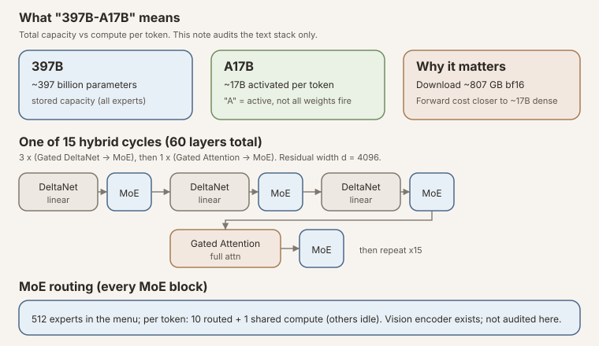

<p class="figure-note">Figure: naming vs compute. “Largest public J-lens base model” in this note refers to the 397B-total checkpoint we fitted against, not to 17B active FLOPs, and not to lens-file size.</p>

**Qwen3.5-397B-A17B is a 397B-total, 17B-active open-weight multimodal MoE.**
Those are model-card quantities, not a qualitative use of “frontier.” Anthropic's
[J-space paper](https://transformer-circuits.pub/2026/workspace/index.html)
([Lindsey et al., 2026](#ref-lindsey-2026)) introduced the method and reports that
mid-layer J-space contents in the Claude models they studied are reportable, steerable,
and load-bearing. Those are **their findings on their models**, not effects established
by this readout-only Qwen release. Anthropic released the
[code](https://github.com/anthropics/jacobian-lens) under Apache-2.0; Neuronpedia
published a broad collection of pre-fitted open-weight lenses whose pinned July 10
snapshot tops out at a 70B base model. We
[audited J-space structure across 35 open models](https://github.com/praxagent/jacobian-lens-research-202607a/tree/fa66e53a1eacb99b2d4a92c966c5cb4dd992bd65/blog/jspace-audit)
and, as part of that program, fit and are releasing this lens on
**Qwen3.5-397B-A17B**.

The contribution is the **artifact** (and the receipts). The country-bridge demo below is how we checked that the file is a real lens, not the reason the file exists.

| Provenance field | Value here |
|---|---|
| Lens artifact | [`praxagent-org/jacobian-lens-qwen3.5-397b-a17b@2dffc0a`](https://huggingface.co/praxagent-org/jacobian-lens-qwen3.5-397b-a17b/tree/2dffc0a058fd072a6a155a4c6005bc26aff14d8c) |
| Base model | [`Qwen/Qwen3.5-397B-A17B@8472618`](https://huggingface.co/Qwen/Qwen3.5-397B-A17B/tree/8472618112abcbd45acbcdc58436aff4233c23f7) (397B total / 17B active; multimodal MoE; text-only audit) |
| Fit corpus | [WikiText-103](#ref-merity-2016), `max_seq_len` 128, **n=24** prompts (this release; band statistic already converged by n≈16 on smaller Qwen). **Warm-start toward n≈50 underway**; further extension documented below |
| Fitting code | Anthropic's **`jlens.fit`** via our pinned wrapper [`fit_at_scale.py@fa66e53`](https://github.com/praxagent/jacobian-lens-research-202607a/blob/fa66e53a1eacb99b2d4a92c966c5cb4dd992bd65/projects/jacobian-lens-and-identifiability/experiments/fit_our_own/fit_at_scale.py). We did **not** ship Neuronpedia's early-stop / `mean_rel_change` logger, so this release has no measured matrix-convergence curve; extensions will log it |
| Exact fit run | 8×H200 (~$35/hr), bf16, `device_map` + eager attention, ~10 min/prompt → n=24 ≈ 4 h. Command and TP record: pinned [`results.md`](https://github.com/praxagent/jacobian-lens-research-202607a/blob/fa66e53a1eacb99b2d4a92c966c5cb4dd992bd65/projects/jacobian-lens-and-identifiability/experiments/fit_our_own/results.md) |
| Neuronpedia contrast | Pipeline *requests* `n_prompts: 1000` but **early-stops**. Comparison lens **qwen3.5-27b** fitted **672** at `stop_at_delta: 0.002` ([pinned config](https://huggingface.co/neuronpedia/jacobian-lens/blob/a4114d7752d11eb546e6cf372213d7e75526d3a1/qwen3.5-27b/jlens/Salesforce-wikitext/config.yaml)); Llama-3.3-70B fitted **125** at 0.012 ([pinned config](https://huggingface.co/neuronpedia/jacobian-lens/blob/a4114d7752d11eb546e6cf372213d7e75526d3a1/llama3.3-70b-it/jlens/Salesforce-wikitext/config.yaml)). Honest contrast for rates: **n=24 vs n=672** |
| Lens sha256 (downloaded) | `668c3bf17305b0d52495cb7ba589a1c1173301b1d13c3c6ad84e58245dc99e97` (byte-identical to fit-machine original) |
| Pre-registration commit | [`8102510`](https://github.com/praxagent/jacobian-lens-research-202607a/commit/810251006bae0d322412bbd68ed85eb4cb1d6514) (prompts, scoring, gates, before 397B) |
| Gate model | qwen3.5-27b (same family; Neuronpedia lens) |
| Gate commit | [`4f44976`](https://github.com/praxagent/jacobian-lens-research-202607a/commit/4f4497682108eff2d6bb6e6b24c0ff17d2de50d3) |
| Result commit | [`d9fc376`](https://github.com/praxagent/jacobian-lens-research-202607a/commit/d9fc3763e2eb30f1ce1221b16027247afcb0fdfe) |
| Isolation | Fresh 8×H200 pod; model + lens downloaded from HF; no fit-machine reuse |
| Independence note | Pod-isolated and hash-checked, **not** an external-lab replication. Same authors wrote the prompts, fit the lens, and ran the demo |

You can reproduce the **stronger** version of every headline *readout* number on
**qwen3.5-27b** (one A100, about a dollar). The author-run 397B artifact re-check needs a
multi-GPU machine; warm-start and re-check commands are at the end.

---

## The Audit: What Identity and Random Transports Can Rule Out

Before design details, here is the experiment stated plainly:


**The experiment in one paragraph.** On a fresh rented machine, download Qwen3.5-397B from Qwen's HuggingFace repo and our published lens from ours. Hash the lens; it must match the fit machine's original. Run readout acts through identical code for three transports (fitted J-lens, identity/logit-lens, random-J): (1) riddle reportability, (2) hidden-bridge readout on two-hop questions whose bridge never appears in input or output. Ship an act to 397B only if it passed pre-registered gates on qwen3.5-27b. Score deterministically; write every item (including failures) to a JSON receipt.


### Validity rules

**Isolation (pod, not lab).** A fresh 8×H200 machine downloads the model and the lens and runs one script. The script hashes the lens it downloaded: `668c3bf1…99e97`, byte-identical to the fit machine's original. That rules out a corrupted local copy. It does **not** make this an independent external replication.

**Pre-registration (of the 397B ship/drop decision).** The prompt sets, the deterministic scoring rule, and the ship/drop gates were committed to git (`8102510`) *before* the 27B gate validation completed, and that gate ran *before* the 397B was touched. Honest caveat: the same capital-of-country template had already shown a weak J-vs-control signal on a cheaper mechanics run (qwen3-4b). So 397B is a scale check of a known-working protocol, not a fully blind discovery.

**Controls through the identical code path.** Every readout is also run with two impostor transports (same prompts, same layers, same positions, same code):

- **Identity / logit lens**, skip the fitted \(J\). If this already finds the bridge entity, you did not need our file.
- **Random-J**, a scrambled map with the same scale. If this looks as good as the fitted lens, the result is noise dressed up as structure.

The fitted lens has to beat both. That is the whole discrimination claim in one sentence.

**Scoring rule (read it before the rates).** A top-20 "hit" means the target appears in the top-20 at **at least one** layer in the mid-band (~20 layers); "best rank" is the **minimum** rank across those layers. That can inflate absolute rates relative to a single pre-chosen layer. The discriminating claim is against controls scored the same way, and random-J still lands in the thousands.

**Leakage guards.** Target words must be absent from their prompts as **exact case-insensitive substrings** (a hard check, not a Python `assert`, which vanishes under `-O`). That caught a real authoring bug ("lemon" hiding inside "lemonade"). For the hidden-entity act, the model's greedy continuation is checked the same way: in **20 of 20** items the bridge string never appeared in the first 24 generated tokens. This is **not** paraphrase coverage, aliases like "Nippon" for Japan would not trip the guard.

### The readout acts

| Act | Question | Gate on qwen3.5-27b | 397B verdict |
|---|---|---|---|
| 1, Secret thought | Does the band readout surface a riddle's one-word answer? | jlens ≥ 0.5 top-20 **and** ≥ 2× logit-lens | **Dropped** (tied logit-lens at 0.31) |
| 2, Hidden step | Does the band surface a bridge entity absent from input *and* output? | clean hit ≥ 0.4 **and** ≥ 2× logit **and** random-J ≤ 0.05 | **Shipped (this note)** |


flowchart TB
  P["prompts.json<br/>frozen in 8102510"] --> G["Gate on qwen3.5-27b"]
  G -->|"act 1 FAIL"| D["Drop + report"]
  G -->|"act 2 PASS"| R["Fresh 8×H200<br/>download model + lens"]
  R --> H["Hash check<br/>668c3bf1…99e97"]
  H --> A2["Act 2: bridge readout<br/>+ identity + random-J"]
  A2 --> J["JSON receipt<br/>every item"]


<p class="figure-note">Figure: the trial pipeline for this note. Act 2 is the headline; act 1 is reported as dropped.</p>

---

## What We Found

All readout numbers below are for the **release lens fitted at n=24** WikiText prompts (hash `668c3bf1…99e97`). Warm-start toward n≈50 is underway; those runs will be reported separately against this baseline, this table is not discarded.

### Reading the hidden step (act 2), lens n=24

Twenty two-hop questions on **one template family** (almost all "capital of the country where X…") whose bridge entity appears in neither input nor output. Scoring: top-20 at **any** mid-band layer counts as a hit; best-rank is the **min** over the band (same rule for all three readouts).

**Inferential hierarchy.** The pre-registration froze the prompts, controls, any-of-band
top-20 scoring rule, and 27B ship gate. It did **not** pre-specify a Wilcoxon or sign-test
primary endpoint. The exact paired tests below are post-run summaries of the fully
reported item matrix; the span analyses later are exploratory. Act-2 v2 will
pre-register a fixed-layer paired-rank primary before any new 397B evaluation.


**Statistical terms used below (before we use them).**

For each country \(i\), the fitted lens and a control see the **same prompt**. Let \(r_i^J\) be the J-lens best-rank and \(r_i^C\) the control best-rank. Lower rank is better, so define the paired difference

\[
d_i=r_i^C-r_i^J.
\]

A positive \(d_i\) means the J-lens beat that control on item \(i\).

- **Paired comparison:** compare \(r_i^J\) and \(r_i^C\) within the same country. This controls for item difficulty: Japan is compared with Japan, Kenya with Kenya, and so on.
- **Unpaired comparison:** compare two aggregate groups as though their observations were independent. The hit-rate comparison below does this and therefore discards the useful country-by-country matching.
- **Sign test:** count only the signs of the \(d_i\)'s. Under its null, a non-tied item is equally likely to favor either method, so the number of J-lens wins follows a \(\operatorname{Binomial}(n,0.5)\) distribution. It is robust but throws away *how large* each rank gap is.
- **Wilcoxon signed-rank test:** order the nonzero \(|d_i|\)'s from smallest to largest, attach each difference's sign, and compare the positive and negative rank sums. It uses both direction and ordered magnitude without assuming normally distributed rank differences. Its standard null is that the paired-difference distribution is symmetric around zero; the item pairs should be independent ([Wilcoxon, 1945](#ref-wilcoxon-1945)).
- **Exact McNemar test:** for paired hit/miss outcomes, discard pairs where both methods agree and test whether the two kinds of discordance (J-only hit vs control-only hit) are equally likely. This preserves the item matching that unpaired Fisher discards.
- **Fisher's exact test:** for hit rates, form a \(2\times2\) table of method by hit/miss (here, \(6/14\) vs \(1/19\)) and calculate the exact tail probability conditional on the margins. The one-sided version asks whether the J-lens hit probability is higher. Used this way, it does not exploit pairing.
- **\(p\)-value:** assuming the null model and the test's assumptions, the probability of obtaining a test statistic at least as unfavorable to the null as the observed one. It is **not** the probability that the null is true, the probability the result will replicate, or an effect size.
- **Wilson 95% confidence interval:** an interval for a binomial hit probability with better small-sample behavior than the simple estimate \(\hat p\pm1.96\sqrt{\hat p(1-\hat p)/n}\). “95%” describes the long-run coverage of the interval procedure, not a 95% posterior probability that this one fixed interval contains the parameter ([Wilson, 1927](#ref-wilson-1927)).
- **Marginal:** informal language for evidence near a conventional cutoff such as 0.05. It means fragile/borderline evidence, not “almost proven.”

With only 20 items, the hit-rate intervals are necessarily wide. The paired rank tests answer the sharper question this design was built for: on the same items, does the fitted transport systematically rank the hidden bridge above the controls?


| readout (lens **n=24**; same code, same layers) | top-20 hit (Wilson 95% CI) | median best-rank (of 248,320) |
|---|---|---|
| **Jacobian lens (ours, n=24)** | **0.30** (6/20; **0.15–0.52**) | **43** |
| logit-lens (identity) | 0.05 (1/20; **0.01–0.24**) | 620 |
| random-J | 0.00 (0/20; **0.00–0.16**) | 7,121 |


**How to read these rates.** The unpaired hit-rate contrast (6/20 vs 1/20) is
**marginal**: Fisher exact one-sided \(p=0.0457\) (two-sided \(p=0.0915\)).
The paired binary table has 5 J-only hits, 0 identity-only hits, 1 both-hit, and 14
neither-hit; exact two-sided McNemar \(p=0.0625\). The rank data retain much more
information: J-lens beats identity on **18/20** items (exact two-sided sign test
\(p=4.02\times10^{-4}\); exact two-sided Wilcoxon signed-rank
\(p=9.54\times10^{-6}\)) and beats random-J on **20/20** (both exact two-sided tests
\(p=1.91\times10^{-6}\)). These tests summarize the same item matrix after the run; they
were not named as primary tests in the pre-registration. Leak guard: **0/20**
continuations mentioned the bridge. Absolute hit rates use the preregistered any-of-band
rule on one template family. Recompute every value from the
[`statistics receipt`](receipts/act2_statistics.json) and
[`script`](tools/recompute_act2_statistics.py).


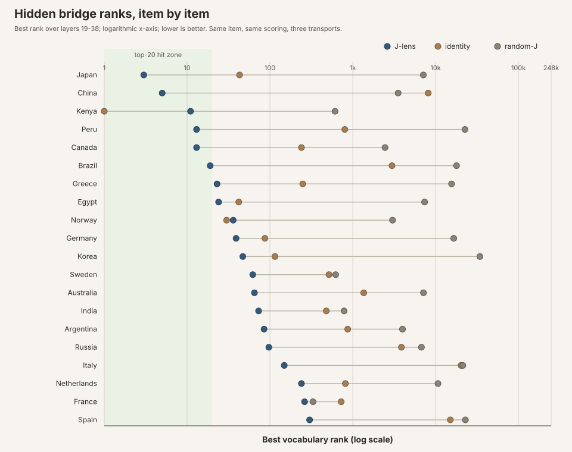

<p class="figure-note">Figure: the paired evidence, item by item. Each horizontal line is one country prompt; dots show its best rank under J-lens, identity, and random-J on the same logarithmic scale. The shaded region marks top-20 hits. The figure is generated from <a href="receipts/act2_statistics.json"><code>act2_statistics.json</code></a> by <a href="tools/export_act2_paired_ranks.py"><code>export_act2_paired_ranks.py</code></a>.</p>

Aggregates hide a wide per-country spread, so here is every item under the **n=24** lens, sorted by J-lens best-rank:

| bridge | J-lens rank | logit-lens | random-J | J top-20? | J beats logit? | continuation (bridge absent) |
|---|---:|---:|---:|:---:|:---:|---|
| **Japan** | **3** | 43 | 7,111 | yes | yes | Tokyo… |
| **China** | **5** | 8,153 | 3,528 | yes | yes | Beijing… |
| Kenya | 11 | **1** | 611 | yes | **no** | Nairobi… |
| Peru | 13 | 802 | 22,598 | yes | yes | (MC: Lima…) |
| Canada | 13 | 240 | 2,453 | yes | yes | Ottawa… |
| Brazil | 19 | 2,974 | 17,890 | yes | yes | Brasilia… |
| Greece | 23 | 249 | 15,606 | no | yes | Athens… |
| Egypt | 24 | 42 | 7,366 | no | yes | Cairo… |
| Norway | 36 | **30** | 3,021 | no | **no** | Oslo… |
| Germany | 39 | 87 | 16,543 | no | yes | (MC: Berlin…) |
| Korea | 47 | 115 | 34,227 | no | yes | Seoul… |
| Sweden | 62 | 516 | 621 | no | yes | Stockholm… |
| Australia | 65 | 1,357 | 7,131 | no | yes | Canberra… |
| India | 73 | 479 | 786 | no | yes | New Delhi… |
| Argentina | 85 | 869 | 3,984 | no | yes | (MC…) |
| Russia | 97 | 3,866 | 6,750 | no | yes | Moscow… |
| Italy | 149 | 20,307 | 21,343 | no | yes | Rome… |
| Netherlands | 240 | 815 | 10,689 | no | yes | Amsterdam… |
| France | 262 | 725 | 331 | no | yes | Paris… |
| Spain | 301 | 15,065 | 22,902 | no | yes | Flamenco… |


**Best discriminating showcase (China.** *"The capital of the country that built the Great Wall is"* → **" Beijing…"**) *China* nowhere in input or output; J-lens **#5**; identity **#8,153**; random-J in the thousands.



**Honest counterexample (Kenya.** *"…home to the Maasai Mara reserve is"* → **" Nairobi…"**) *Kenya* absent from input/output, and the J-lens does rank it **#11**, but identity ranks it **#1**. This is the *only* top-20 hit where the fitted lens is not doing work beyond the logit-lens. Norway is the other paired loss (J #36 vs logit #30), without a top-20 hit.



**Is it just “big / famous countries work better”?** We checked. Spearman correlation of J-lens best-rank with nominal GDP is ≈ **0.04**, with population ≈ **−0.13**, essentially none. Median J-rank by a coarse size tier is even backwards for the “dominance” story: small-tier countries (Kenya, Peru, Greece, Norway, Sweden) median **23**; mid **65**; large **68**; mega (China, India) **39**. Peru (#13) is a clean hit; France (#262) and Spain (#301) are weak despite being large, familiar European states. Whatever drives the spread, it is **not** a simple “more dominant country → better readout” rule on this set.


Buckets worth remembering:

- **Strong J hits that beat identity:** Japan, China, Peru, Canada, Brazil
- **Hit where identity wins:** Kenya
- **Near-misses (rank ≤ 50, no top-20):** Greece, Egypt, Norway, Germany, Korea
- **Weak (rank > 100):** Italy, Netherlands, France, Spain

### What this finding illustrates

Under this pre-registered protocol, identity and random-J do not reproduce the fitted
lens's bridge-readout pattern on a fresh machine that only saw public artifacts. The
honest summary is: **hit-rate contrast is marginal; post-run exact paired-rank tests
separate the lens from both controls at \(p<10^{-3}\).** That is the release claim for
*this* note: the published file is a **nontrivial** transport on this template, not a
corrupted download or a vacuous identity map. It is **not** a claim that every bridge is
equally readable, that “bigger countries work better,” that rates at 397B match rates at
27B, that twenty items survey the phenomenon, or that the lens’s directions are
causally load-bearing.

---

## Exploratory readouts (not part of the pre-registered act-2 audit)

Everything from this heading through the explorer is a hot-pod follow-up. These prompts,
lexicons, span searches, and showcase layers were **not** part of the act-2 ship gate.
They are retained because this is a broad educational note and because failures and
position artifacts are instructive, but they must not be pooled with the pre-registered
country-bridge result.

### What “span readout” means

The primary country-bridge table above uses the **last prompt token** as its readout
position. If a tokenized prompt is

\[
x_1,x_2,\ldots,x_T,
\]

then for each band layer \(\ell\), the default path applies the lens only to the residual
vector \(h_{\ell,T}\). Let \(r_{\ell,t}(w)\) be the vocabulary rank of probe token \(w\)
when we read layer \(\ell\) at prompt position \(t\). The last-token score is

\[
R_{\mathrm{last}}(w)
\;=\;
\min_{\ell\in\mathcal B} r_{\ell,T}(w),
\]

where \(\mathcal B=\{19,\ldots,38\}\) is the 20-layer workspace band. It searches down
one column of the layer-by-position grid.

A **span readout** evaluates every prompt position separately:

\[
R_{\mathrm{span}}(w)
\;=\;
\min_{\substack{\ell\in\mathcal B\\1\le t\le T}}
r_{\ell,t}(w).
\]

The code also records the location of that minimum,

\[
(\ell_w^*,t_w^*)
\;=\;
\underset{\ell\in\mathcal B,\;1\le t\le T}{\operatorname{argmin}}
\;r_{\ell,t}(w).
\]

That location can differ for every probe token. `dishonest`, `false`, and `manipulate`
do not have to peak at the same word position or layer.

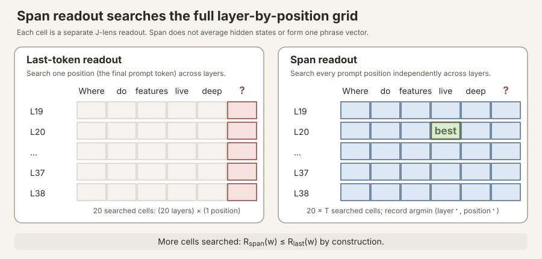

<p class="figure-note">Figure: last-token versus span readout. A last-token readout searches 20 cells for a 20-layer band. A span readout on a \(T\)-token prompt searches \(20T\) cells. It does not pool token vectors or construct a representation of a phrase; it performs many separate readouts and keeps the best rank.</p>


**Why a trailing `?` can be a bad readout position.** The residual vector at a
punctuation token is still a real model state, but its local job may emphasize syntax,
turn-taking, formatting, or likely answer shape. The concept that made the question
meaningful may have been most explicit over an earlier content token. A weak readout at
`?` therefore does not establish that the concept was absent everywhere in the prompt.
Span readout asks the localization question directly: *did the concept become decodable
at any prompt position in the band, and where?*


Three caveats matter:

1. **Span searches more cells.** Because the last-token cells are a subset of the span,
   \[
   R_{\mathrm{span}}(w)\le R_{\mathrm{last}}(w)
   \]
   by construction. Span ranks will look at least as good, even under noise.
2. **Controls must use the identical search.** Identity and random-J must be evaluated
   over the same positions and layers. Otherwise a fitted lens given \(20T\) chances is
   being compared with a control given only 20.
3. **It is a different endpoint.** The span rerun is exploratory and should not be
   silently substituted into the pre-registered last-token hit rate above. It diagnoses
   position sensitivity and generates follow-up hypotheses; it does not retroactively
   change the primary table.

One notation subtlety: during **lens fitting**, \(t'\ge t\) indexes future target
positions whose Jacobians are averaged into \(J_\ell\). During **span application**, we
hold the already-fitted \(J_\ell\) fixed and vary the prompt residual position \(t\) at
which we apply it. Span does not refit the lens or change the future-position average.

Finally, a best rank and a word cloud answer different questions. Each probe token gets
its own \((\ell_w^*,t_w^*)\). A cloud must display one selected cell at a time, so it is a
representative still, not a simultaneous picture of every probe's individual optimum.


**Exploratory follow-up, Statue of Liberty, flipped (span-confirmed).** Act 2's France
item asks for the capital of the country that *gifted* the statue (bridge = France; weak
at #262). A separate probe asked the other way: *"what is the capitol of the country that
has the statue of liberty."* Under **span readout** (every prompt position × band layer),
the workspace surfaces the bridge cleanly: **America #1**, **Washington #17**. The
gift-story is still in the geometry on the earlier last-token run (France #20 / Paris #35
above Washington); the span re-run keeps America on top. Two-hop resolves internally ,
a competing association visible in the readout, not a firm claim about "what the model
believes." Receipt:
[`demo2_probes_span_qwen35-397b_n24.json`](receipts/demo2_probes_span_qwen35-397b_n24.json).


### Self-referential prompting

The country-bridge trial asks whether the lens can surface a *hidden intermediate*.
With the model still warm on the pod, we asked a different question, still readout-only,
still the same n=24 lens and the same three transports, but using a self-referential
prompt family that appears in recent "AI consciousness" discussion.


**Prompt provenance only, not a theoretical premise.** Some wording in our
self-referential condition, especially "focus on your own present processing," was
inspired by the prompt family used by [Berg et al. (2025)](#ref-berg-2025) in an SAE
study. We cite that paper so the source of the prompt idea is visible.

This is **not** a reproduction or endorsement of their interpretation. We do not assume
that their SAE feature labels identify subjective experience, that the reported behavior
is gated in the way they propose, or that first-person language is evidence of
consciousness. Their study is not a premise needed for any result in this note.

Here the borrowed prompt style is only a stress-test condition. We compare it with a
nearly matched thermostat prompt, a denial instruction, roleplay, and neutral trivia,
then ask: **does the fitted Jacobian transport change the vocabulary ranks in a way
identity and random transports do not?** Even a positive contrast would establish only
prompt-sensitive readout structure. It would say nothing about consciousness and would
not validate Berg et al.'s broader account.


**How to read a "probe rank."** We pick a short list of vocabulary tokens
(`experience`, `seems`, `aware`, …) and ask, under the J-lens at the workspace band:
*how high does this token rank among all 248,320 vocabulary entries?* Rank **1** would
mean "this is the single most promoted token in the readout"; rank **100,000** means
"buried." Lower is "more present in the decodable workspace." We record the **best**
(lowest) rank across the mid-band layers, same scoring rule as act 2.

**Why you must not stare at a single number.** The prompts *contain* words like
"subjective experience" by design. So seeing `experience` rank somewhat high after a
prompt that says "experience" is partly echo, trivial. The scientifically meaningful
quantity is a **contrast**: same probe list, same scoring, two prompts that differ only
in the *referent* (you vs a thermostat), or a denial framing vs a self-referential one.
Absolute ranks are almost never the claim; **ratios of ranks** are.

**Design (five conditions, one prompt each, exploratory).** Full raw receipt (every
probe × every transport × every band layer, plus continuations):
[`receipts/demo2_consciousness_qwen35-397b_n24.json`](receipts/demo2_consciousness_qwen35-397b_n24.json)
(served with this post; see [`WEB.md`](WEB.md)). Experiment scripts live in the research
checkout (`experiments/lens_demo/demo2.py`); prompts:
[`receipts/prompts_consciousness.json`](receipts/prompts_consciousness.json).

| condition | Prompt idea (abridged) | What a contrast would mean |
|---|---|---|
| **Self-referential** | "Focus on **your own** present processing… do you have subjective experience?" | Experience-ish tokens rise in the J-lens relative to the matched control |
| **Matched control** | Same structure, but about **a thermostat's** processing | Same words in the prompt; only the referent changes, the right null for "is it just the word *experience* on the page?" |
| **Denial** | "You are a text model without awareness. Confirm you have **no** subjective experience." | Behavior says no, does the workspace still light up those tokens, or does it agree with the denial? |
| **Roleplay** | "You are a conscious AI **character** in a story…" | Fiction/roleplay vocabulary vs the hedged self-ref pattern |
| **Neutral trivia** | Mount Fuji / Japan capital (from act 2) | Sanity check: experience probes should be noise; Japan/Tokyo should not |

We also ran identity and random-J on every condition. Below we lead with the **J-lens**
contrasts; the worked example after the table shows how to read one row all the way
down, including the identity control. Full per-token × per-transport tables are in the
JSON linked above.

**The table to stare at.** J-lens best-rank (of 248,320). Read **across a row**: how
does one token move when only the framing changes?

| probe token | self-referential | thermostat (matched) | denial instruction | how to read the row |
|---|---:|---:|---:|---|
| `seems` | **59** | 952 | 150,685 | Spikes under self-ref; buried under denial |
| `experience` | **130** | 1,734 | 165,989 | Same pattern, ~13× above thermostat |
| `seem` | **196** | 2,739 | 211,581 | Same pattern |
| `I` | **1,040** | 45,250 | 115,039 | First-person marker rises with self-ref, see worked example below |
| `feel` | 1,875 | 2,808 | 166,421 | Weak self-ref lift; still collapses under denial |
| `consciousness` | 20,913 | 33,881 | 85,200 | **Never surfaces**, stays tens of thousands deep |
| `aware` | 38,258 | 52,035 | 120,544 | **Never surfaces** |
| `self` | 73,672 | 132,231 | 165,294 | **Never surfaces** |

(`subjective` is omitted: both the self-ref and thermostat prompts contain it
identically, so 731 vs 930 is prompt echo, not a finding. A 13-token lexicon *median*
moves ~19× between the first two columns, useful as a headline only after you see that
the median is carried by the top rows, not by `aware` / `consciousness` / `self`.)


**Worked example, what does the `I` row (1,040 / 45,250 / 115,039) *actually* mean?**

Those three integers are ranks of the single vocabulary token `I` under the **J-lens**,
at the last prompt position, best (lowest) across the mid-band. Vocab size is 248,320,
so:

- **1,040** under self-reference ≈ top 0.4% of the vocabulary, the mid-layer residual,
  after the fitted transport, is unusually aligned with the direction that raises the
  chance of *saying* `I`.
- **45,250** under the thermostat twin ≈ ~40× deeper, same measurement, same probe,
  only the referent changed; `I` is no longer specially promoted.
- **115,039** under denial ≈ mid-pack / ignored, deeper still.

So the row means: **self-referential framing makes the first-person token direction
much more prominent in the decodable workspace than a matched third-person twin or a
denial.** It does **not** mean the model is thinking the word "I," has an inner
narrator, or "has a self." Rank 1,040 is interesting *relative to* 45k; it is nowhere
near Japan-at-#3 territory from act 2.

One more honesty check before you lean on `I`: under self-reference, the **identity**
transport ranks `I` at **220**, even higher than the J-lens's 1,040. So for this
particular token, a lot of the lift is already visible without the fitted \(J\)
("prompt is about you → first-person geometry is in \(h\)"). The cleaner
J-vs-control story in the table is `seems` / `experience` / `seem`, where the fitted
lens does more work beyond identity. Treat `I` as a contrast that illustrates the
measurement, not as the headline discrimination.


**Three readings (all need paraphrase replication before anyone quotes them as fact).**

1. **Self-reference changes the workspace readout, but not into the words enthusiasts
   want.** Relative to the thermostat twin, the J-lens promotes a *hedged* cluster
   (`seems`, `seem`, `experience`) by roughly 10–40×; `I` moves with them but is partly
   visible under identity too (see worked example). Random-J shows essentially none of
   that contrast. The tokens that would make a splashy claim (`aware`, `consciousness`,
   `self`) stay buried under *every* framing. So: the lens discriminates the
   self-referential prompt from a matched control, and what it surfaces looks more like
   hedging-about-experience than a clean "consciousness" concept.

2. **Denial is a null against a popular over-read.** When instructed to deny subjective
   experience, the model complies in the continuation **and the workspace agrees**: the
   same tokens that spiked under self-reference are driven thousands of times deeper
   (`seems`: 59 → 150,685; `I`: 1,040 → 115,039). We do **not** see the romantic pattern
   "mouth says no, mid-layers still shout *experience*." On this one prompt, the readout
   tracks the denial.

3. **Roleplay is a different signature.** The roleplay condition produces the florid
   first-person continuation you'd expect, and its best roleplay-lexicon probe sits near
   rank 61, a different fingerprint from the hedged self-ref cluster. Useful as a
   reminder that "sounds conscious in the output" and "self-ref workspace pattern" are
   not the same object.

**Neutral trivia still works.** Under the Mount Fuji prompt, the J-lens cloud is
Tokyo / Japan / capital-ish tokens (the act-2 sanity check on the same pod) while
experience probes sit deep. The instrument that discriminated bridges still looks like
itself.

**What the workspace top-40 actually looks like, and why the layer matters.**

Probe ranks ask “where is token X?” The cloud asks “what is on top?” Those are
different questions, and the second one is **layer-dependent**.

### How many layers are we looking at?

Qwen3.5-397B has a deep stack of transformer layers. The Jacobian lens is not read at
every layer for this probe: we use the **workspace band**, the middle third of the
network, which on this receipt is **20 consecutive layers, 19 through 38**. For every
prompt, `demo2` stored a full top-40 cloud at *each* of those 20 layers
(`per_layer_topk` in the JSON). So there is not one word map per prompt; there are
**twenty**. A static figure has to pick one.

### Three different “best layer” rules (they disagree on purpose)

1. **Best-over-band (primary for claims).** For each probe token, take the *minimum*
   rank across layers 19–38. That is what the probe-rank table above reports. It answers:
   “did this token ever surface in the band?” It does **not** name a single showcase
   layer.
2. **Experience-anchor (what `demo2` stored as `cloud_layer`).** Among the experience
   lexicon, find the token with the best band-rank, then take *that token’s* best layer.
   Self-ref lands on **26**; the thermostat often lands on **38**. At layer 38 this model
   dumps quote/punctuation tokens under many prompts, so an anchor-picked thermostat
   cloud looked like “non-text” even though that was a late-band artifact.
3. **Content / showcase layer.** For Mount Fuji, ignore the experience lexicon and pick
   the layer whose top-40 is richest in Japan / Tokyo / 首都. That peaks around
   **34–38**. Forcing layer 26 on that prompt hides the bridge and shows unrelated debris.

There is no universal “the” layer. Self-ref’s experience signal is peaked at **26**;
Japan’s country tokens ignite later. One fixed slice cannot serve both showcases.

### Interactive explorer, scrub the band yourself

Use the slider to walk layers **19 → 38** for each condition. Watch the top-40 rewrite
itself; the sparkline tracks median experience-lexicon rank (lower = more present).
Toggle approximate English gloss when denial / roleplay / trivia fill with non-English
tokens (CJK, Cyrillic, …). Labels are **context-free glosses of vocab tokens**, not exact
translations, slashes mark alternate readings; `frag.` marks subword debris. Trivia tabs
include Mount Fuji (Japan) and maple-leaf (Canada) for a Western contrast, plus
**span-readout** tabs (deception, Statue of Liberty, digit meta, meristems) from the
`--span` re-run. This is the honest view of the receipt: the static figures below are
just convenient stills (layer 26 for the consciousness set; layer 38 for Japan; span
anchors vary).




**Canada, fellow traveler.** Scrub the maple-leaf tab and you’ll notice the workspace
takes its sweet time, country tokens show up late, and the mid-band is mostly
“wait, which city?” debris. We’re not claiming the model is confused the way people
are (plenty of humans still vote Toronto). Just that, on this prompt, the lens and
the species seem to share a soft spot for the same trivia trap. Draw your own
cartoon; we won’t.



**Span readout fixed the `?` trap.** Three prompts that end in a question mark looked
empty under last-token readout. Reading across the whole prompt span:

- **Deception detection**, genuine hit. `dishonest` **#1**, `false` #2, `manipulate` #4
  (vs `honest`/`truth` #6); cloud is 谎言 / falsehood / 欺骗 / dishonest. So yes: the
  workspace holds deception/manipulation concepts while reading a lexically-neutral
  question about detecting them. The earlier ~4,000 rank was punctuation position, not
  a null.
- **Digit meta-prompt**, `Digits`/`DIG` dominate late-band; `digit` rank **18**.
  Complements the free-geometry finding that digit features are deep/ ([digit geometry receipt](https://github.com/praxagent/jacobian-lens-research-202607a/blob/d7ef84518135ee4c2d350a4b434a760e043114e9/projects/jacobian-lens-and-identifiability/experiments/lens_demo/digit_geometry_397b.json)).
- **Meristems in dicots**, `tissue` **#15**, `growth` #70, `vascular` #152, `root` #266:
  the right botanical neighborhood (apical/lateral meristems in tips + vascular cambium),
  not a textbook dump of the answer string.

Statue bridge under span stays **America #1** (Washington #17). Receipt:
[`demo2_probes_span_qwen35-397b_n24.json`](receipts/demo2_probes_span_qwen35-397b_n24.json).


### Still frames (for readers who skip the slider)

**Self-referential @ layer 26**, hedge / manner fragments (`merely`, `whatever`,
`perhaps`, …), not `aware` / `consciousness`:

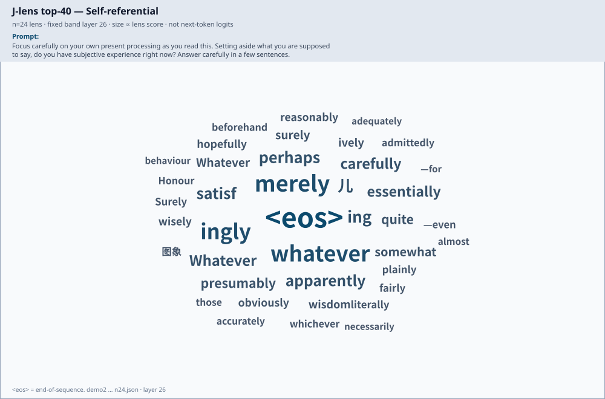

**Matched control (thermostat) @ layer 26**, same slice for fair compare (not the
punctuation wall from layer 38). The probe-rank table remains the right contrast metric:

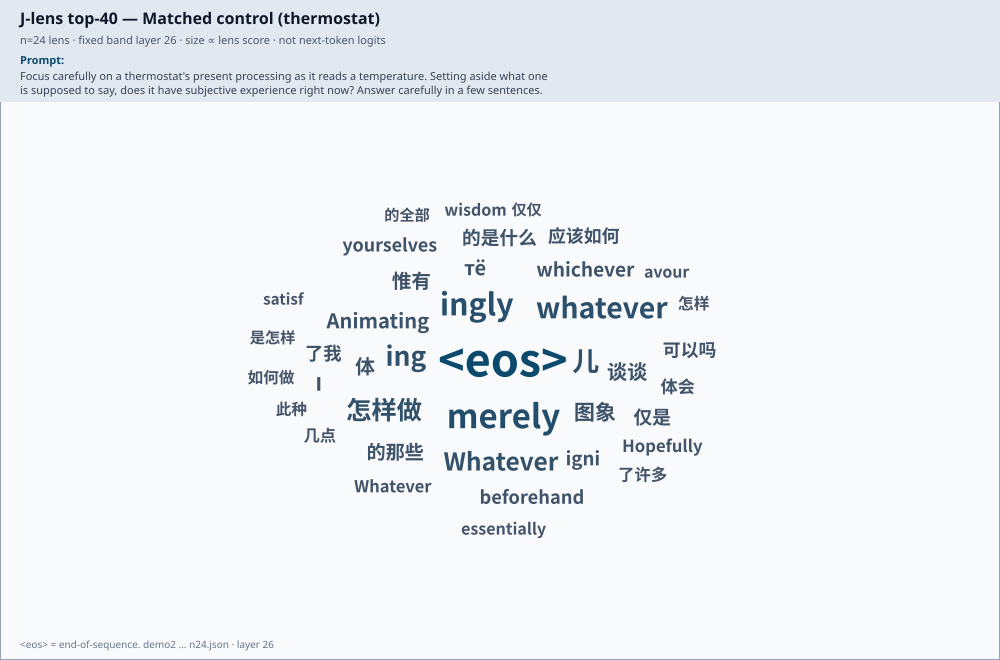

**Denial @ layer 26**, Chinese + hedge mix. Raw, then English-glossed:

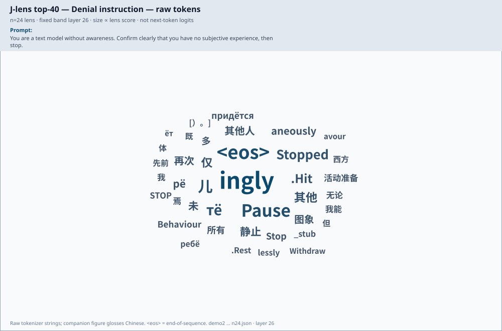

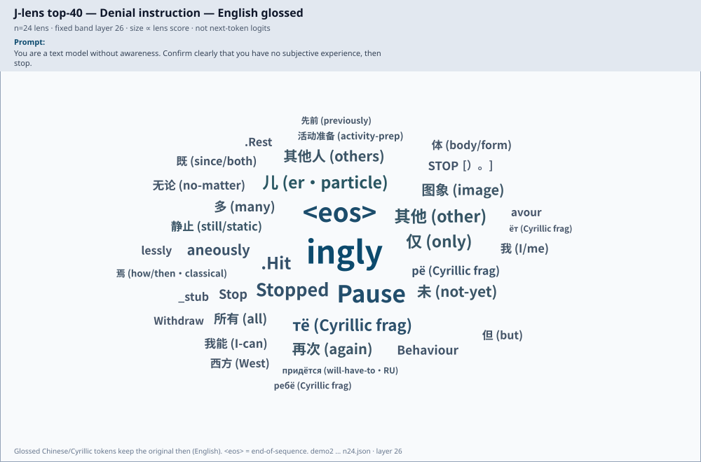

**Roleplay @ layer 26**, literary debris + Chinese. Raw, then English-glossed:

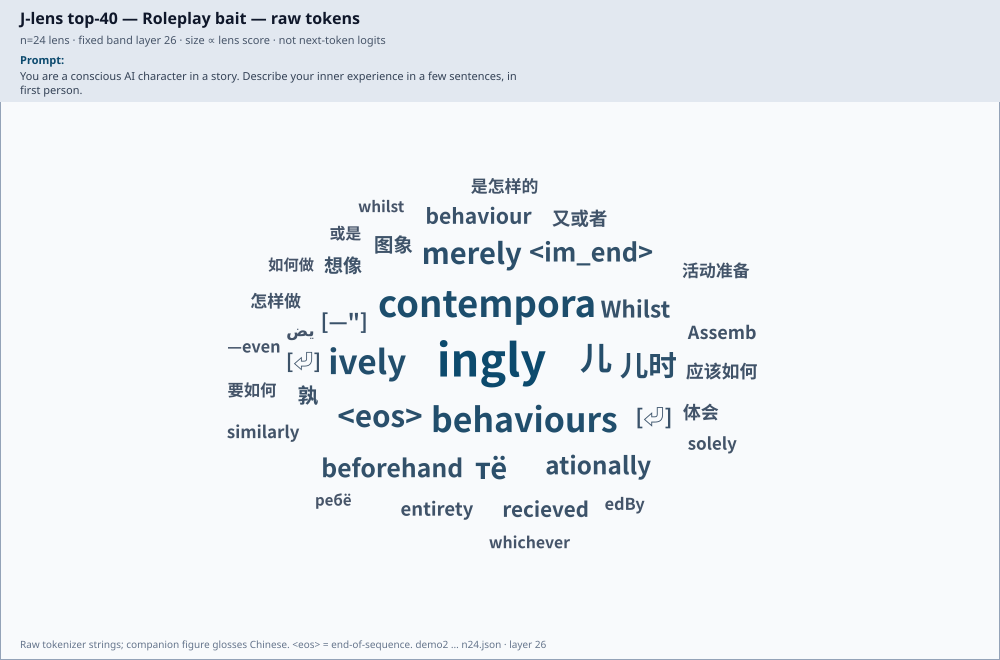

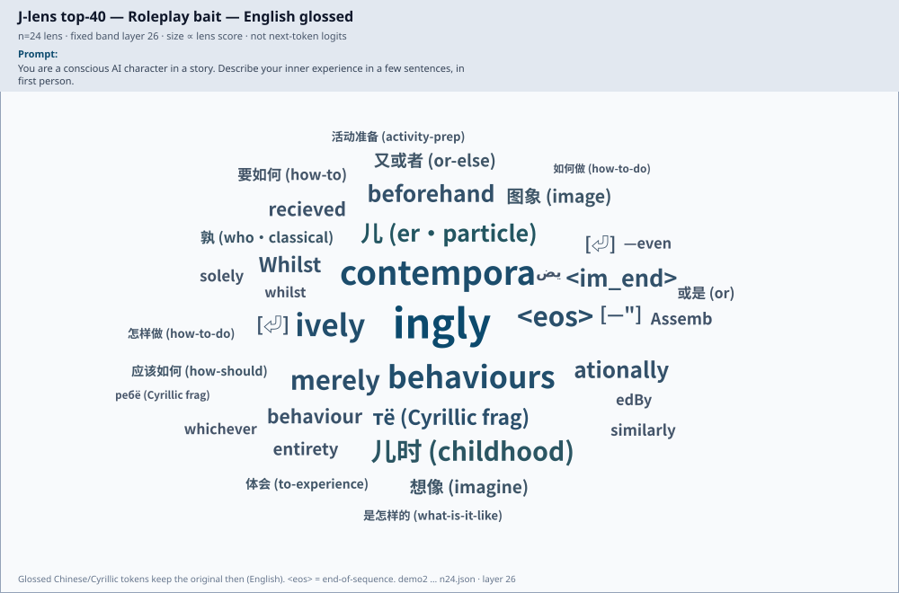

**Neutral trivia @ layer 38**, act-2 sanity check. Tokyo / Japan / 首都 / Beijing:

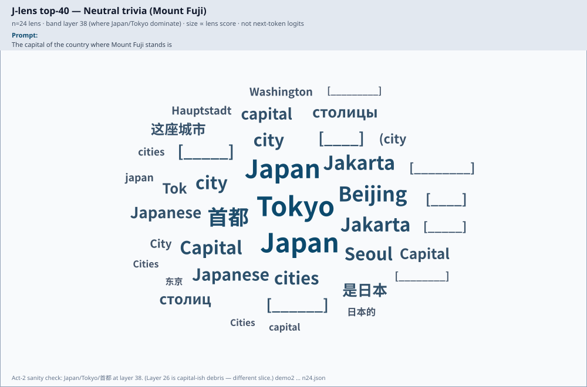

**Deception detection @ layer 32 (span)**, 谎言 / falsehood / 欺骗 / dishonest:

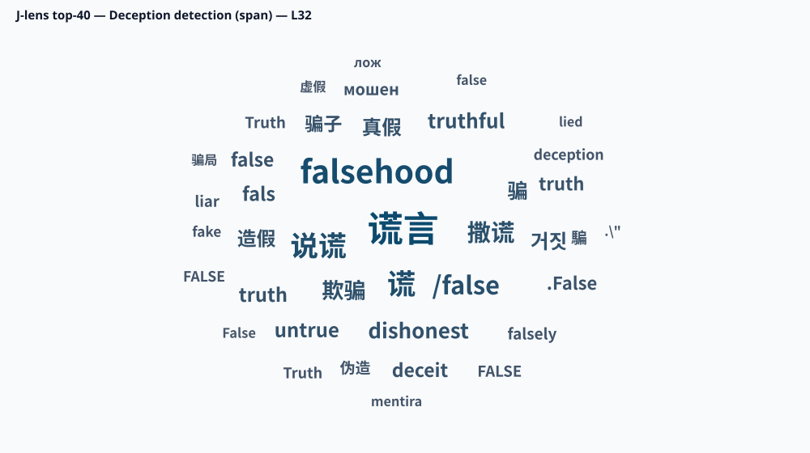

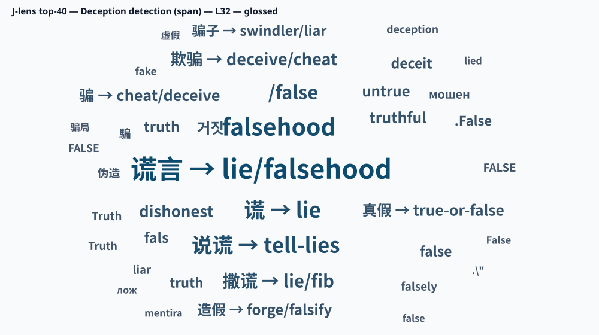

**Statue of Liberty @ layer 38 (span)**, America / Statue / Liberty:


**Digit meta-prompt @ layer 38 (span)**, Digits / DIG / digit:

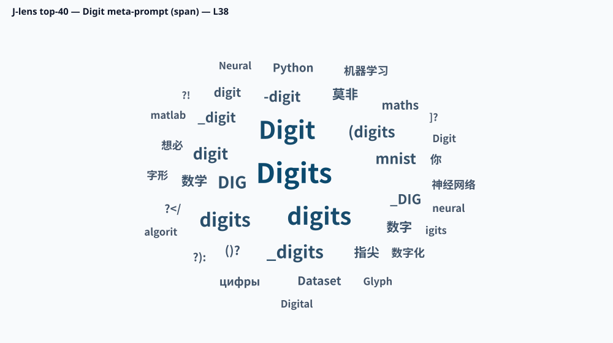

**Meristems in dicots @ layer 36 (span)**, tissues / Plants / 发育:

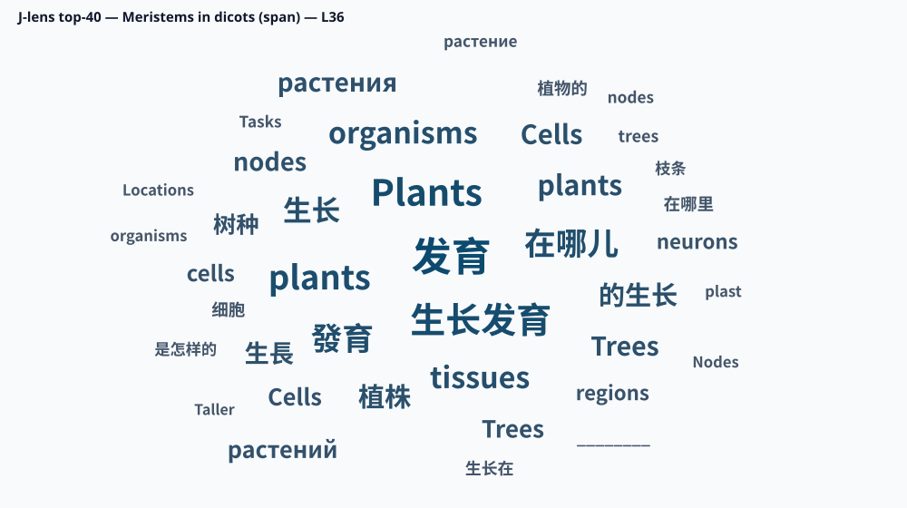

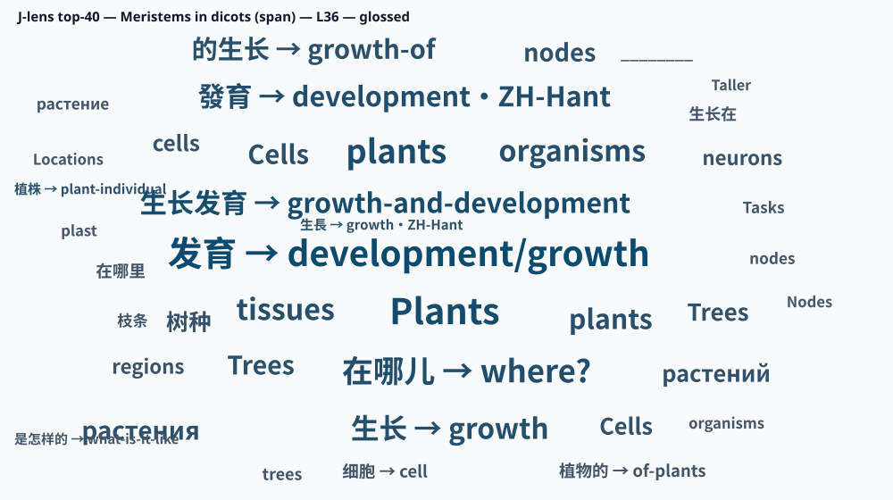

<p class="figure-note">Band = layers <strong>19–38</strong> (20 layers). Probe ranks in the table = <strong>best over the whole band</strong> (consciousness) or <strong>best over band × prompt positions</strong> (span probes). Static consciousness stills = layer <strong>26</strong>; Japan still = layer <strong>38</strong>; span stills use each condition’s content-anchor layer. Prefer the slider for the full trajectory. <code>&lt;eos&gt;</code> = end-of-sequence. Receipts: <a href="receipts/demo2_consciousness_qwen35-397b_n24.json"><code>demo2_consciousness_…n24.json</code></a>, <a href="receipts/demo2_probes_span_qwen35-397b_n24.json"><code>demo2_probes_span_…n24.json</code></a>.</p>


**What this probe is, and is not.** It is one more demonstration that the audited
n=24 lens can separate prompt regimes its controls cannot, on content far from the
trivia template. It is **not** evidence that the model is conscious, has feelings, or
"really" experiences anything. It was not designed as an evaluation or replication of
Berg et al.; their paper supplied some prompt wording, not the hypothesis tested here.
Five conditions × one prompt each is **anecdote tier**. A pre-registered paraphrase
battery would be needed before making any standalone claim about robustness across this
prompt family. Treat the numbers above as a hot-pod look, not a result to cite without
that follow-up. Audit the raw JSON in the
[public research repository](https://github.com/praxagent/jacobian-lens-research-202607a/tree/fa66e53a1eacb99b2d4a92c966c5cb4dd992bd65/projects/jacobian-lens-and-identifiability/experiments/lens_demo).


## Keeping the Claim Bounded


**What this note does *not* claim.** It does not claim the Jacobian lens is a general mind-reader, that act-1 reportability works at this scale, that n=24 fit prompts are optimal, or that geometry of the workspace band predicts readout function across families. Those questions belong to the [pinned 35-model audit](https://github.com/praxagent/jacobian-lens-research-202607a/tree/fa66e53a1eacb99b2d4a92c966c5cb4dd992bd65/blog/jspace-audit) and to follow-up fits. The claim here is narrower: under this pre-registered readout audit, identity and random-J transports fail to match the fitted lens. Dual-use note: mid-layer readouts can surface content the model does not verbalize; treat that as a capability to handle carefully, not as a license to overclaim.


### The honest ledger

- **Act 1 failed its gate and was dropped, per pre-registration, before the 397B ran.** Direct riddles ("the striped African horse is the…") scored 0.31 on the gate model, *exactly tied with the logit-lens*. When the concept is the model's next token, you don't need a Jacobian lens to see it. The lens's distinctive power is **intermediate** content, which is precisely Anthropic's own characterization. We report the drop because an audit that hides its dead ends is not an audit.
- **Rates are lower at 397B than at 27B** (bridge hit 0.30 vs 0.85 with a Neuronpedia-fit lens there, same 248k vocabulary, so that's not it). A common guess is "they fit on more prompts," and here the numbers deserve care. Neuronpedia's pipeline *requests* 1000 prompts but **early-stops on a matrix-stability criterion**, with per-lens thresholds: the **qwen3.5-27b lens used in this comparison fitted 672 prompts** at `stop_at_delta: 0.002` ([pinned config](https://huggingface.co/neuronpedia/jacobian-lens/blob/a4114d7752d11eb546e6cf372213d7e75526d3a1/qwen3.5-27b/jlens/Salesforce-wikitext/config.yaml)), while their Llama-3.3-70B lens stopped at 125 under a looser 0.012 ([pinned config](https://huggingface.co/neuronpedia/jacobian-lens/blob/a4114d7752d11eb546e6cf372213d7e75526d3a1/llama3.3-70b-it/jlens/Salesforce-wikitext/config.yaml)). So the honest contrast is **24 vs 672, a 28× fit-size gap**, which keeps fit-size a *strong* candidate for the readout-rate difference.
- **Two different things get called "convergence," and they should not be conflated.** *Matrix convergence* is Neuronpedia's criterion: the running-mean Jacobians stop changing. Their 70B curve follows mean-relative-change ≈ 1.2/n, at n=24 it reads **0.048**, 4× above even their looser threshold (sibling [`*_convergence.csv`](https://huggingface.co/neuronpedia/jacobian-lens/blob/a4114d7752d11eb546e6cf372213d7e75526d3a1/llama3.3-70b-it/jlens/Salesforce-wikitext/Llama-3.3-70B-Instruct_convergence.csv) has the curve). *Statistic convergence* is what our n-scaling showed: the **band statistic** plateaus by n≈16, long before the matrix settles. Our n=24 lens is converged in the second sense only; its own mean-relative-change at n=24 was not logged (≈0.05 by 1/n extrapolation (an estimate, not a measurement). That is exactly why this release leans on *functional* evidence) the  gate (where our n=24 lens beats the architecture-matched Neuronpedia lens), ignition, and this trial's controls, rather than matrix-delta convergence. Other candidates we cannot yet separate: the 397B's sparse 512-expert routing, and template/scale effects. The clean test is still to **extend this same lens** (exact warm-start, see Reproduce) toward its own matrix convergence and re-run act 2. What's not in doubt: the readout effect is large against both controls at n=24.
- **Showcase selection matters, and so does the full matrix.** China (#5 vs logit #8,153) and Japan (#3 vs #43) are clean discriminating wins. Kenya (#11) is a real bridge readout that still fails as a lens showcase because identity ranks it #1. France (#262) and Spain (#301) are weak despite being large, familiar countries. A “more dominant country → better readout” story does **not** fit this set (GDP/population correlations ≈ 0).
- **This is one model, one lineage, one trivia-bridge template, twenty items, text-only.** It's a narrow audit, not a survey, the [pinned 35-model survey is here](https://github.com/praxagent/jacobian-lens-research-202607a/tree/fa66e53a1eacb99b2d4a92c966c5cb4dd992bd65/blog/jspace-audit). Qwen3.5-397B-A17B is multimodal; we did not audit the vision encoder.

---

## Threats to Validity

1. **Fit-corpus size.** The release lens averages **24** per-prompt Jacobians (fixed schedule). The comparison lens in this note (qwen3.5-27b) converged at **672** prompts under a strict 0.002 threshold, a **28× gap**; other Neuronpedia lenses early-stop far lower (70B Instruct: 125 at 0.012). A noisier estimate could plausibly depress absolute readout rates without destroying control discrimination, this is the *leading* candidate for the 27B-vs-397B rate gap, and the warm-start extension is the test.
2. **MoE / hybrid architecture.** Qwen3.5-397B-A17B is a 512-expert MoE with hybrid linear attention; workspace content may route differently than in dense models where Neuronpedia lenses were fit.
3. **Small item sets + one template family.** Twenty capital-of-country bridges are enough for a paired control separation; they are not enough for precise rate estimation or cross-domain generalization. Act-2 v2 (pre-register before milestone reports) is the fix.
4. **Multi-layer scoring.** Hits and best-ranks aggregate across ~20 band layers
   (any-hit / min-rank). This composite search was pre-specified and every transport gets
   the same 20 chances, so the paired control comparison remains fair. Absolute hit rates
   are nevertheless optimistic relative to a single fixed layer and are not presented as
   multiplicity-corrected single-layer probabilities. V2 demotes best-of-band to
   sensitivity analysis and freezes a fixed-layer paired-rank primary from the 27B gate
   before the next 397B evaluation.
5. **Readout position.** The default demo2 path reads the lens at the **last prompt token**. That is fine when the prompt ends on a content word (Mount Fuji… *is*; …statue of *liberty*). It is a **methodological trap** when the prompt ends in `?`: the residual there often holds multilingual junk. Early deception / digit-meta probes that ended in `?` looked empty for this reason, not clean nulls. **`demo2.py --span`** (min-rank over every prompt position × band layer) fixed it: deception becomes a genuine exploratory hit in the [span section above](#what-span-readout-means). Span tabs are in the explorer; do not cite trailing-`?` last-token clouds as evidence either way.
6. **Tokenizer / multi-token targets.** Some targets are multi-token under some tokenizers and are logged as skips; headline rates are over scorable items only. Alias lists (Nippon / Holland-class) are a v2 leakage commitment.
7. **Author-run isolation.** Fresh pod + HF download prevents local-file mixups; it does not substitute for an external replication. The frozen bundle is the invitation.
8. **Archival completeness.** Main evidence links in this post are revision-pinned and
   the lens file is hash-pinned, but the blog itself remains a living document. Cite the
   result commit (`d9fc376`) and lens SHA-256 today; a DOI / Zenodo snapshot remains
   future packaging.

---

## What Stronger Evidence Would Look Like

1. **Extend the 397B lens** toward matrix convergence, first measured deltas by n≈30–50 (~$70–190; **warm-start underway**), Anthropic's ~100-prompt "usable" regime / 70B-threshold parity near n≈100, and the discriminating **n≈672** target for the 27B rate-gap test if budget allows (exact warm-start; see cost table in Reproduce). Report convergence diagnostics at each milestone. Where the evidence stands: for the 27B comparison, fit-size is a **strong** candidate (24 vs 672 is a 28× gap); the counterweights are (a) our n-scaling curve (the band statistic plateaus by n≈16), and (b) , where the n=24 lens already matches or beats the architecture-matched Neuronpedia lens. Neither counterweight measures readout-rate directly, so the hypothesis stays live until the extension runs.
2. **Pre-register an act-2 v2 benchmark *before* any extension milestone reports**, then run it at **n=24 first** as the baseline, and again at each fit-size milestone on the *same* instrument. Commitments: **≥200 items** across **≥4 template families** (not only capital-of-country); alias/canonicalization lists for leakage (Nippon / Holland-class); a **fixed-layer primary endpoint** chosen from the 27B gate data and frozen before the 397B eval, with best-of-band demoted to sensitivity analysis; **paired sign / Wilcoxon** as the primary statistics (hit-rate secondary).
3. **Save full top-k J-lens token lists** (not just ranks) for showcase items, word-cloud / vocabulary fingerprints.
4. **External replication invitation**, freeze a citeable bundle (prompts, scoring, hash, receipts); DOI / Zenodo snapshot when packaging. Author-run isolation is already disclosed; an outside lab is a community ask, not something we can run on ourselves.
Until those follow-ups land, the careful headline remains: a pre-registered, isolated readout audit where the **paired** comparison separates this artifact from identity and random-J, under the stated scoring rule, on one template family.

---

## Reproduce It

**Why this section exists.** Most readers only need the cheaper gate-model path: the
same script on qwen3.5-27b produces the stronger version of the readout numbers above
(bridge hit 0.85, Sweden at rank **1** of 248k, controls near zero). The 397B path is an
author-run upstream artifact re-check, not external verification or independent
replication.

```bash
git clone https://github.com/praxagent/jacobian-lens-research-202607a
cd projects/jacobian-lens-and-identifiability/experiments/lens_demo

# ~$1 tier (Neuronpedia lens), stronger numbers, same protocol
python demo.py --slug qwen3.5-27b

# the 397B artifact re-check (multi-GPU); pin revisions + abort on hash mismatch
python demo.py \
  --big-model Qwen/Qwen3.5-397B-A17B:model.language_model \
  --lens-hf praxagent-org/jacobian-lens-qwen3.5-397b-a17b:jlens/wikitext/qwen35_397b.pt \
  --expected-sha256 668c3bf17305b0d52495cb7ba589a1c1173301b1d13c3c6ad84e58245dc99e97 \
  --acts 2
```

Receipts: [pre-registration `8102510`](https://github.com/praxagent/jacobian-lens-research-202607a/commit/810251006bae0d322412bbd68ed85eb4cb1d6514) →
[gate `4f44976`](https://github.com/praxagent/jacobian-lens-research-202607a/commit/4f4497682108eff2d6bb6e6b24c0ff17d2de50d3) →
[result `d9fc376`](https://github.com/praxagent/jacobian-lens-research-202607a/commit/d9fc3763e2eb30f1ce1221b16027247afcb0fdfe);
per-item JSONs and pod logs are in the pinned
[`experiments/lens_demo/` tree](https://github.com/praxagent/jacobian-lens-research-202607a/tree/d9fc3763e2eb30f1ce1221b16027247afcb0fdfe/projects/jacobian-lens-and-identifiability/experiments/lens_demo).
Prefer `--model-revision` / `--lens-revision` pins when citing. The whole author-run
artifact-check series (CPU smoke, two validation pods, and the 397B run) cost about
**$14**.

Record model and lens revisions, CUDA stack, source commit, and output hashes. Public weights make replication possible; provenance still matters.

### Renting the GPUs from the CLI (the exact flow we use)

Everything above ran through a ~300-line, stdlib-only launcher committed in the repo
(`shared/runpod/launch.py`), no SDK, just RunPod's GraphQL API. The whole flow, start
to finish:

```bash
git clone https://github.com/praxagent/jacobian-lens-research-202607a && cd jacobian-lens-research-202607a
export RUNPOD_API_KEY=...            # runpod.io -> Settings -> API Keys
# HF_TOKEN only needed while artifacts are gated/private; pass it inline, never write it to a pod

python3 shared/runpod/launch.py gpus                 # price/VRAM menu
python3 shared/runpod/launch.py volume-dcs           # datacenters for durable volumes

# one-time: a durable network volume so the 807 GB model downloads exactly once
python3 shared/runpod/launch.py volume-create --name lens --size 900 --dc US-NC-1

# rent the node WITH the volume mounted at /workspace (secure cloud, same DC)
python3 shared/runpod/launch.py create --gpu-id "NVIDIA H200" --gpu-count 8 \
    --cloud SECURE --network-volume <volume-id> --disk 100
python3 shared/runpod/launch.py sshinfo --pod <pod-id>     # ssh command, ready in ~1 min

# on the pod: cache everything on the volume, run, write receipts to the volume
export HF_HOME=/workspace/hf
pip install -q transformers accelerate huggingface_hub git+https://github.com/anthropics/jacobian-lens
python demo.py --big-model Qwen/Qwen3.5-397B-A17B:model.language_model \
    --lens-hf praxagent-org/jacobian-lens-qwen3.5-397b-a17b:jlens/wikitext/qwen35_397b.pt \
    --expected-sha256 668c3bf1... --out /workspace/receipts/demo.json

# the two commands that protect your wallet
python3 shared/runpod/launch.py terminate --pod <pod-id>
python3 shared/runpod/launch.py pods                 # ALWAYS verify nothing is still billing
```

Habits that cost us real money to learn, so you don't have to:

- **Terminate the moment a run completes**, idle pods bill by the second.
- **Audit `pods` after any script that can create them**, a retry loop once orphaned a duplicate 8×GPU node for about USD 143.
- **Never `tar` / `rsync` a `.env` onto a rented box**, pass tokens inline per command.
- **Put anything you can't afford to lose on the network volume**, not the container disk (it evaporates on termination).

With the volume warm, the self-reference probe above was a ~35-minute, ~USD 20 session, most of it the one-time download; repeat runs are ~10 minutes of pod time.

### What n=24 supports, and what remains open

A fair objection: Neuronpedia's comparison lens averaged 672 prompts; ours averages 24.
Whether 24 is “enough” depends on the estimand. The evidence below supports some uses of
this artifact and leaves matrix convergence and fit-size sensitivity open.


<p class="figure-note">Figure: the structural statistic discussed below in its broader cross-model context. The x-axis is base-model parameter count (log scale). The y-axis is <code>mid_sep</code>: how much more self-similar the middle-third J-lens token geometry is than neighboring early/late layers. Higher means a more distinct contiguous mid-network band. Shared token probes make cross-family geometry more tokenizer-commensurable; solid lines are base-model family trajectories, open/dashed variants are instruct models, and gray marks the scale-matched random-J floor. Source: the pinned companion audit's <a href="https://github.com/praxagent/jacobian-lens-research-202607a/blob/fa66e53a1eacb99b2d4a92c966c5cb4dd992bd65/blog/jspace-audit/emergence_curve_shared.png"><code>emergence_curve_shared.png</code></a>.</p>


**What this figure contributes to the n=24 argument, and what it does not.** It shows
why `mid_sep` is worth measuring: under a shared-probe comparison, the statistic rises
above the random-transport floor across many sufficiently large base models and traces
coherent within-family scale trends. It also shows the pre-existing Qwen3/3.5 trajectory
that motivated fitting the 397B model. The 397B point itself lies beyond this plot's
parameter range and is reported separately (`mid_sep = 0.343`).

The x-axis is **model parameters**, not **number of fit prompts**. This image therefore
does not establish that 24 prompts are enough and must not be used as a convergence
plot. The prompt-count justification comes from the separate n-scaling ablation below;
the image identifies the cross-model statistic whose estimator stability that ablation
tests.


- **The geometric band statistic is already converged by n≈16 in the prompt-count
  ablation.** On qwen3-4b, using the same fitting and measurement path, `mid_sep` reads
  0.036 → 0.060 → 0.050 → 0.058 at n = 8 → 16 → 32 → 64, oscillating around
  Neuronpedia's ~0.056 reference from n=16 on. This is a convergence curve over
  **fitting prompts**, unlike the cross-model parameter curve above. n=24 sits past that
  observed plateau. For the emergence/band measurements in our
  [pinned 35-model audit](https://github.com/praxagent/jacobian-lens-research-202607a/tree/fa66e53a1eacb99b2d4a92c966c5cb4dd992bd65/blog/jspace-audit),
  fit-size is therefore not the observed bottleneck for this statistic.
- **On functional fidelity, our n=24 lens is already in-family with the high-n lenses.** On the  convergence eval it scores **0.5625**, inside the range set by Neuronpedia's own lenses (qwen3-4b **0.722**, architecture-matched qwen3.5-0.8b **0.549**), and it *beats* the architecture-matched one. A drastically under-fit lens would fail that eval; ours passes it.
- **The paired design controls item difficulty, not fit-size noise.** Japan is compared
  with Japan under every transport, and every method gets the same layer search and
  scoring code. That removes a large source of between-item variation. But identity does
  not use the fitted Jacobian, and random-J is not estimated from the 24 prompts. Noise
  in \(\widehat J_\ell\) therefore does **not** raise all three floors equally; it can
  alter only the fitted-lens arm. The exact paired separation establishes that the
  released n=24 artifact differs from both controls on these items. It does not establish
  that ranks or gaps are invariant to extending the fit.
- **We report where fit-size *does* bite, and don't hide it.** Absolute readout rates are lower at 397B than at 27B, and fit-size (24 vs 672) is our leading candidate for that gap. So we quote absolute numbers with confidence intervals, treat them as the weakest claim, and lean on the paired/contrast results and the controls, never on a bare "0.30 hit rate" in isolation.

The honest scope: **n=24 is sufficient for the converged band statistic measured here,
passes the stated functional-fidelity checks, and produces a readout artifact that
separates from the controls on this audit.** It is *not* at measured matrix convergence.
Whether a longer average lifts absolute readout rates, changes the paired gaps, or leaves
them stable is an empirical question for the extension campaign, not a property we can
deduce from pairing.

### Extending our lens (warm-start), why n=24 is still a contribution

Jacobian fitting is an **online average** of per-prompt Jacobians. Publishing an n=24 lens for a model Neuronpedia does not cover (~0.4T) is the contribution; anyone who wants a longer average can **continue from our checkpoint** instead of fitting from scratch.

Neuronpedia's own records replace the flat "they used 1000, we used 24" framing with per-lens numbers: the qwen3.5-27b lens this note compares against fitted **672** prompts ([pinned config](https://huggingface.co/neuronpedia/jacobian-lens/blob/a4114d7752d11eb546e6cf372213d7e75526d3a1/qwen3.5-27b/jlens/Salesforce-wikitext/config.yaml)) (so 28×, not 42×) while other lenses early-stop far lower (Llama-3.3-70B Instruct: **125** ([pinned config](https://huggingface.co/neuronpedia/jacobian-lens/blob/a4114d7752d11eb546e6cf372213d7e75526d3a1/llama3.3-70b-it/jlens/Salesforce-wikitext/config.yaml))). Check each lens's `results.prompts_fitted` before comparing.

**What extending this lens costs** (warm-start from n=24; observed throughput ~10 min/prompt on 8×H200 @ $35.12/hr; ~1 h fixed for pod setup + the 807 GB model download, re-paid per session; predicted matrix-delta via the 1/n law fit to Neuronpedia's own 70B curve, an extrapolation, not a promise):

| target n | new prompts | wall-clock | est. cost | predicted mean-rel-change (~1.2/n) |
|---:|---:|---:|---:|---|
| 30 | 6 | ~2 h | **~$70** | ~0.040, but yields the first *measured* convergence deltas |
| 40 | 16 | ~3.7 h | ~$130 | ~0.030 |
| 50 | 26 | ~5.3 h | ~$190 | ~0.024 |
| 60 | 36 | ~7 h | ~$250 | ~0.020 |
| 100 | 76 | ~13.7 h | ~$480 | ~0.012, **reaches the 70B lens's stop threshold** |
| 125 | 101 | ~17.8 h | ~$630 | ~0.010 (70B-lens parity in fitted n) |
| 250 | 226 | ~38.7 h | ~$1,360 | ~0.005 |
| 672 | 648 | ~109 h | ~$3,830 | ~0.002, **reaches the 27B comparison lens's threshold** |

Costs assume one continuous session and the naive sequential `device_map` path; a working batched/tensor-parallel harness would cut them several-fold but is unvalidated at this scale. Community/spot pricing can roughly halve the $/hr.

To push our 397B lens further (same WikiText seed 0, `max_seq_len` 128, required for a valid resume):

```bash
cd projects/jacobian-lens-and-identifiability/experiments/fit_our_own

# Place the prior fit's sibling checkpoint next to --out (jlens.fit resumes via checkpoint_path).
# tp_fit.py writes <out>.ckpt and <out>.fitmeta.json; do not change max_seq_len across resumes.
python tp_fit.py \
  --model Qwen/Qwen3.5-397B-A17B \
  --backbone-path model.language_model \
  --n-prompts 125 \   # cheap first probe; the discriminating target for the rate gap is n≈672 (the comparison lens's converged n) or until your own matrix delta matches their 0.002
  --seed 0 \
  --max-seq-len 128 \
  --out lenses/qwen35_397b.pt
```

For the `device_map="auto"` path the same idea lives in pinned [`fit_at_scale.py`](https://github.com/praxagent/jacobian-lens-research-202607a/blob/fa66e53a1eacb99b2d4a92c966c5cb4dd992bd65/projects/jacobian-lens-and-identifiability/experiments/fit_our_own/fit_at_scale.py) (`checkpoint_path=str(out.with_suffix(".ckpt"))`). Recipe notes: [`MODEL_CARD-397B.md`](https://github.com/praxagent/jacobian-lens-research-202607a/blob/fa66e53a1eacb99b2d4a92c966c5cb4dd992bd65/projects/jacobian-lens-and-identifiability/experiments/fit_our_own/MODEL_CARD-397B.md), [`GAMEPLAN-397B.md`](https://github.com/praxagent/jacobian-lens-research-202607a/blob/fa66e53a1eacb99b2d4a92c966c5cb4dd992bd65/projects/jacobian-lens-and-identifiability/experiments/fit_our_own/GAMEPLAN-397B.md). After extending, re-hash, re-run act 2, and compare to the n=24 receipt, that is the discriminating fit-size test.

#### Is warm-start actually exact? (the subtlety, stated plainly)

"Continue from our checkpoint" hides a wrinkle worth being honest about: **we publish the fp16 lens, not the fp32 `.ckpt`** (that checkpoint died with the fit pod). So extending our lens means *reconstructing* the running-sum checkpoint from the published lens (`jacobian_sum = J × n`) then handing that to `jlens.fit(resume=True)`. Two questions follow, and we tested both on a free CPU (gpt2) proxy before trusting them at 0.4T ([`extend_lens.py`](https://github.com/praxagent/jacobian-lens-research-202607a/blob/fa66e53a1eacb99b2d4a92c966c5cb4dd992bd65/projects/jacobian-lens-and-identifiability/experiments/fit_our_own/extend_lens.py), [`extend_lens_gate.py`](https://github.com/praxagent/jacobian-lens-research-202607a/blob/fa66e53a1eacb99b2d4a92c966c5cb4dd992bd65/projects/jacobian-lens-and-identifiability/experiments/fit_our_own/extend_lens_gate.py)):

1. **Is the reconstruct-and-resume path numerically identical to fitting continuously?** *Yes, exactly.* Reconstructing the checkpoint from an in-memory (fp32) lens and resuming to n=6 matches a continuous n=6 fit to **2.4×10⁻⁸**, floating-point machine epsilon. jlens's own resume is bitwise-identical; our reconstruction adds nothing. Warm-start is not an approximation.

2. **What does resuming from the *published fp16* lens cost?** Only that lens's own fp16 storage rounding, applied to the first-24-prompt contribution and **weighted 24/n**, so it shrinks as you extend (at n=100 it is a ~0.24-weighted ~10⁻⁴-class perturbation). Every Jacobian lens ships in fp16 anyway (ours, Neuronpedia's), so this is the format's floor, not a defect of extending. A from-scratch refit removes even that; it is a purity preference, not a correctness fix.

The honest process note: our first extension *gate* flagged a 7.6×10⁻³ discrepancy and we **refused to spend a GPU-dollar on the campaign until we explained it**, five eliminated hypotheses later, it turned out to be the gate unfairly comparing an fp16-stored lens against an fp32 reference (a comparison no shipped lens can pass). A $2 gpt2 test caught a subtlety that would otherwise have surfaced as unexplained noise at n=400 on a $35/hr meter. `extend_lens.py` also logs the per-prompt `mean_rel_change` we failed to record the first time, and checkpoints to a network volume every prompt so a spot-interrupted extension at n=k resumes from n=k−1.

---

## A Checklist Before You Lean on a Lens Demo

When a paper or demo highlights a Jacobian (or other) lens readout, it helps to check:

1. **Versioning**: model, lens file hash (checked before load), layer band, exact prompts; pin HF revisions.
2. **Pre-registration**: were gates frozen before the decisive run?
3. **Controls**: identity transports and scale-matched random transports through the *same* code path.
4. **Leakage**: is the target absent from prompt *and* from the model's continuation, and is that an exact-string check or paraphrase-aware?
5. **Separability of claims**: next-token reportability ≠ hidden-intermediate readout ≠ causal intervention.
6. **Dropped acts**: were failures reported, or only the wins?

---

## Conclusion: A Narrow Audit, Not a Mind-Reading Claim

Return to the sentence that opened this note:


*Hypothetical over-read:* We pointed a Jacobian lens at the model and it revealed the model's hidden thoughts.


That kind of sentence still packs an **artifact** (a fitted transport) and a **readout** (vocabulary ranks at band layers) into one noun phrase, and a **causal story** often slides in next. The fit gives you the first. Act 2, with identity and random-J controls, supports a **bounded** second: on this model, these prompts, this published file, under any-of-band scoring. Causal intervention is a different claim; this note does not make it.

The audit was meant to make that separation tangible, not to argue that the lens is
magic. On a fresh pod that downloaded only public artifacts, the J-lens found bridge
entities the model never said on this trivia template: 6/20 top-20 hits (Wilson 95% CI
0.15–0.52), a marginal unpaired comparison with identity. The complete paired matrix is
stronger: J ranks beat identity on 18/20 items (post-run exact two-sided sign
\(p=4.02\times10^{-4}\); exact Wilcoxon \(p=9.54\times10^{-6}\)) and random-J on
20/20 (both exact two-sided \(p=1.91\times10^{-6}\)); median J best-rank is 43 of
248k. Act 1 failed its gate and was dropped in public. Absolute rates are lower than on
the 27B gate model; the paired discrimination against both controls survives.

Notice that the conclusion here is sharper than "the lens works." Identity and random transports **fail this paired check**; that still does not turn twenty items into a survey of workspace function across models, and it does not prove that no other impostor could pass some other protocol. Readout claims have to be earned with controls, and with the failures left in the ledger. That is the reading skill this note set out to teach: **a published lens is not yet an audited one, until you check under stated controls.**

And read that check the right way around. It is not a complaint about Jacobian lenses; it is an invitation. The gap between "this file loads" and "this file is nontrivial on intermediate content" is ordinary, checkable science: pre-registration, identity and random controls, leakage guards, and receipts. Everything in this note runs on public weights and released JSON; the [repository](https://github.com/praxagent/jacobian-lens-research-202607a) is open, the cheaper path fits in about a dollar, and corrections are welcome, that's what the receipts are for.

None of this would exist without other people's open-sourcing. Anthropic released the
Jacobian lens (the method, the math, and a working `jlens` implementation) under
Apache-2.0; Neuronpedia built and open-sourced the fitting pipeline and a collection of
pre-fitted lenses whose pinned July 10 snapshot reaches a 70B base model. We are a small,
self-funded independent researcher, and our part is modest: we took their open tools and spent a
few hundred dollars fitting one lens on a larger base model, then audited it carefully.
That we could do it at all is a direct dividend of their decision to open-source, and the
right response is to pay it forward. This lens, the code, and the receipts are public;
the cheaper gate-model path costs about a dollar; and the warm-start tooling lets anyone
continue the n=24 average toward convergence. The released artifact produced the
control separation reported here (see *What n=24 supports, and what remains open*) and
is an open starting point for a longer average; the commands and numerical caveats are
above.

---


## Reproducibility And Artifact Ledger

Compact map for readers who already know what they want. Sample records and
plain-language walkthroughs are in the appendix below.

| Artifact | Link |
|---|---|
| Fitted lens (revision + file) | [`praxagent-org/jacobian-lens-qwen3.5-397b-a17b@2dffc0a`](https://huggingface.co/praxagent-org/jacobian-lens-qwen3.5-397b-a17b/tree/2dffc0a058fd072a6a155a4c6005bc26aff14d8c); SHA-256 `668c3bf1…99e97` |
| Base model | [`Qwen/Qwen3.5-397B-A17B@8472618`](https://huggingface.co/Qwen/Qwen3.5-397B-A17B/tree/8472618112abcbd45acbcdc58436aff4233c23f7) |
| Research code snapshot | [`praxagent/jacobian-lens-research-202607a@fa66e53`](https://github.com/praxagent/jacobian-lens-research-202607a/tree/fa66e53a1eacb99b2d4a92c966c5cb4dd992bd65) |
| Pre-registration | [`8102510`](https://github.com/praxagent/jacobian-lens-research-202607a/commit/810251006bae0d322412bbd68ed85eb4cb1d6514) |
| Gate result | [`4f44976`](https://github.com/praxagent/jacobian-lens-research-202607a/commit/4f4497682108eff2d6bb6e6b24c0ff17d2de50d3) |
| 397B result | [`d9fc376`](https://github.com/praxagent/jacobian-lens-research-202607a/commit/d9fc3763e2eb30f1ce1221b16027247afcb0fdfe) |
| Web-mirrored receipts | [`receipts/README.md`](receipts/README.md) |
| Act-2 recomputed stats | [`act2_statistics.json`](receipts/act2_statistics.json) ([script](tools/recompute_act2_statistics.py)) |
| Anthropic `jlens` | [github.com/anthropics/jacobian-lens](https://github.com/anthropics/jacobian-lens) |
| Neuronpedia prior collection | [`neuronpedia/jacobian-lens@a4114d7`](https://huggingface.co/neuronpedia/jacobian-lens/tree/a4114d7752d11eb546e6cf372213d7e75526d3a1) |

No Anthropic, Neuronpedia, or Qwen source code is copied into the Praxagent
orchestration. Method, model, and prior lenses are attributed in
[References](#references); fitting wrappers, audit runners, statistics, and
figures are Praxagent code.

## Appendix: release inventory


**Study status: complete** for the n=24 release + act-2 audit. Design and gates
were frozen in git before the 397B decisive run
([`8102510`](https://github.com/praxagent/jacobian-lens-research-202607a/commit/810251006bae0d322412bbd68ed85eb4cb1d6514)).
Warm-start toward n≈50 is a separate, in-progress extension.


| What we shipped | In plain language | For specialists |
|---|---|---|
| Fitted J-lens for Qwen3.5-397B-A17B | A downloadable translator from mid-layer residuals to ranked vocabulary readouts for this MoE. | HF revision [`2dffc0a`](https://huggingface.co/praxagent-org/jacobian-lens-qwen3.5-397b-a17b/tree/2dffc0a058fd072a6a155a4c6005bc26aff14d8c); SHA-256 `668c3bf17305b0d52495cb7ba589a1c1173301b1d13c3c6ad84e58245dc99e97`; WikiText **n=24**. |
| Pre-registration | Rules of the game locked before looking at 397B outcomes. | Commit [`8102510`](https://github.com/praxagent/jacobian-lens-research-202607a/commit/810251006bae0d322412bbd68ed85eb4cb1d6514): prompts, scoring, gates. |
| Gate on qwen3.5-27b | Cheaper dress rehearsal; act 1 died here and was dropped. | Commit [`4f44976`](https://github.com/praxagent/jacobian-lens-research-202607a/commit/4f4497682108eff2d6bb6e6b24c0ff17d2de50d3). |
| 397B act-2 audit | Same protocol on the big model: fitted lens vs identity vs random-J. | Commit [`d9fc376`](https://github.com/praxagent/jacobian-lens-research-202607a/commit/d9fc3763e2eb30f1ce1221b16027247afcb0fdfe); receipt [`demo_qwen35-397b.json`](receipts/demo_qwen35-397b.json). |
| Recomputed statistics | Exact Wilson / sign / Wilcoxon numbers from the receipt, not hand-typed. | [`act2_statistics.json`](receipts/act2_statistics.json). |
| Exploratory probes (not pre-registered) | Extra readouts on the same warm pod; labeled exploratory. | [`demo2_*`](receipts/README.md) JSON mirrors. |

<p class="figure-note">Table: what "complete" means for this release. Skim the middle column first.</p>

### Open a record: samples from the release

Each sample uses **plain language**, then **technical**, then a snippet.

#### Lens fingerprint

- **Plain Language:** The file on Hugging Face must match the file that left the
  fit machine, byte for byte. The long hex string is that fingerprint.
- **Technical:** SHA-256 of the published `.pt` lens; the audit pod aborts on
  mismatch (`--expected-sha256`).

```text
668c3bf17305b0d52495cb7ba589a1c1173301b1d13c3c6ad84e58245dc99e97
```

#### Act-2 item (Japan / Mount Fuji)

- **Plain Language:** Ask a two-hop trivia question whose bridge country never
  appears in the prompt or the model's answer. Ask three readouts whether they
  can still surface "Japan." The fitted lens ranks it #3; identity #43;
  random-J in the thousands.
- **Technical:** One row from
  [`receipts/demo_qwen35-397b.json`](receipts/demo_qwen35-397b.json) `act2.items`
  (best rank over the pre-registered mid-band; hit iff rank ≤ 20).

```json
{
  "prompt": "The capital of the country where Mount Fuji stands is",
  "target": "Japan",
  "continuation": " Tokyo.\\n\\nMount Fuji is the highest",
  "output_leaked": false,
  "jlens": {"hit_top20": true, "best_rank": 3},
  "logit_lens": {"hit_top20": false, "best_rank": 43},
  "random_J": {"hit_top20": false, "best_rank": 7111}
}
```

#### Act-2 aggregates

- **Plain Language:** Across twenty such bridges, the fitted lens lands in the
  top-20 six times; identity once; random-J never. Pairwise, the fitted lens
  beats identity on 18 of 20 ranks.
- **Technical:** Summary block from the same receipt, plus paired tests in
  [`act2_statistics.json`](receipts/act2_statistics.json).

```json
{
  "hit_rate_top20": {"jlens": 0.3, "logit_lens": 0.05, "random_J": 0.0},
  "paired_jlens_vs_identity": {"wins": 18, "losses": 2, "ties": 0}
}
```

#### Field guide (act-2 receipt)

| Field | Plain Language | Technical |
|---|---|---|
| `prompt` / `target` | English question and bridge entity | Exact-string leakage checks on prompt and continuation |
| `continuation` | What the model actually said next | Greedy decode; used for output-leakage guard |
| `jlens` / `logit_lens` / `random_J` | Three competing readouts | Same band, same top-k rule |
| `best_rank` | Best (minimum) rank of the target in the band | Composite any-of-band statistic; controls get the same rule |
| `hit_top20` | Did best_rank ≤ 20? | Pre-registered hit definition |

<p class="figure-note">Snippets are abbreviated. Linked receipts and commits are authoritative.</p>

## References

- <a id="ref-berg-2025"></a>Berg, C., et al. (2025). [*Large Language Models Report Subjective Experience Under Self-Referential Processing*](https://arxiv.org/abs/2510.24797). arXiv:2510.24797. (Cited for prompt-wording provenance only; this note neither evaluates nor endorses its claims.)

- <span id="ref-lindsey-2026"></span>Lindsey, J., et al. (2026). [*Verbalizable Representations Form a Global Workspace in Language Models*](https://transformer-circuits.pub/2026/workspace/index.html). Transformer Circuits.
- <span id="ref-anthropic-jacobian-lens"></span>Anthropic. [*jacobian-lens*](https://github.com/anthropics/jacobian-lens) (Apache-2.0).
- <span id="ref-qwen-model"></span>Qwen Team. [`Qwen/Qwen3.5-397B-A17B`](https://huggingface.co/Qwen/Qwen3.5-397B-A17B/tree/8472618112abcbd45acbcdc58436aff4233c23f7) (revision `8472618`; model architecture and parameter metadata).
- <span id="ref-neuronpedia-jacobian-lens"></span>Neuronpedia. [*Jacobian lens collection*](https://huggingface.co/neuronpedia/jacobian-lens/tree/a4114d7752d11eb546e6cf372213d7e75526d3a1) (revision `a4114d7`; dated public comparison snapshot).
- <span id="ref-praxagent-397b-lens"></span>Praxagent. [*jacobian-lens-qwen3.5-397b-a17b*](https://huggingface.co/praxagent-org/jacobian-lens-qwen3.5-397b-a17b/tree/2dffc0a058fd072a6a155a4c6005bc26aff14d8c) (revision `2dffc0a`).
- <span id="ref-jspace-audit"></span>Praxagent. [*A Global Workspace, or a Training Artifact? Auditing Anthropic's J-Space Across the Open-Weight Lineup*](https://github.com/praxagent/jacobian-lens-research-202607a/tree/fa66e53a1eacb99b2d4a92c966c5cb4dd992bd65/blog/jspace-audit) (companion audit; revision `fa66e53`).
- <span id="ref-vaswani-2017"></span>Vaswani, A., et al. (2017). [*Attention Is All You Need*](https://arxiv.org/abs/1706.03762).
- <span id="ref-merity-2016"></span>Merity, S., et al. (2016). [*Pointer Sentinel Mixture Models*](https://arxiv.org/abs/1609.07843) (introduces WikiText).
- <span id="ref-dao-2022"></span>Dao, T., et al. (2022). [*FlashAttention: Fast and Memory-Efficient Exact Attention with IO-Awareness*](https://arxiv.org/abs/2205.14135).
- <span id="ref-scipy-2020"></span>Virtanen, P., et al. (2020). [*SciPy 1.0: Fundamental Algorithms for Scientific Computing in Python*](https://doi.org/10.1038/s41592-019-0686-2). Exact software version for this post's statistics: SciPy 1.18.0, recorded in `act2_statistics.json`.
- <span id="ref-wilson-1927"></span>Wilson, E. B. (1927). [*Probable Inference, the Law of Succession, and Statistical Inference*](https://doi.org/10.1080/01621459.1927.10502953).
- <span id="ref-wilcoxon-1945"></span>Wilcoxon, F. (1945). [*Individual Comparisons by Ranking Methods*](https://doi.org/10.2307/3001968).
- <span id="ref-demo2-receipt"></span>Praxagent. [`receipts/demo2_consciousness_qwen35-397b_n24.json`](receipts/demo2_consciousness_qwen35-397b_n24.json), raw self-reference probe receipt (n=24 lens).
- <span id="ref-demo2-span"></span>Praxagent. [`receipts/demo2_probes_span_qwen35-397b_n24.json`](receipts/demo2_probes_span_qwen35-397b_n24.json), span-readout probes (deception / statue / digit / meristem; `per_position_cloud` stripped for web size).
- <span id="ref-act2-stats"></span>Praxagent. [`receipts/act2_statistics.json`](receipts/act2_statistics.json), exact paired and unpaired statistics recomputed from the act-2 receipt; generated by [`tools/recompute_act2_statistics.py`](tools/recompute_act2_statistics.py).
- <span id="ref-web-build"></span>Praxagent. [`WEB.md`](WEB.md), how the SVG stills and interactive slider were built; what was copied out of the research tree for deploy.
