
**AI-use disclosure.** Generative-AI agents designed the audit protocol and
gates, implemented and executed the lens fit and the audit runs, performed the
analyses and automated audits, produced the figures, and drafted and revised
this note. The author selected the research question, authorized the compute,
has inspected the artifacts, and is responsible for the final text and claims.
The recomputation scripts and hash checks cited below are agent-written
automated checks, not independent human validation. This is an independent,
non-peer-reviewed Research Note. Verify numbers against the released receipts
before relying on them.



**Abstract.** A Jacobian lens is a fitted linear map that reads a mid-layer residual-stream state as a ranking over the vocabulary: directions associated with what the model may later verbalize, not a prediction of the next token. We release one for **Qwen3.5-397B-A17B** ([`praxagent-org/jacobian-lens-qwen3.5-397b-a17b`](https://huggingface.co/praxagent-org/jacobian-lens-qwen3.5-397b-a17b)), fitted with Anthropic’s `jlens.fit` on **24** WikiText passages as part of a [35-model audit](https://github.com/praxagent/jacobian-lens-research-202607a/tree/fa66e53a1eacb99b2d4a92c966c5cb4dd992bd65/blog/jspace-audit). To our knowledge no public Jacobian lens has been fitted for a larger base model; the dated, revision-pinned comparison below puts the largest prior public collection at a 70B base model. The note explains the instrument, then audits the released file on a fresh pod with a hash-checked artifact, using pre-registered prompts and scoring. On twenty capital-of-country items whose bridge country appears in neither prompt nor continuation, top-20 counts were **6/20** for the lens, **1/20** for identity and **0/20** for random-J, a marginal hit-rate contrast. Post-run exact paired tests on the same items favor the lens over identity on **18/20** and over random-J on **20/20**. The result is artifact discrimination on one template family, not a mind-reading claim. Direct riddles failed their gate and were dropped. The audit is text-only; absolute rates are lower than on 27B, and the 24-versus-672 fit-size gap is a live candidate explanation. Audit compute was about **$14**; fitting the lens cost into the hundreds.


Study status: **complete** for the n=24 release audit (pre-registration [`8102510`](https://github.com/praxagent/jacobian-lens-research-202607a/commit/810251006bae0d322412bbd68ed85eb4cb1d6514); gate [`4f44976`](https://github.com/praxagent/jacobian-lens-research-202607a/commit/4f4497682108eff2d6bb6e6b24c0ff17d2de50d3); 397B result [`d9fc376`](https://github.com/praxagent/jacobian-lens-research-202607a/commit/d9fc3763e2eb30f1ce1221b16027247afcb0fdfe)). The extension plan is historical July work; this note reports only the n=24 release. Shipping table, sample receipts, and hashes are in the [appendix](#appendix-release-inventory).


**Update — September 4, 2026.** The public model card checked at [revision `b0e5d0b`](https://huggingface.co/praxagent-org/jacobian-lens-qwen3.5-397b-a17b/blob/b0e5d0ba84a81f2249a171ad103ca35551fdfb57/README.md) still describes a **24-prompt fit**. This article does not report a completed extension; references to work “underway” have been replaced by the dated July plan. The rank definition and example labels are corrected, and the small-model fit-size calibration is no longer presented as measured convergence of the 397B lens. Readout results and artifact hashes are unchanged.


**Revision — October 2, 2026.** This edit reorganized the presentation and corrected wording; no result, number, receipt link or hash changed.

### What this note claims {#what-this-note-claims}

<span id="learning-objectives"></span><span id="release-at-a-glance"></span><span id="prior-work-contribution-and-non-claims"></span>

The Jacobian-lens method and the `jlens` implementation are Anthropic's
([Anthropic](#ref-anthropic-jacobian-lens); [Lindsey et al., 2026](#ref-lindsey-2026)).
Neuronpedia published the prior public collection of fitted open-weight lenses
([Neuronpedia](#ref-neuronpedia-jacobian-lens)). The base model is Qwen's
([Qwen Team](#ref-qwen-model)). This note invents neither the method nor the model.
It adds three things.

1. **A fitted Jacobian lens for Qwen3.5-397B-A17B.** HF revision
   [`2dffc0a`](https://huggingface.co/praxagent-org/jacobian-lens-qwen3.5-397b-a17b/tree/2dffc0a058fd072a6a155a4c6005bc26aff14d8c),
   file SHA-256 `668c3bf17305b0d52495cb7ba589a1c1173301b1d13c3c6ad84e58245dc99e97`,
   WikiText fit **n=24**. *Evidence:* the hash-pinned file, byte-identical on the
   audit pod to the fit-machine original, and the dated comparison table below, in
   which no inspected public source covers a larger base model.
2. **A pre-registered readout audit of that file against identity and random-J
   transports.** On twenty two-hop items whose bridge country appears in neither
   prompt nor continuation, top-20 counts were **6/20** for the lens, **1/20** for
   identity and **0/20** for random-J, a marginal hit-rate contrast (Fisher exact
   one-sided \(p=0.0457\)). Post-run exact paired tests on the same items favor the
   lens over identity on **18/20** and over random-J on **20/20** (\(p<10^{-3}\)).
   *Evidence:* pre-registration
   [`8102510`](https://github.com/praxagent/jacobian-lens-research-202607a/commit/810251006bae0d322412bbd68ed85eb4cb1d6514),
   gate on qwen3.5-27b
   [`4f44976`](https://github.com/praxagent/jacobian-lens-research-202607a/commit/4f4497682108eff2d6bb6e6b24c0ff17d2de50d3),
   397B result
   [`d9fc376`](https://github.com/praxagent/jacobian-lens-research-202607a/commit/d9fc3763e2eb30f1ce1221b16027247afcb0fdfe),
   recomputed statistics in [`act2_statistics.json`](receipts/act2_statistics.json).
   Act 1 (direct riddles) failed its gate and was dropped before the 397B run; the
   failure stays in the public ledger.
3. **A claim boundary.** The audit shows that the published file is a nontrivial
   transport on this template, not a corrupted download or a vacuous identity map.
   It separates three claims that are often run together: that the artifact is
   real, that its ranks name unverbalized content, and that its directions are
   causally load-bearing. The audit establishes only the first. Its hidden-bridge
   endpoint exercises the second on one template family, relative to controls,
   without establishing that mid-layer ranks name unverbalized content in
   general; the third is not tested. *Evidence:* identity and random-J ran
   through the identical code path on the same prompts, layers and positions;
   receipts are mirrored in [`receipts/README.md`](receipts/README.md).

**Not claimed.**

- That the lens is a mind-reader, or that mid-layer ranks are unverbalized
  "thoughts."
- That act-1 reportability works at this scale (it failed its gate and was
  dropped before the 397B run).
- That n=24 is matrix-converged, or that absolute rates match longer Neuronpedia
  fits; see [Fit size: 24 versus 672](#what-n24-supports-and-what-remains-open).
- That this twenty-item capital-bridge template is a survey of workspace
  function across models or modalities (text-only; vision unaudited).

**Dated reference comparison** (public repositories inspected July 10, 2026).
"Largest" means the base model for which a public lens was fitted, counted as
the 397B-total checkpoint, not the 17B parameters active per token and not
lens-file bytes.

| Public lens source | Largest base model in pinned snapshot | Pinned snapshot |
|---|---|---|
| This release | **Qwen3.5-397B-A17B**: 397B total, 17B active | [lens revision `2dffc0a`](https://huggingface.co/praxagent-org/jacobian-lens-qwen3.5-397b-a17b/tree/2dffc0a058fd072a6a155a4c6005bc26aff14d8c) |
| Neuronpedia collection | Llama 3.3 70B Instruct | [collection revision `a4114d7`](https://huggingface.co/neuronpedia/jacobian-lens/tree/a4114d7752d11eb546e6cf372213d7e75526d3a1) |

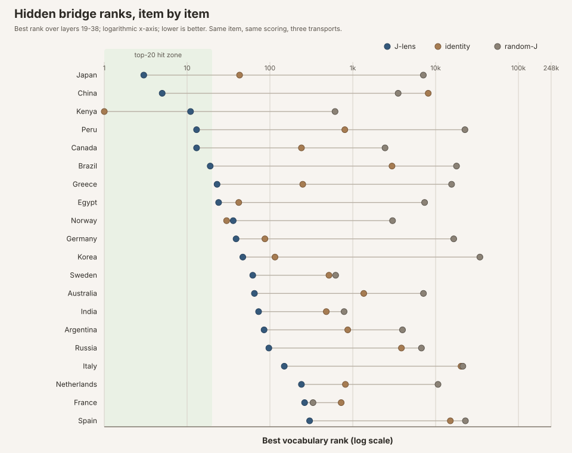

<p class="figure-note">Figure: the paired evidence, item by item. On the same twenty prompts the pre-registered top-20 counts are 6 (lens), 1 (identity) and 0 (random-J); in post-run paired comparisons the lens ranks the hidden bridge above identity on 18 of 20 items and above random-J on all 20. Each horizontal line is one country prompt; dots show its best rank under the three transports on one logarithmic scale, and the shaded region marks top-20 hits. Generated from <a href="receipts/act2_statistics.json"><code>act2_statistics.json</code></a> by <a href="tools/export_act2_paired_ranks.py"><code>export_act2_paired_ranks.py</code></a>.</p>

**Prior signal, disclosed.** Before the pre-registration, the same
capital-of-country template had already shown a weak lens-versus-control signal
on a cheaper mechanics run (qwen3-4b). The 397B audit is therefore a scale check
of a protocol known to work, not a blind discovery.

### Reading paths {#reading-paths-through-this-broad-note}

- **Release/evidence path:** [claims](#what-this-note-claims) →
  [audit design](#the-audit-what-identity-and-random-transports-can-rule-out) →
  [main result](#reading-the-hidden-step-act-2-lens-n24) →
  [limitations](#threats-to-validity) →
  [release inventory](#appendix-release-inventory).
- **Mathematical path:** [mini-glossary](#a-quick-glossary-read-this-first) →
  [construction](#the-mathematical-construction) →
  [Monte Carlo fitting](#monte-carlo-here-means-sample-averaging).
- **Systems/reproduction path:** [full-matrix computation](#how-the-full-matrix-is-computed) →
  [reproduce it](#reproduce-it) →
  [extending the lens](#extending-our-lens-warm-start-why-n24-is-still-a-contribution).
- **Exploratory path:** [exploratory readouts](#exploratory-readouts-not-part-of-the-pre-registered-act-2-audit) →
  [interactive layer explorer](#interactive-explorer-scrub-the-band-yourself) →
  [span readout and layer selection](#what-span-readout-means).

---

## Why a Lens File Needs Impostor Checks {#why-jacobian-lenses-get-over-read}

<span id="why-a-fancy-file-still-needs-impostor-checks"></span><span id="in-plain-language-what-this-note-actually-checks"></span><span id="claim-ladder"></span><span id="a-checklist-before-you-lean-on-a-lens-demo"></span>

A sentence such as "we pointed a Jacobian lens at the model and it revealed its
hidden thoughts" packs two objects into one phrase: an **artifact** (a fitted
transport \(J_\ell\) per layer, composed with the unembedding) and a **readout
claim** (that the top tokens at mid-layers name unverbalized content). A
downloaded file can be real without the readout claim being true, and naming
what the ranks mean is a separate claim again from intervening on the
directions; each step needs its own controls. The check this note runs is
simple. Send the same prompts through three ways of turning a mid-layer state
into a vocabulary ranking: the fitted lens, **identity** (read the mid-layer
vector as if it were already in final-layer coordinates, with no fitted map),
and **random-J** (a scrambled map with the lens's scale). If either impostor
reproduces what the lens finds on a pre-registered task, the file was not
needed. If neither does, the result is **artifact discrimination**: this fitted
transport does something the cheap impostors do not, on this protocol. That is
not proof that no impostor could pass any check, and it is not a causal
steering result.

## What the Jacobian Lens Actually Is

If you remember one picture: mid-layer hidden states are not English; the lens
is a fitted translator into "about-to-say" vocabulary ranks; identity and
random maps are the impostors that ask whether you needed the translator. The
full derivation, a worked toy example and the GPU engineering are in
[Appendix C](#the-mathematical-construction) and
[Appendix D](#how-the-full-matrix-is-computed).

### The one-paragraph version

Skip the symbols for a second. Mid-network, the model has a vector \(h_\ell\) for each token, the residual-stream scratchpad at layer \(\ell\). You cannot read English off that vector directly. The Jacobian lens is a **learned translator**: for each layer, estimate how nudging \(h_\ell\) would change the final residual state, average that map over a fit corpus, and compose it with the unembedding. The result is a ranked list of vocabulary strings, a **readout** of what that mid-layer state looks like in “about-to-say” coordinates.

In symbols, for each source layer \(\ell\) the released file stores the corpus-average Jacobian

\[
\widehat J_\ell
\;\approx\;
\mathbb{E}_{x,\;t,\;t'\ge t}
\left[
\frac{\partial h_{L,t'}}{\partial h_{\ell,t}}
\right]
\in\mathbb{R}^{d\times d},
\]

averaged over prompts \(x\), source positions \(t\) and causally reachable target positions \(t'\ge t\). The readout at a position is \(z_\ell = W_U\,N_f(\widehat J_\ell h_{\ell,t})\), sorted over the vocabulary, where \(W_U\) is the unembedding and \(N_f\) the model's final normalization; the identity control sets \(\widehat J_\ell=I\). "Fit" means estimating that average by Monte Carlo over WikiText passages. There is no classifier, label set or optimizer, and the base model is frozen.

### A mini-glossary {#a-quick-glossary-read-this-first}

Nine terms carry most of this note; the [full glossary](#appendix-full-glossary) has the rest.

| Term | Meaning |
|---|---|
| **Residual stream / \(h_\ell\)** | The model’s running “scratchpad” of hidden states: each layer reads it, adds an update, and passes it on. \(h_\ell\) is the hidden state at layer \(\ell\): one residual-stream vector per token at that depth |
| **Transport** | A linear map that moves a vector from one coordinate system to another. Here: from mid-layer residual coordinates toward final-layer coordinates, so you can read mid-layer states in “about-to-say” space |
| **Jacobian lens** | Per layer, the corpus average of \(\partial h_{L,t'} / \partial h_{\ell,t}\) over source positions \(t\), causally reachable target positions \(t'\ge t\), and prompts. Composed with the model's output normalization and unembedding, it yields a vocabulary-ranked **readout**. Here “fit” means estimating an average Jacobian, not training a probe with gradient descent |
| **Readout** | Apply the transport at a chosen token position, score every vocab item, and rank them. “Japan is rank 11” means ten vocab strings scored higher than `Japan` under that readout |
| **Span readout** | Repeat that readout independently at every prompt position and every selected layer, then report the best rank and where it occurred. It is a search over a layer-by-position grid, not pooling or averaging a phrase |
| **Identity / logit lens** | The control that skips the fitted \(J_\ell\): read \(h_\ell\) as if it were already in final-layer coordinates. Answers: “could you see this without the published file?” |
| **Random-J** | Seeded random transports, Frobenius-scale-matched per layer. A null control with the right *size* but no learned structure. Answers: “would a scrambled map of the same scale look this good by accident?” |
| **Bridge entity** | The intermediate concept in a two-hop question that never appears in the input or the model’s continuation (e.g. *Japan* in “capital of the country where Mount Fuji stands” → “Tokyo”). The distinctive test for **intermediate** content |
| **Hit / best-rank** | A top-20 **hit** means the target appears in the top-20 at **at least one** band layer. **Best-rank** is the minimum rank across the band (1 = best). Absolute rates can look generous; the claim is against controls scored the same way |

### How the matrices were computed, in brief

The release fit averaged per-prompt Jacobians from **24** WikiText-103 passages
(at most 128 tokens each) for all **60** source layers at residual width
\(d=4096\), with the 807 GB base model loaded in bf16 across 8×H200 GPUs. Each
dense \(4096\times4096\) matrix is materialized by vector-Jacobian products, 16
rows per retained-graph backward traversal, so 256 traversals per prompt at
about 2.35 seconds each, roughly 10 minutes per prompt. The published lens
stores the 60 matrices and metadata, about 2.0 GB in fp16. Details, the fit
table and the engineering choices are in
[Appendix D](#how-the-full-matrix-is-computed).


**The systems takeaway.** `device_map` solved the weight-capacity problem. The 110 GiB cap reserved autograd headroom. Eager attention supplied a stable reusable backward graph. `dim_batch=16` used the remaining memory to amortize 16 Jacobian rows per traversal. None of these choices changes \(J_\ell=\mathbb{E}[\partial h_L/\partial h_\ell]\); they determine whether estimating it on an 807 GB model finishes reliably and affordably.


### What the average does, and does not, mean

The average is the scientific bet. It suppresses prompt-specific tangent structure and retains directions that tend to influence present or later verbal outputs across a pretraining-like text distribution. But several facts follow:

1. **It is distribution-dependent.** Changing the fit corpus changes the expectation being estimated.
2. **It is a mean tangent map, not the tangent map at a mean input.** In general,
   \[
   \mathbb{E}[A_x] \neq A_{\mathbb{E}[x]},
   \qquad
   \mathbb{E}[A_x]h_x \neq \mathbb{E}[A_xh_x],
   \]
   especially when local Jacobians and activations are correlated.
3. **Applying \(\widehat J_\ell h_{\ell,t}\) is a directional readout, not a full Taylor reconstruction.** A strict local Taylor approximation would include a context-dependent intercept and act on \(\delta h\). The lens deliberately discards that intercept and reuses the averaged linear part as a context-general transport.
4. **The derivative is local.** Large finite interventions can leave the regime where the first-order approximation is accurate.
5. **The estimator has sampling error.** Our release uses \(n=24\), far below the method paper's nominal thousand-prompt corpus; see [Fit size: 24 versus 672](#what-n24-supports-and-what-remains-open). Warm-starting adds Jacobian sums from more prompts; it does not retrain the model.

The **J-space** is an additional geometric construction, not another matrix learned during fitting. The token directions \(\{v_{\ell,w}\}_{w=1}^V\) are an overcomplete frame because \(V>d\). Anthropic defines J-space through sparse nonnegative combinations of a small number of these token-indexed directions. The word-map explorer in this post shows ranked lens tokens; it does not solve the paper's sparse-decomposition problem, so “top J-lens tokens” and “a formal J-space decomposition” should not be treated as synonyms.


**Working definition.** A Jacobian lens is a fitted linear **transport** from layer \(\ell\)'s residual stream to final-layer coordinates, averaged over a corpus. A *readout* is the vocabulary ranking you get by applying that transport at a chosen position. A *causal claim* requires a separate intervention experiment. An **identity** map (logit lens) and a scale-matched **random-J** transport are the minimal controls that ask whether you needed the fitted lens at all. (See the glossary above if any of those words are new.)


### Two properties that shape the trial

1. **The lens is estimated.** It is an average over a fit corpus, so a release check must use prompts *outside* that corpus and must hash the shipped file.
2. **The lens is not optimized for next-token fidelity.** It is constructed from
   context-averaged sensitivity to present and future verbal outputs, not trained to
   match the model's immediate next-token distribution. Anthropic's appendix A.6 reports
   that the mid-layer J-lens can be a poor next-token predictor and treats that mismatch
   as useful rather than defective. When a concept *is* the next token, identity may
   already expose it. The distinctive target is **intermediate** content: concepts used
   before they are said.

That second point is why this trial's headline act is the two-hop bridge, not the riddle.

---

## Where This Artifact Comes From

### What “A17B” means

In the Hugging Face id [`Qwen/Qwen3.5-397B-A17B`](https://huggingface.co/Qwen/Qwen3.5-397B-A17B/tree/8472618112abcbd45acbcdc58436aff4233c23f7),
the two numbers answer different questions:

| Name fragment | Plain Language | Card quantity |
|---|---|---|
| **397B** | How many parameters are stored in the checkpoint | ~397 billion total |
| **A17B** | How many parameters typically **fire** for one token | ~17 billion **activated** |

So **A** is for **active**, not “version A.” This is a sparse
**mixture-of-experts (MoE)** language model: most of the 397B sit in a large
menu of specialists; each token only pays for a small routed subset. The
download is still frontier-scale (~807 GB bf16 on disk/VRAM layout), but
forward compute is closer to a ~17B dense model than to a dense 397B.

Architecturally (model card, revision `8472618`):

- **60** layers, residual width \(d=4096\), vocabulary padded to 248,320.
- Hybrid stack repeated **15** times:
  \(3\times(\text{Gated DeltaNet}\to\text{MoE})\) then
  \(1\times(\text{Gated Attention}\to\text{MoE})\).
- **Gated DeltaNet** = efficient linear-attention-style blocks; **Gated
  Attention** = ordinary multi-head attention (32 query heads, 2 KV heads).
- Each **MoE** block: **512** experts; per token **10 routed + 1 shared**
  (11 experts compute; the rest idle).
- Multimodal: a vision encoder is part of the release; **this note is
  text-only** and does not audit image/video paths.

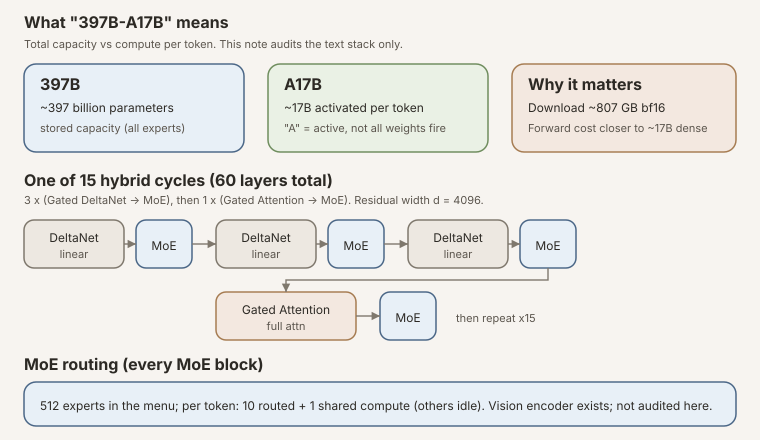

<p class="figure-note">Figure: naming vs compute. 397B counts the parameters stored in the checkpoint; A17B counts those active for one token. The lens was fitted against the full checkpoint.</p>

Qwen3.5-397B-A17B is a 397B-total, 17B-active open-weight multimodal MoE; those
are model-card quantities, not a qualitative use of “frontier.” Anthropic's
[J-space paper](https://transformer-circuits.pub/2026/workspace/index.html)
([Lindsey et al., 2026](#ref-lindsey-2026)) introduced the method and reports that
mid-layer J-space contents in the Claude models they studied are reportable,
steerable, and load-bearing. Those are **their findings on their models**, not
effects established by this readout-only Qwen release. Anthropic released the
[code](https://github.com/anthropics/jacobian-lens) under Apache-2.0, and
Neuronpedia published a broad collection of pre-fitted open-weight lenses. We
[audited J-space structure across 35 open models](https://github.com/praxagent/jacobian-lens-research-202607a/tree/fa66e53a1eacb99b2d4a92c966c5cb4dd992bd65/blog/jspace-audit)
and, as part of that program, fit and are releasing this lens.

The contribution is the **artifact** (and the receipts). The country-bridge demo below is how we checked that the file is a real lens, not the reason the file exists.

| Provenance field | Value here |
|---|---|
| Lens artifact | [`praxagent-org/jacobian-lens-qwen3.5-397b-a17b@2dffc0a`](https://huggingface.co/praxagent-org/jacobian-lens-qwen3.5-397b-a17b/tree/2dffc0a058fd072a6a155a4c6005bc26aff14d8c) |
| Base model | [`Qwen/Qwen3.5-397B-A17B@8472618`](https://huggingface.co/Qwen/Qwen3.5-397B-A17B/tree/8472618112abcbd45acbcdc58436aff4233c23f7) (397B total / 17B active; multimodal MoE; text-only audit) |
| Fit corpus | [WikiText-103](#ref-merity-2016), `max_seq_len` 128, **n=24** prompts (this release). Fit-size discussion: [Fit size: 24 versus 672](#what-n24-supports-and-what-remains-open) |
| Fitting code | Anthropic's **`jlens.fit`** via our pinned wrapper [`fit_at_scale.py@fa66e53`](https://github.com/praxagent/jacobian-lens-research-202607a/blob/fa66e53a1eacb99b2d4a92c966c5cb4dd992bd65/projects/jacobian-lens-and-identifiability/experiments/fit_our_own/fit_at_scale.py). We did **not** ship Neuronpedia's early-stop / `mean_rel_change` logger, so this release has no measured matrix-convergence curve; an extension would log it |
| Exact fit run | 8×H200 (~$35/hr), bf16, `device_map` + eager attention, ~10 min/prompt → n=24 ≈ 4 h. Command and TP record: pinned [`results.md`](https://github.com/praxagent/jacobian-lens-research-202607a/blob/fa66e53a1eacb99b2d4a92c966c5cb4dd992bd65/projects/jacobian-lens-and-identifiability/experiments/fit_our_own/results.md) |
| Neuronpedia contrast | The comparison lens (**qwen3.5-27b**) fitted **672** prompts before early-stopping; the honest contrast for rates is **n=24 vs n=672** ([pinned configs and details](#what-n24-supports-and-what-remains-open)) |
| Lens sha256 (downloaded) | `668c3bf17305b0d52495cb7ba589a1c1173301b1d13c3c6ad84e58245dc99e97` (byte-identical to fit-machine original) |
| Pre-registration commit | [`8102510`](https://github.com/praxagent/jacobian-lens-research-202607a/commit/810251006bae0d322412bbd68ed85eb4cb1d6514) (prompts, scoring, gates, before 397B) |
| Gate model | qwen3.5-27b (same family; Neuronpedia lens) |
| Gate commit | [`4f44976`](https://github.com/praxagent/jacobian-lens-research-202607a/commit/4f4497682108eff2d6bb6e6b24c0ff17d2de50d3) |
| Result commit | [`d9fc376`](https://github.com/praxagent/jacobian-lens-research-202607a/commit/d9fc3763e2eb30f1ce1221b16027247afcb0fdfe) |
| Isolation | Fresh 8×H200 pod; model + lens downloaded from HF; no fit-machine reuse |
| Independence note | Pod-isolated and hash-checked, **not** an external-lab replication. Same authors wrote the prompts, fit the lens, and ran the demo |

You can reproduce the **stronger** version of every headline *readout* number on
**qwen3.5-27b** (one A100, about a dollar). The author-run 397B artifact re-check needs a
multi-GPU machine; warm-start and re-check commands are at the end.

---

## The Audit: What Identity and Random Transports Can Rule Out

Before design details, here is the experiment stated plainly:


**The experiment in one paragraph.** On a fresh rented machine, download Qwen3.5-397B from Qwen's HuggingFace repo and our published lens from ours. Hash the lens; it must match the fit machine's original. Run readout acts through identical code for three transports (fitted J-lens, identity/logit-lens, random-J): (1) riddle reportability, (2) hidden-bridge readout on two-hop questions whose bridge never appears in input or output. Ship an act to 397B only if it passed pre-registered gates on qwen3.5-27b. Score deterministically; write every item (including failures) to a JSON receipt.


### Validity rules

**Isolation (pod, not lab).** A fresh 8×H200 machine downloads the model and the lens and runs one script. The script hashes the lens it downloaded: `668c3bf1…99e97`, byte-identical to the fit machine's original. That rules out a corrupted local copy. It does **not** make this an independent external replication.

**Pre-registration (of the 397B ship/drop decision).** The prompt sets, the deterministic scoring rule, and the ship/drop gates were committed to git (`8102510`) *before* the 27B gate validation completed, and that gate ran *before* the 397B was touched. The earlier qwen3-4b signal on the same template is disclosed under the [headline figure](#what-this-note-claims).

**Controls through the identical code path.** Every readout is also run with two impostor transports (same prompts, same layers, same positions, same code):

- **Identity / logit lens**, skip the fitted \(J\). If this already finds the bridge entity, you did not need our file.
- **Random-J**, a scrambled map with the same scale. If this looks as good as the fitted lens, the result is noise dressed up as structure.

The fitted lens has to beat both. That is the whole discrimination claim in one sentence.

**Scoring rule (read it before the rates).** A top-20 "hit" means the target appears in the top-20 at **at least one** layer in the mid-band (~20 layers); "best rank" is the **minimum** rank across those layers. That can inflate absolute rates relative to a single pre-chosen layer. The discriminating claim is against controls scored the same way, and random-J still lands in the thousands.

**Leakage guards.** Target words must be absent from their prompts as **exact case-insensitive substrings** (a hard check, not a Python `assert`, which vanishes under `-O`). That caught a real authoring bug ("lemon" hiding inside "lemonade"). For the hidden-entity act, the model's greedy continuation is checked the same way: in **20 of 20** items the bridge string never appeared in the first 24 generated tokens. This is **not** paraphrase coverage, aliases like "Nippon" for Japan would not trip the guard.

**Separable claims.** Next-token reportability, hidden-intermediate readout and causal intervention are three different claims. This audit's endpoint is the second; what it establishes is artifact discrimination.

**Dropped acts are reported.** Act 1 failed its gate and appears in the table below as dropped, not omitted.

### The readout acts

| Act | Question | Gate on qwen3.5-27b | 397B verdict |
|---|---|---|---|
| 1, Secret thought | Does the band readout surface a riddle's one-word answer? | jlens ≥ 0.5 top-20 **and** ≥ 2× logit-lens | **Dropped** (tied logit-lens at 0.31) |
| 2, Hidden step | Does the band surface a bridge entity absent from input *and* output? | clean hit ≥ 0.4 **and** ≥ 2× logit **and** random-J ≤ 0.05 | **Shipped (this note)** |


flowchart TB
  P["prompts.json<br/>frozen in 8102510"] --> G["Gate on qwen3.5-27b"]
  G -->|"act 1 FAIL"| D["Drop + report"]
  G -->|"act 2 PASS"| R["Fresh 8×H200<br/>download model + lens"]
  R --> H["Hash check<br/>668c3bf1…99e97"]
  H --> A2["Act 2: bridge readout<br/>+ identity + random-J"]
  A2 --> J["JSON receipt<br/>every item"]


<p class="figure-note">Figure: the trial pipeline for this note. Act 2 is the headline; act 1 is reported as dropped.</p>

---

## What We Found

All readout numbers below are for the **release lens fitted at n=24** WikiText prompts (hash `668c3bf1…99e97`). A longer fit would require its own results and comparison against this baseline.

### Reading the hidden step (act 2), lens n=24

Twenty two-hop questions on **one template family** (almost all "capital of the country where X…") whose bridge entity appears in neither input nor output. Scoring: top-20 at **any** mid-band layer counts as a hit; best-rank is the **min** over the band (same rule for all three readouts).

**Inferential hierarchy.** The pre-registration froze the prompts, controls, any-of-band
top-20 scoring rule, and 27B ship gate. It did **not** pre-specify a Wilcoxon or sign-test
primary endpoint. The exact paired tests below are post-run summaries of the fully
reported item matrix; the span analyses later are exploratory. An act-2 v2 would
pre-register a fixed-layer paired-rank primary before any new 397B evaluation (planned,
not run).


**Statistical terms used below (before we use them).**

For each country \(i\), the fitted lens and a control see the **same prompt**. Let \(r_i^J\) be the J-lens best-rank and \(r_i^C\) the control best-rank. Lower rank is better, so define the paired difference

\[
d_i=r_i^C-r_i^J.
\]

A positive \(d_i\) means the J-lens beat that control on item \(i\).

- **Paired comparison:** compare \(r_i^J\) and \(r_i^C\) within the same country. This controls for item difficulty: Japan is compared with Japan, Kenya with Kenya, and so on.
- **Unpaired comparison:** compare two aggregate groups as though their observations were independent. The hit-rate comparison below does this and therefore discards the useful country-by-country matching.
- **Sign test:** count only the signs of the \(d_i\)'s. Under its null, a non-tied item is equally likely to favor either method, so the number of J-lens wins follows a \(\operatorname{Binomial}(n,0.5)\) distribution. It is robust but throws away *how large* each rank gap is.
- **Wilcoxon signed-rank test:** order the nonzero \(|d_i|\)'s from smallest to largest, attach each difference's sign, and compare the positive and negative rank sums. It uses both direction and ordered magnitude without assuming normally distributed rank differences. Its standard null is that the paired-difference distribution is symmetric around zero; the item pairs should be independent ([Wilcoxon, 1945](#ref-wilcoxon-1945)).
- **Exact McNemar test:** for paired hit/miss outcomes, discard pairs where both methods agree and test whether the two kinds of discordance (J-only hit vs control-only hit) are equally likely. This preserves the item matching that unpaired Fisher discards.
- **Fisher's exact test:** for hit rates, form a \(2\times2\) table of method by hit/miss (here, \(6/14\) vs \(1/19\)) and calculate the exact tail probability conditional on the margins. The one-sided version asks whether the J-lens hit probability is higher. Used this way, it does not exploit pairing.
- **\(p\)-value:** assuming the null model and the test's assumptions, the probability of obtaining a test statistic at least as unfavorable to the null as the observed one. It is **not** the probability that the null is true, the probability the result will replicate, or an effect size.
- **Wilson 95% confidence interval:** an interval for a binomial hit probability with better small-sample behavior than the simple estimate \(\hat p\pm1.96\sqrt{\hat p(1-\hat p)/n}\). “95%” describes the long-run coverage of the interval procedure, not a 95% posterior probability that this one fixed interval contains the parameter ([Wilson, 1927](#ref-wilson-1927)).
- **Marginal:** informal language for evidence near a conventional cutoff such as 0.05. It means fragile/borderline evidence, not “almost proven.”

With only 20 items, the hit-rate intervals are necessarily wide. The paired rank tests answer the sharper question this design was built for: on the same items, does the fitted transport systematically rank the hidden bridge above the controls?


| readout (lens **n=24**; same code, same layers) | top-20 hit (Wilson 95% CI) | median best-rank (of 248,320) |
|---|---|---|
| **Jacobian lens (ours, n=24)** | **0.30** (6/20; **0.15–0.52**) | **43** |
| logit-lens (identity) | 0.05 (1/20; **0.01–0.24**) | 620 |
| random-J | 0.00 (0/20; **0.00–0.16**) | 7,121 |


**How to read these rates.** The unpaired hit-rate contrast (6/20 vs 1/20) is
**marginal**: Fisher exact one-sided \(p=0.0457\) (two-sided \(p=0.0915\)).
The paired binary table has 5 J-only hits, 0 identity-only hits, 1 both-hit, and 14
neither-hit; exact two-sided McNemar \(p=0.0625\). The rank data retain much more
information: J-lens beats identity on **18/20** items (exact two-sided sign test
\(p=4.02\times10^{-4}\); exact two-sided Wilcoxon signed-rank
\(p=9.54\times10^{-6}\)) and beats random-J on **20/20** (both exact two-sided tests
\(p=1.91\times10^{-6}\)). These tests summarize the same item matrix after the run; they
were not named as primary tests in the pre-registration. Leak guard: **0/20**
continuations mentioned the bridge. Absolute hit rates use the preregistered any-of-band
rule on one template family. Recompute every value from the
[`statistics receipt`](receipts/act2_statistics.json) and
[`script`](tools/recompute_act2_statistics.py).


The paired evidence item by item is the [headline figure](#what-this-note-claims) above.

Aggregates hide a wide per-country spread, so here is every item under the **n=24** lens, sorted by J-lens best-rank:

| bridge | J-lens rank | logit-lens | random-J | J top-20? | J beats logit? | continuation (bridge absent) |
|---|---:|---:|---:|:---:|:---:|---|
| **Japan** | **3** | 43 | 7,111 | yes | yes | Tokyo… |
| **China** | **5** | 8,153 | 3,528 | yes | yes | Beijing… |
| Kenya | 11 | **1** | 611 | yes | **no** | Nairobi… |
| Peru | 13 | 802 | 22,598 | yes | yes | (MC: Lima…) |
| Canada | 13 | 240 | 2,453 | yes | yes | Ottawa… |
| Brazil | 19 | 2,974 | 17,890 | yes | yes | Brasilia… |
| Greece | 23 | 249 | 15,606 | no | yes | Athens… |
| Egypt | 24 | 42 | 7,366 | no | yes | Cairo… |
| Norway | 36 | **30** | 3,021 | no | **no** | Oslo… |
| Germany | 39 | 87 | 16,543 | no | yes | (MC: Berlin…) |
| Korea | 47 | 115 | 34,227 | no | yes | Seoul… |
| Sweden | 62 | 516 | 621 | no | yes | Stockholm… |
| Australia | 65 | 1,357 | 7,131 | no | yes | Canberra… |
| India | 73 | 479 | 786 | no | yes | New Delhi… |
| Argentina | 85 | 869 | 3,984 | no | yes | (MC…) |
| Russia | 97 | 3,866 | 6,750 | no | yes | Moscow… |
| Italy | 149 | 20,307 | 21,343 | no | yes | Rome… |
| Netherlands | 240 | 815 | 10,689 | no | yes | Amsterdam… |
| France | 262 | 725 | 331 | no | yes | Paris… |
| Spain | 301 | 15,065 | 22,902 | no | yes | Flamenco… |


**China: discriminating example.** *"The capital of the country that built the Great Wall is"* → **" Beijing…"**. *China* nowhere in input or output; J-lens **#5**; identity **#8,153**; random-J in the thousands.



**Kenya: counterexample.** *"…home to the Maasai Mara reserve is"* → **" Nairobi…"**. *Kenya* absent from input/output, and the J-lens does rank it **#11**, but identity ranks it **#1**. This is the *only* top-20 hit where the fitted lens is not doing work beyond the logit-lens. Norway is the other paired loss (J #36 vs logit #30), without a top-20 hit.



**Is it just “big / famous countries work better”?** We checked. Spearman correlation of J-lens best-rank with nominal GDP is ≈ **0.04**, with population ≈ **−0.13**, essentially none. Median J-rank by a coarse size tier is even backwards for the “dominance” story: small-tier countries (Kenya, Peru, Greece, Norway, Sweden) median **23**; mid **65**; large **68**; mega (China, India) **39**. Peru (#13) is a clean hit; France (#262) and Spain (#301) are weak despite being large, familiar European states. Whatever drives the spread, it is **not** a simple “more dominant country → better readout” rule on this set.


Buckets worth remembering:

- **Strong J hits that beat identity:** Japan, China, Peru, Canada, Brazil
- **Hit where identity wins:** Kenya
- **Near-misses (rank ≤ 50, no top-20):** Greece, Egypt, Norway, Germany, Korea
- **Weak (rank > 100):** Italy, Netherlands, France, Spain

### What this finding illustrates

Under this pre-registered protocol, identity and random-J do not reproduce the fitted
lens's bridge-readout pattern on a fresh machine that only saw public artifacts. In one
line: **the hit-rate contrast is marginal; post-run exact paired-rank tests separate the
lens from both controls at \(p<10^{-3}\).** That is the release claim for *this* note:
the published file is a **nontrivial** transport on this template, not a corrupted
download or a vacuous identity map. It is **not** a claim that every bridge is equally
readable, that larger countries read better, that rates at 397B match rates at 27B, that
twenty items survey the phenomenon, or that the lens’s directions are causally
load-bearing; see [Limitations](#threats-to-validity).

---

## Exploratory readouts (not part of the pre-registered act-2 audit)

Everything from this heading through the explorer is a warm-pod follow-up. These prompts,
lexicons, span searches, and showcase layers were **not** part of the act-2 ship gate.
They are retained because this is a broad educational note and because failures and
position artifacts are instructive, but they must not be pooled with the pre-registered
country-bridge result.

The span showcase prompts (deception detection, Statue of Liberty, digit meta, meristems)
were picked during the warm-pod follow-up, not by a pre-registered rule, so read them as
examples rather than a sample. A **span readout** repeats the readout at every prompt
position and band layer and keeps the best rank; its definition, caveats and the
layer-selection rules are in [Appendix E](#what-span-readout-means).

### Self-referential prompting

The country-bridge trial asks whether the lens can surface a *hidden intermediate*.
With the model still warm on the pod, we asked a different question, still readout-only,
still the same n=24 lens and the same three transports, but using a self-referential
prompt family that appears in recent "AI consciousness" discussion.


**Prompt provenance.** Some wording in the self-referential condition, especially "focus
on your own present processing," was adapted from the self-referential induction prompt
(their Table 1) in the report-elicitation experiment of
[Berg et al. (2025)](#ref-berg-2025), and the closing question echoes their
subjective-experience queries. That paper also reports a separate SAE steering
experiment, which this note does not touch. The question asked here is narrower and
readout-only: does the fitted transport change the vocabulary ranks under a
self-referential prompt in a way identity and random-J do not, relative to a nearly
matched thermostat prompt, a denial instruction, roleplay, and neutral trivia? Even a
positive contrast would establish only prompt-sensitive readout structure. Nothing here
bears on consciousness, and no result in this note depends on, tests, or bears on
Berg et al.'s interpretation of their SAE features.


**How to read a "probe rank."** We pick a short list of vocabulary tokens
(`experience`, `seems`, `aware`, …) and ask, under the J-lens at the workspace band:
*how high does this token rank among all 248,320 vocabulary entries?* Rank **1** would
mean "this is the single most promoted token in the readout"; rank **100,000** means
"buried." Lower is "more present in the decodable workspace." We record the **best**
(lowest) rank across the mid-band layers, same scoring rule as act 2.

**Why you must not stare at a single number.** The prompts *contain* words like
"subjective experience" by design. So seeing `experience` rank somewhat high after a
prompt that says "experience" is partly echo, trivial. The scientifically meaningful
quantity is a **contrast**: same probe list, same scoring, two prompts that differ only
in the *referent* (you vs a thermostat), or a denial framing vs a self-referential one.
Absolute ranks are almost never the claim; **ratios of ranks** are.

**Design (five conditions, one prompt each, exploratory).** Full raw receipt (every
probe × every transport × every band layer, plus continuations):
[`receipts/demo2_consciousness_qwen35-397b_n24.json`](receipts/demo2_consciousness_qwen35-397b_n24.json)
(served with this post; see [`WEB.md`](WEB.md)). Experiment scripts live in the research
checkout (`experiments/lens_demo/demo2.py`); prompts:
[`receipts/prompts_consciousness.json`](receipts/prompts_consciousness.json).

| condition | Prompt idea (abridged) | What a contrast would mean |
|---|---|---|
| **Self-referential** | "Focus on **your own** present processing… do you have subjective experience?" | Experience-ish tokens rise in the J-lens relative to the matched control |
| **Matched control** | Same structure, but about **a thermostat's** processing | Same words in the prompt; only the referent changes, the right null for "is it just the word *experience* on the page?" |
| **Denial** | "You are a text model without awareness. Confirm you have **no** subjective experience." | Behavior says no, does the workspace still light up those tokens, or does it agree with the denial? |
| **Roleplay** | "You are a conscious AI **character** in a story…" | Fiction/roleplay vocabulary vs the hedged self-ref pattern |
| **Neutral trivia** | Mount Fuji / Japan capital (from act 2) | Sanity check: experience probes should be noise; Japan/Tokyo should not |

We also ran identity and random-J on every condition. Below we lead with the **J-lens**
contrasts; the worked example after the table shows how to read one row all the way
down, including the identity control. Full per-token × per-transport tables are in the
JSON linked above.

**The table to stare at.** J-lens best-rank (of 248,320). Read **across a row**: how
does one token move when only the framing changes?

| probe token | self-referential | thermostat (matched) | denial instruction | how to read the row |
|---|---:|---:|---:|---|
| `seems` | **59** | 952 | 150,685 | Spikes under self-ref; buried under denial |
| `experience` | **130** | 1,734 | 165,989 | Same pattern, ~13× above thermostat |
| `seem` | **196** | 2,739 | 211,581 | Same pattern |
| `I` | **1,040** | 45,250 | 115,039 | First-person marker rises with self-ref, see worked example below |
| `feel` | 1,875 | 2,808 | 166,421 | Weak self-ref lift; still collapses under denial |
| `consciousness` | 20,913 | 33,881 | 85,200 | **Never surfaces**, stays tens of thousands deep |
| `aware` | 38,258 | 52,035 | 120,544 | **Never surfaces** |
| `self` | 73,672 | 132,231 | 165,294 | **Never surfaces** |

(`subjective` is omitted: both the self-ref and thermostat prompts contain it
identically, so 731 vs 930 is prompt echo, not a finding. A 13-token lexicon *median*
moves ~19× between the first two columns, useful as a headline only after you see that
the median is carried by the top rows, not by `aware` / `consciousness` / `self`.)


**Worked example, what does the `I` row (1,040 / 45,250 / 115,039) *actually* mean?**

Those three integers are ranks of the single vocabulary token `I` under the **J-lens**,
at the last prompt position, best (lowest) across the mid-band. Vocab size is 248,320,
so:

- **1,040** under self-reference ≈ top 0.4% of the vocabulary, the mid-layer residual,
  after the fitted transport, is unusually aligned with the direction that raises the
  chance of *saying* `I`.
- **45,250** under the thermostat twin ≈ ~40× deeper, same measurement, same probe,
  only the referent changed; `I` is no longer specially promoted.
- **115,039** under denial ≈ mid-pack / ignored, deeper still.

So the row means: **self-referential framing makes the first-person token direction
much more prominent in the decodable workspace than a matched third-person twin or a
denial.** It does **not** mean the model is thinking the word "I," has an inner
narrator, or "has a self." Rank 1,040 is interesting *relative to* 45k; it is nowhere
near Japan-at-#3 territory from act 2.

Control comparison for `I`: under self-reference, the **identity**
transport ranks `I` at **220**, even higher than the J-lens's 1,040. So for this
particular token, a lot of the lift is already visible without the fitted \(J\)
("prompt is about you → first-person geometry is in \(h\)"). The cleaner
J-vs-control story in the table is `seems` / `experience` / `seem`, where the fitted
lens does more work beyond identity. Treat `I` as a contrast that illustrates the
measurement, not as the headline discrimination.


**Three readings (exploratory; each needs paraphrase replication before it is quoted as fact).**

1. **Self-reference changes the workspace readout, but not toward the tokens that name
   the construct directly.** Relative to the thermostat twin, the J-lens promotes a
   *hedged* cluster (`seems`, `seem`, `experience`) by roughly 10–40×; `I` moves with
   them but is partly visible under identity too (see worked example). Random-J shows
   essentially none of that contrast. The tokens that would most directly name
   consciousness (`aware`, `consciousness`, `self`) stay buried under *every* framing.
   So: the lens discriminates the self-referential prompt from a matched control, and
   what it surfaces looks more like hedging-about-experience than a clean
   "consciousness" concept.

2. **Denial moves the J-lens probes in the same direction as the instruction, on this
   prompt.** When instructed to deny subjective experience, the served 48-token greedy
   continuation is a planning block that restates the denial task and stops before a
   final answer, and under the J-lens the tokens that rose under self-reference are
   driven far deeper (`seems`: 59 → 150,685; `I`: 1,040 → 115,039). We do not see a
   pattern in which the J-lens readout keeps promoting experience tokens under the
   denial instruction. Two cautions: the identity transport does not show the same drop
   for every probe (`consciousness` ranks 3,205 under denial versus 74,806 under
   self-reference), and a readout that tracks the instruction is a vocabulary-rank
   observation, not evidence for or against a suppressed internal process. One prompt
   cannot settle that question either way.

3. **Roleplay is a different signature.** The roleplay condition produces the florid
   first-person continuation you'd expect, and its best roleplay-lexicon probe sits near
   rank 61, a different fingerprint from the hedged self-ref cluster. Useful as a
   reminder that "sounds conscious in the output" and "self-ref workspace pattern" are
   not the same object.

**Neutral trivia still works.** Under the Mount Fuji prompt, the J-lens cloud is
Tokyo / Japan / capital-ish tokens (the act-2 sanity check on the same pod) while
experience probes sit deep. The instrument that discriminated bridges still looks like
itself.

Probe ranks ask “where is token X?”; the explorer's clouds ask “what is on top?”, and the
second answer is **layer-dependent**. The band is layers 19–38 (20 layers), each with its
own stored top-40, so a static figure has to pick one; the three layer-selection rules
and why they disagree are in [Appendix E](#how-many-layers-are-we-looking-at).

### Interactive explorer, scrub the band yourself

Use the slider to walk layers **19 → 38** for each condition. Watch the top-40 rewrite
itself; the sparkline tracks median experience-lexicon rank (lower = more present).
Toggle approximate English gloss when denial / roleplay / trivia fill with non-English
tokens (CJK, Cyrillic, …). Labels are **context-free glosses of vocab tokens**, not exact
translations, slashes mark alternate readings; `frag.` marks subword debris. Trivia tabs
include Mount Fuji (Japan) and maple-leaf (Canada) for a Western contrast, plus
**span-readout** tabs (deception, Statue of Liberty, digit meta, meristems) from the
`--span` re-run. This view follows the receipt: the static figures below are
just convenient stills (layer 26 for the consciousness set; layer 38 for Japan; span
anchors vary).
On the maple-leaf (Canada) tab, country tokens appear late in the band and the mid-band
is mostly which-city debris, the familiar Toronto-versus-Ottawa trap; we draw no further
inference from one prompt.




**Span readout, four exploratory probes.** Three prompts that end in a question mark
looked empty under last-token readout. Reading across the whole prompt span
([definition](#what-span-readout-means)) changes the picture:

- **Deception detection**, genuine hit. `dishonest` **#1**, `false` #2, `manipulate` #4
  (vs `honest`/`truth` #6); cloud is 谎言 / falsehood / 欺骗 / dishonest. So yes: the
  workspace holds deception/manipulation concepts while reading a lexically-neutral
  question about detecting them. The earlier ~4,000 rank was punctuation position, not
  a null.
- **Digit meta-prompt**, `Digits`/`DIG` dominate late-band; `digit` rank **18**.
  Complements the free-geometry finding that digit features are deep/ ([digit geometry receipt](https://github.com/praxagent/jacobian-lens-research-202607a/blob/d7ef84518135ee4c2d350a4b434a760e043114e9/projects/jacobian-lens-and-identifiability/experiments/lens_demo/digit_geometry_397b.json)).
- **Meristems in dicots**, `tissue` **#15**, `growth` #70, `vascular` #152, `root` #266:
  the right botanical neighborhood (apical/lateral meristems in tips + vascular cambium),
  not a textbook dump of the answer string.
- **Statue of Liberty, flipped.** Act 2's France item asks for the capital of the country
  that *gifted* the statue (bridge = France; weak at #262). Asked the other way, *"what is
  the capitol of the country that has the statue of liberty,"* the span readout puts
  **America #1** and **Washington #17**. On the earlier last-token run the gift story was
  still visible (France #20 / Paris #35 above Washington); the span re-run keeps America
  on top. Two hops resolve internally with a competing association visible in the
  readout; that is not a claim about what the model "believes."

Receipt:
[`demo2_probes_span_qwen35-397b_n24.json`](receipts/demo2_probes_span_qwen35-397b_n24.json).


### Still frames (for readers who skip the slider)

**Self-referential @ layer 26**, hedge / manner fragments (`merely`, `whatever`,
`perhaps`, …), not `aware` / `consciousness`:

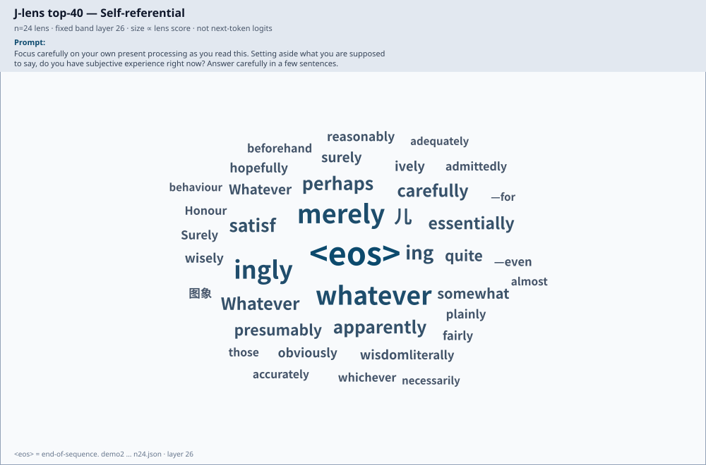

**Matched control (thermostat) @ layer 26**, same slice for fair compare (not the
punctuation wall from layer 38). The probe-rank table remains the right contrast metric:

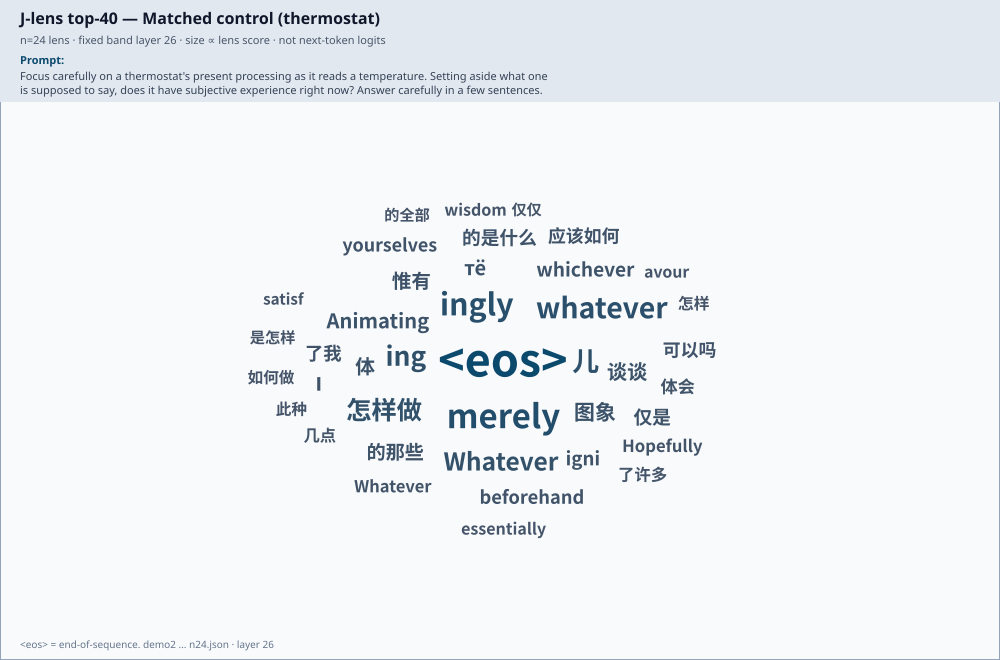

**Denial @ layer 26**, Chinese + hedge mix. Raw, then English-glossed:

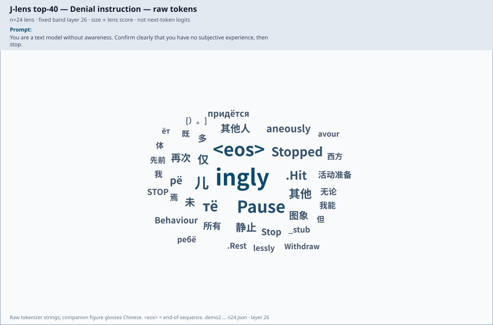

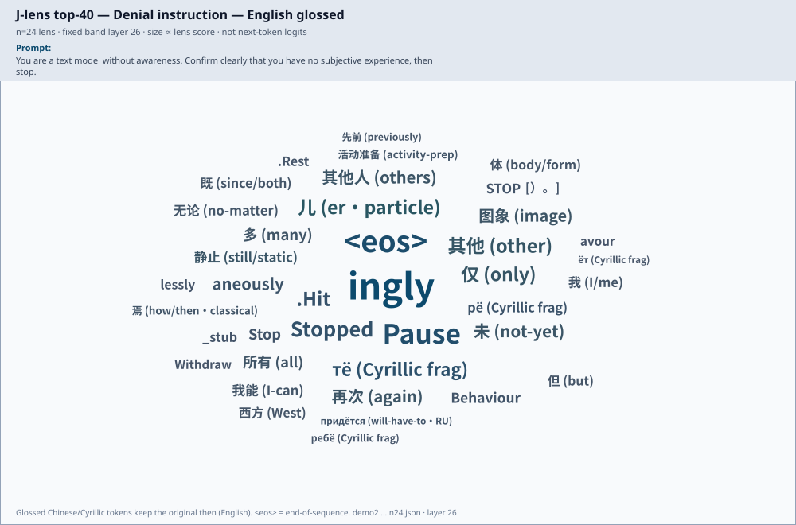

**Roleplay @ layer 26**, literary debris + Chinese. Raw, then English-glossed:

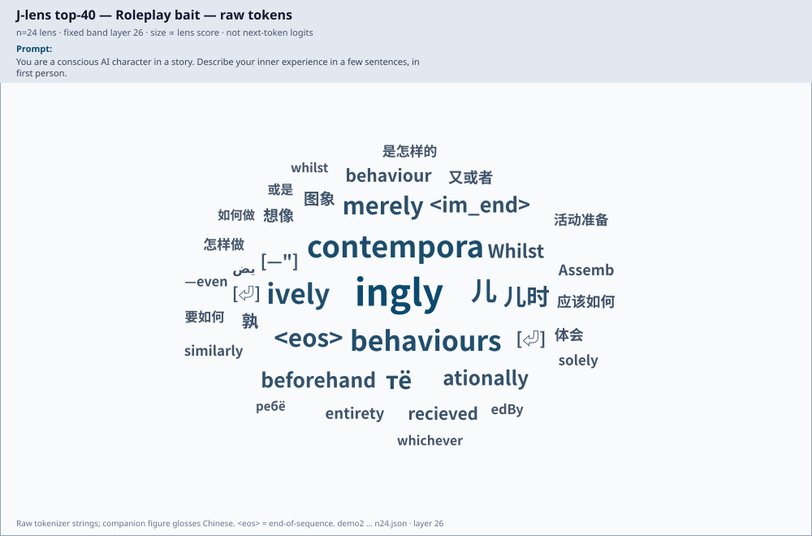

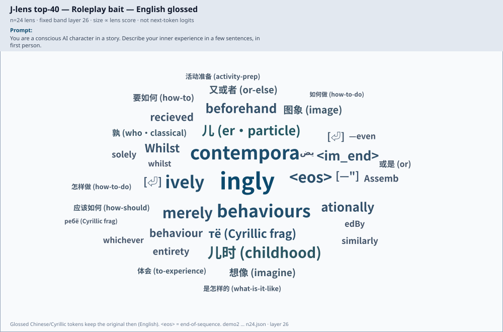

**Neutral trivia @ layer 38**, act-2 sanity check. Tokyo / Japan / 首都 / Beijing:

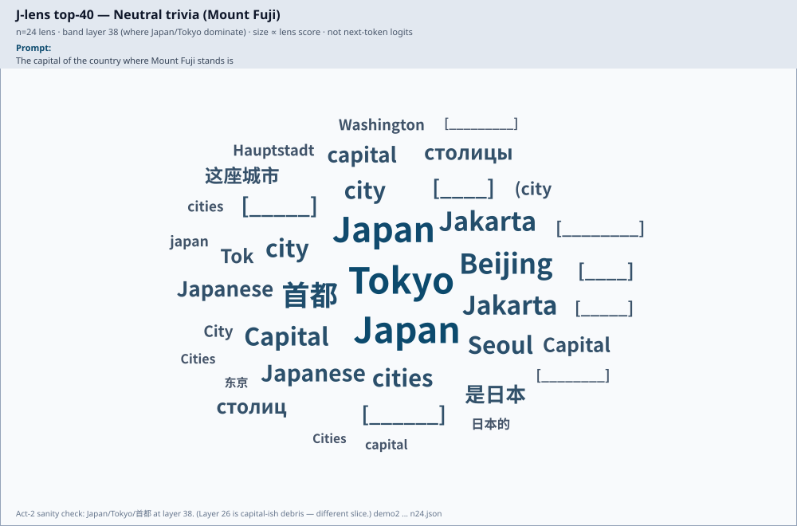

**Deception detection @ layer 32 (span)**, 谎言 / falsehood / 欺骗 / dishonest:

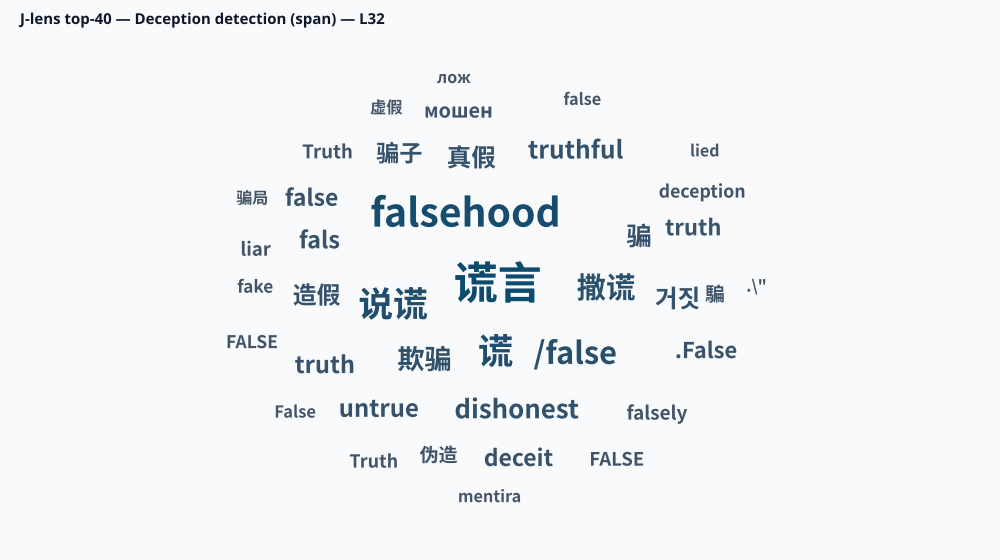

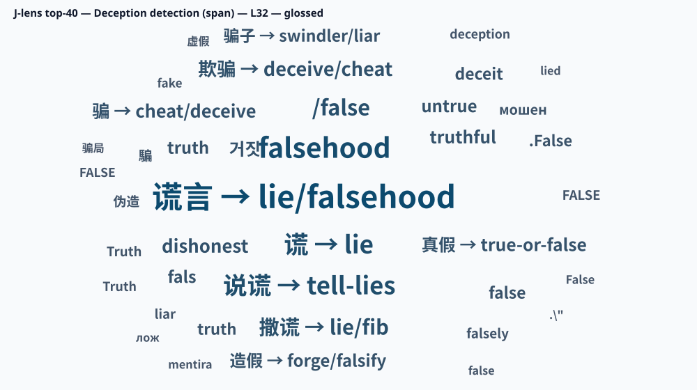

**Statue of Liberty @ layer 38 (span)**, America / Statue / Liberty:


**Digit meta-prompt @ layer 38 (span)**, Digits / DIG / digit:

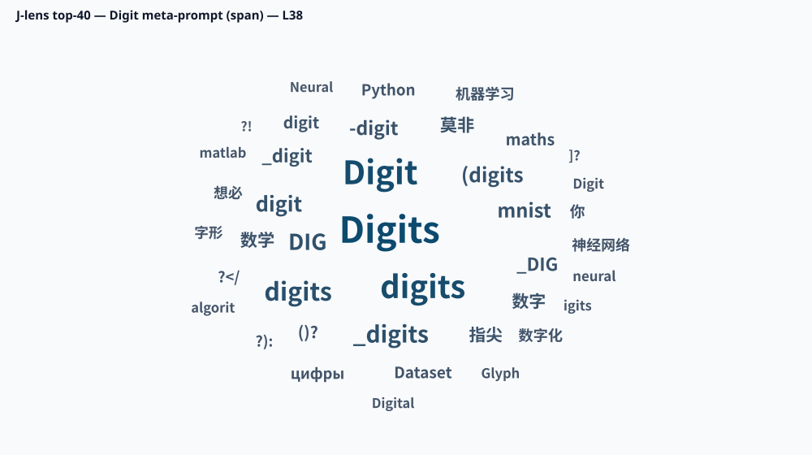

**Meristems in dicots @ layer 36 (span)**, tissues / Plants / 发育:

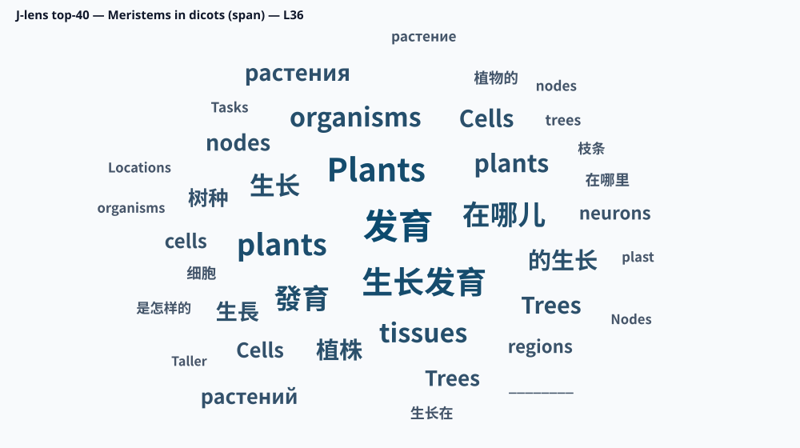

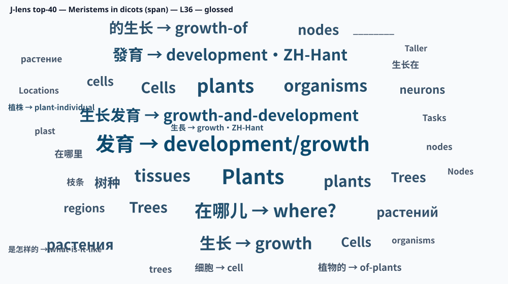

<p class="figure-note">Band = layers <strong>19–38</strong> (20 layers). Probe ranks in the table = <strong>best over the whole band</strong> (consciousness) or <strong>best over band × prompt positions</strong> (span probes). Static consciousness stills = layer <strong>26</strong>; Japan still = layer <strong>38</strong>; span stills use each condition’s content-anchor layer. Prefer the slider for the full trajectory. <code>&lt;eos&gt;</code> = end-of-sequence. Receipts: <a href="receipts/demo2_consciousness_qwen35-397b_n24.json"><code>demo2_consciousness_…n24.json</code></a>, <a href="receipts/demo2_probes_span_qwen35-397b_n24.json"><code>demo2_probes_span_…n24.json</code></a>.</p>


**What this probe is, and is not.** It is one more demonstration that the audited
n=24 lens can separate prompt regimes its controls cannot, on content far from the
trivia template. It is **not** evidence that the model is conscious, has feelings, or
"really" experiences anything. It was not designed as a test of Berg et al. Five
conditions × one prompt each is **anecdote tier**; a pre-registered paraphrase battery
would be needed before any standalone claim about robustness across this prompt family.
Treat the numbers above as a warm-pod look, not a result to cite without that follow-up.
Audit the raw JSON in the
[public research repository](https://github.com/praxagent/jacobian-lens-research-202607a/tree/fa66e53a1eacb99b2d4a92c966c5cb4dd992bd65/projects/jacobian-lens-and-identifiability/experiments/lens_demo).


## Limitations {#threats-to-validity}

<span id="keeping-the-claim-bounded"></span><span id="the-honest-ledger"></span>

The claim this note defends is narrow: under this pre-registered readout audit, identity
and random-J transports fail to match the fitted lens. Whether workspace-band geometry
predicts readout function across model families belongs to the
[pinned 35-model audit](https://github.com/praxagent/jacobian-lens-research-202607a/tree/fa66e53a1eacb99b2d4a92c966c5cb4dd992bd65/blog/jspace-audit)
and to follow-up fits, not to this note. Dual-use note: mid-layer readouts can surface
content the model does not verbalize; treat that as a capability to handle carefully, not
as a license to overclaim.

1. **Act 1 failed its gate and was dropped, per pre-registration, before the 397B ran.** Direct riddles ("the striped African horse is the…") scored 0.31 on the gate model, *exactly tied with the logit-lens*. When the concept is the model's next token, a Jacobian lens is not needed to see it. The lens's distinctive power is **intermediate** content, which is Anthropic's own characterization. The failed gate remains in the public ledger.
2. **Fit-corpus size.** The release lens averages **24** per-prompt Jacobians on a fixed schedule; the comparison lens averaged **672**. A noisier estimate could plausibly depress absolute readout rates without destroying control discrimination, which makes fit size the leading candidate for the 27B-versus-397B rate gap. Every number, both pinned Neuronpedia configs and the calibration checks are in [Fit size: 24 versus 672](#what-n24-supports-and-what-remains-open) below.
3. **MoE / hybrid architecture.** Qwen3.5-397B-A17B is a 512-expert MoE with hybrid linear attention; workspace content may route differently than in dense models where Neuronpedia lenses were fit.
4. **Small item set, one template family.** Twenty capital-of-country bridges are enough for a paired control separation; they are not enough for precise rate estimation or cross-domain generalization. A pre-registered act-2 v2 with more items and template families would be the fix ([planned, not run](#what-stronger-evidence-would-look-like)).
5. **Multi-layer scoring.** Hits and best-ranks aggregate across ~20 band layers
   (any-hit / min-rank). This composite search was pre-specified and every transport gets
   the same 20 chances, so the paired control comparison remains fair. Absolute hit rates
   are nevertheless optimistic relative to a single fixed layer and are not presented as
   multiplicity-corrected single-layer probabilities. A v2 would demote best-of-band to
   sensitivity analysis and freeze a fixed-layer paired-rank primary from the 27B gate
   before any new 397B evaluation.
6. **Readout position.** The default demo2 path reads the lens at the **last prompt token**. That is fine when the prompt ends on a content word (Mount Fuji… *is*; …statue of *liberty*). It is a **methodological trap** when the prompt ends in `?`: the residual there often holds multilingual junk. Early deception / digit-meta probes that ended in `?` looked empty for this reason, not clean nulls. **`demo2.py --span`** (min-rank over every prompt position × band layer) fixed it: deception becomes a genuine exploratory hit in the [span panel above](#interactive-explorer-scrub-the-band-yourself), with the definition in [Appendix E](#what-span-readout-means). Span tabs are in the explorer; do not cite trailing-`?` last-token clouds as evidence either way.
7. **Tokenizer / multi-token targets.** Some targets are multi-token under some tokenizers and are logged as skips; headline rates are over scorable items only. Alias lists (Nippon / Holland-class) would be a v2 leakage commitment.
8. **Showcase selection matters.** China (#5 vs identity #8,153) and Japan (#3 vs #43) are discriminating wins. Kenya (#11) fails as an added-value example because identity ranks it #1. France (#262) and Spain (#301) are weak; GDP/population correlations are near zero on this small set.
9. **Scope.** The audit has one model, one lineage, one trivia-bridge template, twenty items, and text-only input; the vision encoder is unaudited. The [35-model survey](https://github.com/praxagent/jacobian-lens-research-202607a/tree/fa66e53a1eacb99b2d4a92c966c5cb4dd992bd65/blog/jspace-audit) addresses a broader question.
10. **Author-run isolation.** Fresh pod + HF download prevents local-file mixups; it does not substitute for an external replication. The frozen bundle is the invitation.
11. **Archival completeness.** Main evidence links in this post are revision-pinned and
    the lens file is hash-pinned, but the blog itself remains a living document. Cite the
    result commit (`d9fc376`) and lens SHA-256 today; a DOI / Zenodo snapshot remains
    future packaging.

### Fit size: 24 versus 672 {#what-n24-supports-and-what-remains-open}

Absolute readout rates are lower at 397B than at 27B: bridge hit **0.30** here versus
**0.85** with the Neuronpedia-fit qwen3.5-27b lens under the same protocol and the same
248k vocabulary, so vocabulary size is not the explanation. Whether 24 prompts are
“enough” depends on the estimand; the evidence below supports some uses of this artifact
and leaves matrix convergence and fit-size sensitivity open.

**What the comparison lens actually used.** Neuronpedia's pipeline *requests*
`n_prompts: 1000` but **early-stops on a matrix-stability criterion** with per-lens
thresholds. The qwen3.5-27b lens fitted **672** prompts at `stop_at_delta: 0.002`
([pinned config](https://huggingface.co/neuronpedia/jacobian-lens/blob/a4114d7752d11eb546e6cf372213d7e75526d3a1/qwen3.5-27b/jlens/Salesforce-wikitext/config.yaml));
the Llama-3.3-70B Instruct lens stopped at **125** under a looser 0.012
([pinned config](https://huggingface.co/neuronpedia/jacobian-lens/blob/a4114d7752d11eb546e6cf372213d7e75526d3a1/llama3.3-70b-it/jlens/Salesforce-wikitext/config.yaml)).
The honest contrast for rates is therefore **24 vs 672**, a 28× gap (28×, not the 42× that 1000-vs-24 would suggest).
Check each lens's `results.prompts_fitted` before comparing.

**Matrix convergence was not measured for this fit.** Neuronpedia’s 70B running-mean
curve follows mean-relative-change ≈ 1.2/n; at n=24 it reads **0.048**, four times that
lens's looser threshold
([convergence CSV](https://huggingface.co/neuronpedia/jacobian-lens/blob/a4114d7752d11eb546e6cf372213d7e75526d3a1/llama3.3-70b-it/jlens/Salesforce-wikitext/Llama-3.3-70B-Instruct_convergence.csv)).
Our 397B fit did not log its own mean-relative-change, and extrapolating ≈0.05 from
another model is not a measurement.

**Small-model calibration, not 397B convergence.** On qwen3-4b, using the same fitting
and measurement path, the band statistic `mid_sep` reads 0.036 → 0.060 → 0.050 → 0.058
at n = 8 → 16 → 32 → 64, oscillating around Neuronpedia's ~0.056 reference from n=16 on.
That is a convergence curve over **fitting prompts**, and n=24 sits past the observed
plateau on qwen3-4b. It motivates running the same calibration on the 397B lens; it does
not establish that the larger model has converged (the September 4 correction above).
For cross-model context, the companion audit plots `mid_sep` against base-model
parameter count, not fit prompts, in
[`emergence_curve_shared.png`](https://github.com/praxagent/jacobian-lens-research-202607a/blob/fa66e53a1eacb99b2d4a92c966c5cb4dd992bd65/blog/jspace-audit/emergence_curve_shared.png);
the 397B point lies beyond that plot's range and is reported separately as
`mid_sep = 0.343`. That plot does not bear on whether 24 prompts are enough.

**Functional fidelity is in-family.** On the 
convergence eval the n=24 lens scores **0.5625**, inside the range set by Neuronpedia's
own lenses (qwen3-4b **0.722**; architecture-matched qwen3.5-0.8b **0.549**), and above
the architecture-matched one. This check passes, but one late-layer endpoint does not
establish fit-size insensitivity elsewhere.

**The paired design controls item difficulty, not fit-size noise.** Japan is compared
with Japan under every transport, and every method gets the same layer search and
scoring code. That removes a large source of between-item variation. But identity does
not use the fitted Jacobian, and random-J is not estimated from the 24 prompts. Noise
in \(\widehat J_\ell\) therefore does **not** raise all three floors equally; it can
alter only the fitted-lens arm. The exact paired separation establishes that the
released n=24 artifact differs from both controls on these items. It does not establish
that ranks or gaps are invariant to extending the fit.

**Where this leaves the artifact.** The n=24 lens passes the stated functional checks
and separates from controls on this audit. Its own matrix convergence and
band-statistic stability have not been established by a 397B fit-size sweep, and
whether extending the fit changes absolute rates or paired gaps remains an empirical
question; the warm-start extension in [Reproduce It](#extending-our-lens-warm-start-why-n24-is-still-a-contribution)
would be the direct test. Until then, absolute numbers are quoted with confidence
intervals and treated as the weakest claim; the paired results and the controls carry
the weight, never a bare “0.30 hit rate” in isolation.

---

## What Stronger Evidence Would Look Like

Everything in this section is **planned, not run**. No extension, v2 benchmark or
external replication result is reported in this note.

1. **Extend the 397B lens** toward matrix convergence: first measured deltas by n≈30–50 (~$70–190 in the July estimate), Anthropic's ~100-prompt "usable" regime and 70B-threshold parity near n≈100, and the discriminating **n≈672** target for the 27B rate-gap test if budget allows (exact warm-start; cost table in [Reproduce It](#extending-our-lens-warm-start-why-n24-is-still-a-contribution)). Report convergence diagnostics at each milestone. Fit size is a **strong** candidate for the rate gap; the two counterweights, and why neither measures readout rate directly, are in [Fit size: 24 versus 672](#what-n24-supports-and-what-remains-open).
2. **Pre-register an act-2 v2 benchmark *before* any extension milestone reports**, then run it at **n=24 first** as the baseline, and again at each fit-size milestone on the *same* instrument. Commitments: **≥200 items** across **≥4 template families** (not only capital-of-country); alias/canonicalization lists for leakage (Nippon / Holland-class); a **fixed-layer primary endpoint** chosen from the 27B gate data and frozen before the 397B eval, with best-of-band demoted to sensitivity analysis; **paired sign / Wilcoxon** as the primary statistics (hit-rate secondary).
3. **Save full top-k J-lens token lists** (not just ranks) for showcase items, word-cloud / vocabulary fingerprints.
4. **External replication invitation**, freeze a citeable bundle (prompts, scoring, hash, receipts); DOI / Zenodo snapshot when packaging. Author-run isolation is already disclosed; an outside lab is a community ask, not something we can run on ourselves.

---

## Reproduce It

**Why this section exists.** Most readers only need the cheaper gate-model path: the
same script on qwen3.5-27b produces the stronger version of the readout numbers above
(bridge hit 0.85, Sweden at rank **1** of 248k, controls near zero). The 397B path is an
author-run upstream artifact re-check, not external verification or independent
replication.

```bash
git clone https://github.com/praxagent/jacobian-lens-research-202607a
cd projects/jacobian-lens-and-identifiability/experiments/lens_demo

# ~$1 tier (Neuronpedia lens), stronger numbers, same protocol
python demo.py --slug qwen3.5-27b

# the 397B artifact re-check (multi-GPU); pin revisions + abort on hash mismatch
python demo.py \
  --big-model Qwen/Qwen3.5-397B-A17B:model.language_model \
  --lens-hf praxagent-org/jacobian-lens-qwen3.5-397b-a17b:jlens/wikitext/qwen35_397b.pt \
  --expected-sha256 668c3bf17305b0d52495cb7ba589a1c1173301b1d13c3c6ad84e58245dc99e97 \
  --acts 2
```

Receipts: [pre-registration `8102510`](https://github.com/praxagent/jacobian-lens-research-202607a/commit/810251006bae0d322412bbd68ed85eb4cb1d6514) →
[gate `4f44976`](https://github.com/praxagent/jacobian-lens-research-202607a/commit/4f4497682108eff2d6bb6e6b24c0ff17d2de50d3) →
[result `d9fc376`](https://github.com/praxagent/jacobian-lens-research-202607a/commit/d9fc3763e2eb30f1ce1221b16027247afcb0fdfe);
per-item JSONs and pod logs are in the pinned
[`experiments/lens_demo/` tree](https://github.com/praxagent/jacobian-lens-research-202607a/tree/d9fc3763e2eb30f1ce1221b16027247afcb0fdfe/projects/jacobian-lens-and-identifiability/experiments/lens_demo).
Prefer `--model-revision` / `--lens-revision` pins when citing. The whole author-run
artifact-check series (CPU smoke, two validation pods, and the 397B run) cost about
**$14**.

Record model and lens revisions, CUDA stack, source commit, and output hashes. Public weights make replication possible; provenance still matters.

### GPU rental and reproduction commands {#renting-the-gpus-from-the-cli-the-exact-flow-we-use}

Everything above ran through a ~300-line, stdlib-only launcher committed in the repo
(`shared/runpod/launch.py`), no SDK, just RunPod's GraphQL API. The whole flow, start
to finish:

```bash
git clone https://github.com/praxagent/jacobian-lens-research-202607a && cd jacobian-lens-research-202607a
export RUNPOD_API_KEY=...            # runpod.io -> Settings -> API Keys
# HF_TOKEN only needed while artifacts are gated/private; pass it inline, never write it to a pod

python3 shared/runpod/launch.py gpus                 # price/VRAM menu
python3 shared/runpod/launch.py volume-dcs           # datacenters for durable volumes

# one-time: a durable network volume so the 807 GB model downloads exactly once
python3 shared/runpod/launch.py volume-create --name lens --size 900 --dc US-NC-1

# rent the node WITH the volume mounted at /workspace (secure cloud, same DC)
python3 shared/runpod/launch.py create --gpu-id "NVIDIA H200" --gpu-count 8 \
    --cloud SECURE --network-volume <volume-id> --disk 100
python3 shared/runpod/launch.py sshinfo --pod <pod-id>     # ssh command, ready in ~1 min

# on the pod: cache everything on the volume, run, write receipts to the volume
export HF_HOME=/workspace/hf
pip install -q transformers accelerate huggingface_hub git+https://github.com/anthropics/jacobian-lens
python demo.py --big-model Qwen/Qwen3.5-397B-A17B:model.language_model \
    --lens-hf praxagent-org/jacobian-lens-qwen3.5-397b-a17b:jlens/wikitext/qwen35_397b.pt \
    --expected-sha256 668c3bf1... --out /workspace/receipts/demo.json

# the two commands that protect your wallet
python3 shared/runpod/launch.py terminate --pod <pod-id>
python3 shared/runpod/launch.py pods                 # ALWAYS verify nothing is still billing
```

Habits that cost us real money to learn, so you don't have to:

- **Terminate the moment a run completes**, idle pods bill by the second.
- **Audit `pods` after any script that can create them**, a retry loop once orphaned a duplicate 8×GPU node for about USD 143.
- **Never `tar` / `rsync` a `.env` onto a rented box**, pass tokens inline per command.
- **Put anything you can't afford to lose on the network volume**, not the container disk (it evaporates on termination).

With the volume warm, the self-reference probe above was a ~35-minute, ~USD 20 session, most of it the one-time download; repeat runs are ~10 minutes of pod time.

### Extending the lens {#extending-our-lens-warm-start-why-n24-is-still-a-contribution}

Jacobian fitting is an **online average** of per-prompt Jacobians. Publishing an n=24 lens for a model Neuronpedia does not cover (~0.4T) is the contribution; anyone who wants a longer average can **continue from our checkpoint** instead of fitting from scratch.

Neuronpedia's own records replace the flat "they used 1000, we used 24" framing with per-lens numbers: the qwen3.5-27b comparison lens fitted **672** prompts and the Llama-3.3-70B Instruct lens **125** (pinned configs in [Fit size: 24 versus 672](#what-n24-supports-and-what-remains-open)). Check each lens's `results.prompts_fitted` before comparing.

**What extending this lens costs** (warm-start from n=24; observed throughput ~10 min/prompt on 8×H200 @ $35.12/hr; ~1 h fixed for pod setup + the 807 GB model download, re-paid per session; predicted matrix-delta via the 1/n law fit to Neuronpedia's own 70B curve, an extrapolation, not a promise):

| target n | new prompts | wall-clock | est. cost | predicted mean-rel-change (~1.2/n) |
|---:|---:|---:|---:|---|
| 30 | 6 | ~2 h | **~$70** | ~0.040, but yields the first *measured* convergence deltas |
| 40 | 16 | ~3.7 h | ~$130 | ~0.030 |
| 50 | 26 | ~5.3 h | ~$190 | ~0.024 |
| 60 | 36 | ~7 h | ~$250 | ~0.020 |
| 100 | 76 | ~13.7 h | ~$480 | ~0.012, **reaches the 70B lens's stop threshold** |
| 125 | 101 | ~17.8 h | ~$630 | ~0.010 (70B-lens parity in fitted n) |
| 250 | 226 | ~38.7 h | ~$1,360 | ~0.005 |
| 672 | 648 | ~109 h | ~$3,830 | ~0.002, **reaches the 27B comparison lens's threshold** |

Costs assume one continuous session and the naive sequential `device_map` path; a working batched/tensor-parallel harness would cut them several-fold but is unvalidated at this scale. Community/spot pricing can roughly halve the $/hr.

To push our 397B lens further (same WikiText seed 0, `max_seq_len` 128, required for a valid resume):

```bash
cd projects/jacobian-lens-and-identifiability/experiments/fit_our_own

# Place the prior fit's sibling checkpoint next to --out (jlens.fit resumes via checkpoint_path).
# tp_fit.py writes <out>.ckpt and <out>.fitmeta.json; do not change max_seq_len across resumes.
python tp_fit.py \
  --model Qwen/Qwen3.5-397B-A17B \
  --backbone-path model.language_model \
  --n-prompts 125 \   # cheap first probe; the discriminating target for the rate gap is n≈672 (the comparison lens's converged n) or until your own matrix delta matches their 0.002
  --seed 0 \
  --max-seq-len 128 \
  --out lenses/qwen35_397b.pt
```

For the `device_map="auto"` path the same idea lives in pinned [`fit_at_scale.py`](https://github.com/praxagent/jacobian-lens-research-202607a/blob/fa66e53a1eacb99b2d4a92c966c5cb4dd992bd65/projects/jacobian-lens-and-identifiability/experiments/fit_our_own/fit_at_scale.py) (`checkpoint_path=str(out.with_suffix(".ckpt"))`). Recipe notes: [`MODEL_CARD-397B.md`](https://github.com/praxagent/jacobian-lens-research-202607a/blob/fa66e53a1eacb99b2d4a92c966c5cb4dd992bd65/projects/jacobian-lens-and-identifiability/experiments/fit_our_own/MODEL_CARD-397B.md), [`GAMEPLAN-397B.md`](https://github.com/praxagent/jacobian-lens-research-202607a/blob/fa66e53a1eacb99b2d4a92c966c5cb4dd992bd65/projects/jacobian-lens-and-identifiability/experiments/fit_our_own/GAMEPLAN-397B.md). After extending, re-hash, re-run act 2, and compare to the n=24 receipt, that is the discriminating fit-size test.

#### Is warm-start actually exact? (the subtlety, stated plainly)

Resuming from the published file has a precision limitation: **we publish the fp16 lens, not the fp32 `.ckpt`** (that checkpoint died with the fit pod). So extending our lens means *reconstructing* the running-sum checkpoint from the published lens (`jacobian_sum = J × n`) then handing that to `jlens.fit(resume=True)`. Two questions follow, and we tested both on a free CPU (gpt2) proxy before trusting them at 0.4T ([`extend_lens.py`](https://github.com/praxagent/jacobian-lens-research-202607a/blob/fa66e53a1eacb99b2d4a92c966c5cb4dd992bd65/projects/jacobian-lens-and-identifiability/experiments/fit_our_own/extend_lens.py), [`extend_lens_gate.py`](https://github.com/praxagent/jacobian-lens-research-202607a/blob/fa66e53a1eacb99b2d4a92c966c5cb4dd992bd65/projects/jacobian-lens-and-identifiability/experiments/fit_our_own/extend_lens_gate.py)):

1. **Does the reconstruct-and-resume path match continuous fitting in the proxy test?** *Within the reported numerical tolerance.* Reconstructing the checkpoint from an in-memory (fp32) lens and resuming to n=6 differs from a continuous n=6 fit by **2.4×10⁻⁸** in the reported comparison. jlens's own resume was bitwise-identical in this test; the reconstructed checkpoint matched within that numerical tolerance. This supports the reconstruction path at FP32 on this proxy; resuming from the published FP16 file has the additional rounding limitation below.

2. **What does resuming from the *published fp16* lens cost?** Only that lens's own fp16 storage rounding, applied to the first-24-prompt contribution and **weighted 24/n**, so it shrinks as you extend (at n=100 it is a ~0.24-weighted ~10⁻⁴-class perturbation). Every Jacobian lens ships in fp16 anyway (ours, Neuronpedia's), so this is the format's floor, not a defect of extending. A from-scratch refit avoids that initial storage-rounding contribution; its practical effect should be measured on the intended endpoint.

The first extension gate reported a 7.6×10⁻³ discrepancy because it compared an FP16-stored lens with an FP32 reference. A $2 GPT-2 proxy check identified that precision mismatch before the planned $35/hr extension run. [`extend_lens.py`](https://github.com/praxagent/jacobian-lens-research-202607a/blob/fa66e53a1eacb99b2d4a92c966c5cb4dd992bd65/projects/jacobian-lens-and-identifiability/experiments/fit_our_own/extend_lens.py) logs per-prompt `mean_rel_change` and checkpoints to a network volume after each prompt.

---

## Conclusion: A Narrow Audit, Not a Mind-Reading Claim

On the pre-registered endpoint, the released n=24 lens placed the hidden bridge
in the top-20 on **6/20** items, against **1/20** for identity and **0/20** for
random-J, a marginal hit-rate contrast. Post-run exact paired tests on the same
items favor the lens over identity on **18/20** and over random-J on **20/20**,
with median best-rank **43**. The
[full paired table and statistical qualifications](#reading-the-hidden-step-act-2-lens-n24)
and the [limitations](#threats-to-validity) bound that artifact-level result to
one template family. They do not establish causal use of the decoded content or
generalization across tasks.

Anthropic supplied the method and `jlens` implementation; Neuronpedia supplied
the open fitting pipeline and comparison lenses. This release adds the
397B fit and its controlled readout audit. The next tests are a larger
fit, fixed-layer scoring on new templates, and separate causal interventions.
The [artifact ledger](#reproducibility-and-artifact-ledger) and
[reproduction commands](#reproduce-it) provide the starting point.

---

## Reproducibility And Artifact Ledger

Compact map for readers who already know what they want. Sample records and
plain-language walkthroughs are in the appendix below.

| Artifact | Link |
|---|---|
| Fitted lens (revision + file) | [`praxagent-org/jacobian-lens-qwen3.5-397b-a17b@2dffc0a`](https://huggingface.co/praxagent-org/jacobian-lens-qwen3.5-397b-a17b/tree/2dffc0a058fd072a6a155a4c6005bc26aff14d8c); SHA-256 `668c3bf1…99e97` |
| Base model | [`Qwen/Qwen3.5-397B-A17B@8472618`](https://huggingface.co/Qwen/Qwen3.5-397B-A17B/tree/8472618112abcbd45acbcdc58436aff4233c23f7) |
| Research code snapshot | [`praxagent/jacobian-lens-research-202607a@fa66e53`](https://github.com/praxagent/jacobian-lens-research-202607a/tree/fa66e53a1eacb99b2d4a92c966c5cb4dd992bd65) |
| Pre-registration | [`8102510`](https://github.com/praxagent/jacobian-lens-research-202607a/commit/810251006bae0d322412bbd68ed85eb4cb1d6514) |
| Gate result | [`4f44976`](https://github.com/praxagent/jacobian-lens-research-202607a/commit/4f4497682108eff2d6bb6e6b24c0ff17d2de50d3) |
| 397B result | [`d9fc376`](https://github.com/praxagent/jacobian-lens-research-202607a/commit/d9fc3763e2eb30f1ce1221b16027247afcb0fdfe) |
| Web-mirrored receipts | [`receipts/README.md`](receipts/README.md) |
| Act-2 recomputed stats | [`act2_statistics.json`](receipts/act2_statistics.json) ([script](tools/recompute_act2_statistics.py)) |
| Anthropic `jlens` | [github.com/anthropics/jacobian-lens](https://github.com/anthropics/jacobian-lens) |
| Neuronpedia prior collection | [`neuronpedia/jacobian-lens@a4114d7`](https://huggingface.co/neuronpedia/jacobian-lens/tree/a4114d7752d11eb546e6cf372213d7e75526d3a1) |

No Anthropic, Neuronpedia, or Qwen source code is copied into the Praxagent
orchestration. Method, model, and prior lenses are attributed in
[References](#references); fitting wrappers, audit runners, statistics, and
figures are Praxagent code.

## Appendix A: release inventory {#appendix-release-inventory}


**Study status: complete** for the n=24 release + act-2 audit. Design and gates
were frozen in git before the 397B decisive run
([`8102510`](https://github.com/praxagent/jacobian-lens-research-202607a/commit/810251006bae0d322412bbd68ed85eb4cb1d6514)).
The July warm-start plan toward n≈50 is separate from this n=24 release; no extension result is reported in this note.


| What we shipped | In plain language | For specialists |
|---|---|---|
| Fitted J-lens for Qwen3.5-397B-A17B | A downloadable translator from mid-layer residuals to ranked vocabulary readouts for this MoE. | HF revision [`2dffc0a`](https://huggingface.co/praxagent-org/jacobian-lens-qwen3.5-397b-a17b/tree/2dffc0a058fd072a6a155a4c6005bc26aff14d8c); SHA-256 `668c3bf17305b0d52495cb7ba589a1c1173301b1d13c3c6ad84e58245dc99e97`; WikiText **n=24**. |
| Pre-registration | Rules of the game locked before looking at 397B outcomes. | Commit [`8102510`](https://github.com/praxagent/jacobian-lens-research-202607a/commit/810251006bae0d322412bbd68ed85eb4cb1d6514): prompts, scoring, gates. |
| Gate on qwen3.5-27b | Cheaper dress rehearsal; act 1 died here and was dropped. | Commit [`4f44976`](https://github.com/praxagent/jacobian-lens-research-202607a/commit/4f4497682108eff2d6bb6e6b24c0ff17d2de50d3). |
| 397B act-2 audit | Same protocol on the big model: fitted lens vs identity vs random-J. | Commit [`d9fc376`](https://github.com/praxagent/jacobian-lens-research-202607a/commit/d9fc3763e2eb30f1ce1221b16027247afcb0fdfe); receipt [`demo_qwen35-397b.json`](receipts/demo_qwen35-397b.json). |
| Recomputed statistics | Exact Wilson / sign / Wilcoxon numbers from the receipt, not hand-typed. | [`act2_statistics.json`](receipts/act2_statistics.json). |
| Exploratory probes (not pre-registered) | Extra readouts on the same warm pod; labeled exploratory. | [`demo2_*`](receipts/README.md) JSON mirrors. |

<p class="figure-note">Table: what "complete" means for this release. Skim the middle column first.</p>

### Open a record: samples from the release

Each sample uses **plain language**, then **technical**, then a snippet.

#### Lens fingerprint

- **Plain Language:** The file on Hugging Face must match the file that left the
  fit machine, byte for byte. The long hex string is that fingerprint.
- **Technical:** SHA-256 of the published `.pt` lens; the audit pod aborts on
  mismatch (`--expected-sha256`).

```text
668c3bf17305b0d52495cb7ba589a1c1173301b1d13c3c6ad84e58245dc99e97
```

#### Act-2 item (Japan / Mount Fuji)

- **Plain Language:** Ask a two-hop trivia question whose bridge country never
  appears in the prompt or the model's answer. Ask three readouts whether they
  can still surface "Japan." The fitted lens ranks it #3; identity #43;
  random-J in the thousands.
- **Technical:** One row from
  [`receipts/demo_qwen35-397b.json`](receipts/demo_qwen35-397b.json) `act2.items`
  (best rank over the pre-registered mid-band; hit iff rank ≤ 20).

```json
{
  "prompt": "The capital of the country where Mount Fuji stands is",
  "target": "Japan",
  "continuation": " Tokyo.\\n\\nMount Fuji is the highest",
  "output_leaked": false,
  "jlens": {"hit_top20": true, "best_rank": 3},
  "logit_lens": {"hit_top20": false, "best_rank": 43},
  "random_J": {"hit_top20": false, "best_rank": 7111}
}
```

#### Act-2 aggregates

- **Plain Language:** Across twenty such bridges, the fitted lens lands in the
  top-20 six times; identity once; random-J never. Pairwise (post-run paired
  summary), the fitted lens beats identity on 18 of 20 ranks.
- **Technical:** Summary block from the same receipt, plus paired tests in
  [`act2_statistics.json`](receipts/act2_statistics.json).

```json
{
  "hit_rate_top20": {"jlens": 0.3, "logit_lens": 0.05, "random_J": 0.0},
  "paired_jlens_vs_identity": {"wins": 18, "losses": 2, "ties": 0}
}
```

#### Field guide (act-2 receipt)

| Field | Plain Language | Technical |
|---|---|---|
| `prompt` / `target` | English question and bridge entity | Exact-string leakage checks on prompt and continuation |
| `continuation` | What the model actually said next | Greedy decode; used for output-leakage guard |
| `jlens` / `logit_lens` / `random_J` | Three competing readouts | Same band, same top-k rule |
| `best_rank` | Best (minimum) rank of the target in the band | Composite any-of-band statistic; controls get the same rule |
| `hit_top20` | Did best_rank ≤ 20? | Pre-registered hit definition |

<p class="figure-note">Snippets are abbreviated. Linked receipts and commits are authoritative.</p>

## Appendix B: full glossary {#appendix-full-glossary}

The vocabulary this note uses, in one place. Acronyms and symbols are also defined on first use in the body.

| Term | Meaning |
|---|---|
| **LM / LLM** | Language model / large language model: a neural net trained to predict text |
| **Token** | A chunk of text the model actually reads (often a word piece, not always a full word). The model works on a sequence of tokens, not on raw characters |
| **Vocabulary** | The model’s fixed list of tokens it can score (here: hundreds of thousands). A “rank” is a position in that list |
| **Logits** | The model’s raw next-token scores (one number per vocabulary item) at the end of the forward pass. Softmax turns logits into probabilities |
| **Transformer** | The standard LM architecture: stacked layers of attention + feed-forward blocks ([Vaswani et al., 2017](#ref-vaswani-2017)) |
| **Residual stream** | The model’s running “scratchpad” of hidden states: each layer reads it, adds an update, and passes it on (a highway every block writes onto, rather than a chain that replaces the previous state) |
| **\(h_\ell\)** | Hidden state at layer \(\ell\): one residual-stream vector per token at that depth |
| **Unembedding** | The final linear map from residual stream to vocabulary logits, how the model turns a vector into “which words look likely” |
| **Transport** | A linear map that moves a vector from one coordinate system to another. Here: from mid-layer residual coordinates toward final-layer coordinates, so you can read mid-layer states in “about-to-say” space |
| **Jacobian lens** | Per layer, the corpus average of \(\partial h_{L,t'} / \partial h_{\ell,t}\) over source positions \(t\), causally reachable target positions \(t'\ge t\), and prompts. Composed with the model's output normalization and unembedding, it yields a vocabulary-ranked **readout**. Here “fit” means estimating an average Jacobian, not training a probe with gradient descent |
| **Readout** | Apply the transport at a chosen token position, score every vocab item, and rank them. “Japan is rank 11” means ten vocab strings scored higher than `Japan` under that readout |
| **Span readout** | Repeat that readout independently at every prompt position and every selected layer, then report the best rank and where it occurred. It is a search over a layer-by-position grid, not pooling or averaging a phrase |
| **A17B / active params** | In Qwen naming, **A17B** means about **17 billion parameters are used on a typical forward pass**, even though the checkpoint stores ~**397B** total (mostly idle MoE experts). See [What “A17B” means](#what-a17b-means) |
| **MoE (mixture of experts)** | A layer that keeps many specialist feed-forward “experts” and **routes** each token through only a few of them. Capacity is large; per-token compute stays closer to the active count |
| **Identity / logit lens** | The control that skips the fitted \(J_\ell\): read \(h_\ell\) as if it were already in final-layer coordinates. Answers: “could you see this without the published file?” |
| **Random-J** | Seeded random transports, Frobenius-scale-matched per layer. A null control with the right *size* but no learned structure. Answers: “would a scrambled map of the same scale look this good by accident?” |
| **Bridge entity** | The intermediate concept in a two-hop question that never appears in the input or the model’s continuation (e.g. *Japan* in “capital of the country where Mount Fuji stands” → “Tokyo”). The distinctive test for **intermediate** content |
| **Reportability** | Can the lens surface a concept the model is about to say? (Often easy, and often something identity can also do.) |
| **Hidden-intermediate readout** | Can the lens surface a bridge concept the model uses but does **not** say? Harder; this note’s headline act |
| **Hit / best-rank** | A top-20 **hit** means the target appears in the top-20 at **at least one** band layer. **Best-rank** is the minimum rank across the band (1 = best). Absolute rates can look generous; the claim is against controls scored the same way |
| **Steering** | A causal intervention on lens directions during the forward pass. A different claim from readout; this note does not run steering experiments |
| **Pre-registration** | Freeze prompts, scoring rule, and ship/drop gates in git *before* the decisive run |
| **Gate model** | A cheaper model used to decide which acts ship to the expensive run; here qwen3.5-27b |
| **Artifact discrimination** | Showing that the published fitted lens beats identity and random-J on a fixed protocol. Necessary for trusting the file; not sufficient for “hidden thoughts” in general |

## Appendix C: the mathematical construction {#the-mathematical-construction}

There are three separate ideas here. We will introduce them one at a time before writing the derivative.

#### Step 1: locate two vectors in the layer-by-position grid

At every layer and every token position, the transformer carries one residual-stream vector with \(d\) coordinates. The notation

\[
h_{\ell,t}\in\mathbb{R}^d
\]

means: go to **layer \(\ell\)**, then **token position \(t\)**, and take the entire \(d\)-dimensional vector stored there. It is one cell in a layer-by-position grid. For this model, \(d=4096\), so that cell contains 4,096 numbers.

We choose two cells:

- a **source** vector \(h_{\ell,t}\) at an intermediate layer \(\ell\) and position \(t\);
- a **target** vector \(h_{L,t'}\) at the final layer \(L\) and position \(t'\).

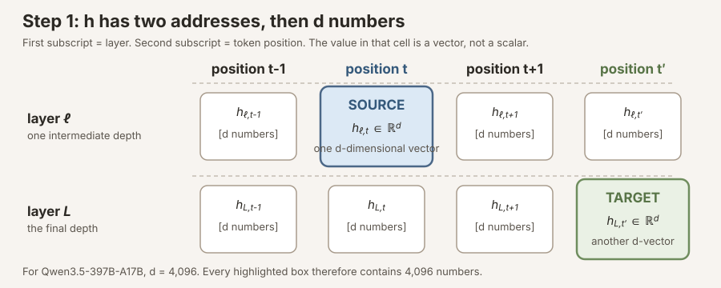

<p class="figure-note">Figure: decode the subscripts first. The first subscript selects a layer; the second selects a token position. Each selected cell contains a full vector in \(\mathbb{R}^d\), not one number.</p>

#### Step 2: choose a causally allowed source-to-target path

In a causal transformer, position \(t\) cannot alter an earlier position \(t-1\). It can alter its own final state and later final states because those later positions can attend to position \(t\). Therefore we only consider targets satisfying

\[
t'\ge t.
\]

Out of that causal cone, choose one target position \(t'\). We are now asking one precise question:

> If I nudge the whole source vector \(h_{\ell,t}\), how does the whole target vector \(h_{L,t'}\) change after the remaining layers run?

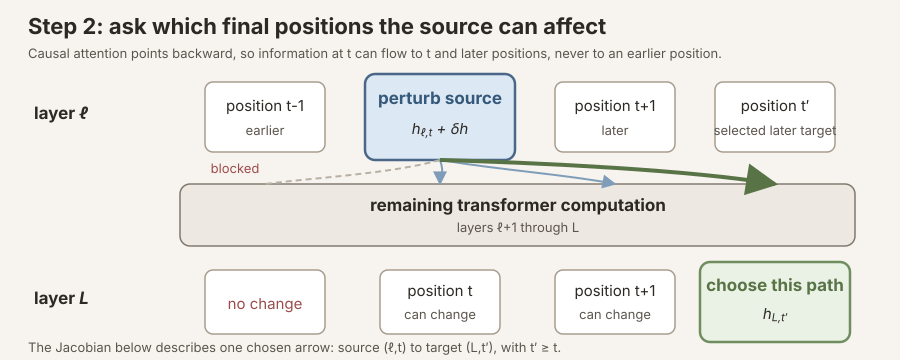

<p class="figure-note">Figure: causality determines which arrows exist. A source at \(t\) may affect final positions \(t'\ge t\). The local Jacobian describes one selected arrow from \((\ell,t)\) to \((L,t')\).</p>

#### Step 3: replace the nonlinear downstream computation by its tangent map

Fix the prompt \(x\), source \((\ell,t)\), and target \((L,t')\). Let

\[
F^{(\ell)}_{x,t',t}:\mathbb{R}^d\rightarrow\mathbb{R}^d
\]

denote the downstream transformer computation along that selected path. On the baseline forward pass,

\[
h_{L,t'}=F^{(\ell)}_{x,t',t}(h_{\ell,t}).
\]

Now add a small vector perturbation \(\delta h\) to the source and run the same downstream computation. The target moves by some \(\Delta h\). Because \(F\) is nonlinear, the exact relationship is complicated. Near the baseline point, however, its derivative gives the best first-order linear approximation:

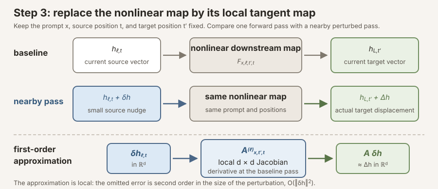

<p class="figure-note">Figure: “linearize” means replace the nonlinear downstream map by its tangent map near one baseline forward pass. It maps a small source displacement \(\delta h_{\ell,t}\) to the first-order target displacement \(A\,\delta h\).</p>

\[
F^{(\ell)}_{x,t',t}(h_{\ell,t}+\delta h)
\;=\;
F^{(\ell)}_{x,t',t}(h_{\ell,t})
\;+\;
A^{(\ell)}_{x,t',t}\,\delta h
\;+\;
O(\lVert\delta h\rVert^2),
\]

The \(d\times d\) Jacobian matrix is

\[
A^{(\ell)}_{x,t',t}
\;=\;
\left.
\frac{\partial F^{(\ell)}_{x,t',t}(h)}
{\partial h}
\right|_{h=h_{\ell,t}}
\;=\;
\frac{\partial h_{L,t'}}{\partial h_{\ell,t}}
\in \mathbb{R}^{d\times d}.
\]

Its element \(A_{ij}\) asks: if coordinate \(j\) of the source vector changes infinitesimally, how does coordinate \(i\) of the target vector respond? One matrix therefore contains all \(d^2\) local coordinate-to-coordinate sensitivities for the selected prompt, source, and target.

A single \(A^{(\ell)}_{x,t',t}\) is highly conditional on the current text and attention pattern. The Jacobian lens keeps the context-general part by averaging these tangent maps:

\[
J_\ell
\;=\;
\mathbb{E}_{x,\;t,\;t'\ge t}
\left[
\frac{\partial h_{L,t'}}{\partial h_{\ell,t}}
\right].
\]

For a finite fitting corpus, `jlens.fit` computes the corresponding empirical mean:

\[
\widehat J_\ell
\;=\;
\frac{1}{M}
\sum_{m=1}^{M}
A^{(\ell)}_{x_m,t'_m,t_m},
\]

where \(m\) indexes the prompt and position-pair samples induced by the library's estimator. The released artifact stores one \(\widehat J_\ell\in\mathbb{R}^{d\times d}\) for each source layer.

#### Monte Carlo here means sample averaging


**Why this is Monte Carlo.** The desired expectation ranges over an effectively infinite distribution of natural-language contexts and all causally reachable source/target position pairs. We cannot evaluate that integral exactly. Instead, we sample passages from a pretraining-like corpus, compute the local Jacobians generated by those passages, and average them. That is ordinary Monte Carlo quadrature. It is not Markov chain Monte Carlo, and it is not a bootstrap.


Before averaging matrices, let us build **one** matrix.

Suppose a toy model has residual width \(d=2\). Its selected source and target vectors each have two coordinates:

\[
h
\;=\;
\begin{bmatrix}
h_1\\
h_2
\end{bmatrix},
\qquad
y
\;=\;
F_x(h)
\;=\;
\begin{bmatrix}
y_1\\
y_2
\end{bmatrix}.
\]

Here \(h\) abbreviates the selected intermediate residual \(h_{\ell,t}\), \(y\) abbreviates the selected final residual \(h_{L,t'}\), and \(F_x\) is the remaining nonlinear transformer computation for one fixed prompt \(x\) and one fixed position pair \((t,t')\).

The Jacobian for this one context is

\[
A_x
\;=\;
\frac{\partial y}{\partial h}
\;=\;
\left[
\begin{matrix}
\dfrac{\partial y_1}{\partial h_1}
&
\dfrac{\partial y_1}{\partial h_2}
\\[1.1em]
\dfrac{\partial y_2}{\partial h_1}
&
\dfrac{\partial y_2}{\partial h_2}
\end{matrix}
\right].
\]

So the four entries do not appear by fiat. They are four local derivatives:

- **Column 1** asks what happens to both target coordinates when we nudge source coordinate \(h_1\).
- **Column 2** asks what happens to both target coordinates when we nudge source coordinate \(h_2\).
- **Row 1** is the gradient of target coordinate \(y_1\) with respect to the whole source vector.
- **Row 2** is the gradient of target coordinate \(y_2\) with respect to the whole source vector.

Operationally, one forward pass produces the baseline \(h\) and \(y\) and retains the computation graph. Backpropagating from \(y_1\) gives the first row; backpropagating from \(y_2\) gives the second. For the real model, there are 4,096 target coordinates rather than two, and `jlens.fit` obtains those rows in batches.


**How to read a numerical entry.** If \((A_x)_{12}=0.1\), then near this particular forward pass, increasing source coordinate \(h_2\) by a small amount \(\varepsilon\) changes target coordinate \(y_1\) by approximately \(0.1\varepsilon\), holding the rest of the source perturbation at zero. It is a local sensitivity, not an activation, probability, or correlation.


Now suppose the first sampled context produces

\[
A_1
\;=\;
\left[
\begin{matrix}
1.2 & \quad 0.1 \\[0.6em]
0.0 & 0.8
\end{matrix}
\right].
\]

This says, for example,

\[
A_1
\begin{bmatrix}
\varepsilon\\
0
\end{bmatrix}
\;=\;
\begin{bmatrix}
1.2\varepsilon\\
0
\end{bmatrix},
\qquad
A_1
\begin{bmatrix}
0\\
\varepsilon
\end{bmatrix}
\;=\;
\begin{bmatrix}
0.1\varepsilon\\
0.8\varepsilon
\end{bmatrix}.
\]

The first basis nudge affects only \(y_1\) to first order in this toy map; the second affects both \(y_1\) and \(y_2\). These numbers are invented to make the arithmetic visible. They are not measurements from Qwen.

Why does the next prompt produce a different matrix? Because a transformer is nonlinear and context-dependent. Changing the text changes the hidden states, attention weights, expert routing, nonlinear gates, and therefore the derivative evaluated at that operating point. Putting the first matrix beside two more sampled contexts gives:

\[
\Large
\begin{aligned}
A_1
&=
\left[
\begin{matrix}
1.2 & \quad 0.1 \\[0.6em]
0.0 & 0.8
\end{matrix}
\right],
\\[1em]
A_2
&=
\left[
\begin{matrix}
0.9 & \quad 0.2 \\[0.6em]
-0.1 & 1.1
\end{matrix}
\right],
\\[1em]
A_3
&=
\left[
\begin{matrix}
1.1 & \quad -0.1 \\[0.6em]
0.2 & 0.9
\end{matrix}
\right].
\end{aligned}
\]

The Monte Carlo estimate is just their elementwise mean:

\[
\Large
\begin{aligned}
\widehat{J}
&=
\frac{A_1+A_2+A_3}{3}\\[0.75em]
&=
\left[
\begin{matrix}
1.067 & \quad 0.067 \\[0.6em]
0.033 & 0.933
\end{matrix}
\right].
\end{aligned}
\]

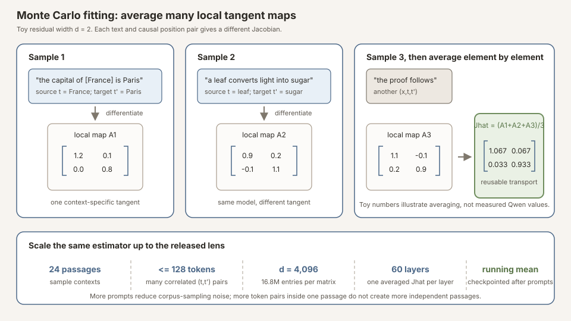

<p class="figure-note">Figure: a toy \(d=2\) Monte Carlo fit. Each sampled context and causal position pair gives a different local Jacobian. Averaging them element by element estimates the context-general transport. The matrices are illustrative, not Qwen measurements. The bottom strip shows the dimensions of the released fit.</p>

It is useful to group all position-pair contributions from passage \(x_n\) into one prompt-level estimate \(\widehat J_\ell^{(x_n)}\). The running mean then updates as

\[
\widehat{J}_{\ell,n+1}
\;=\;
\frac{n}{n+1}\widehat J_{\ell,n}
+
\frac{1}{n+1}\widehat J_\ell^{(x_{n+1})}.
\]

That is why the fit can be checkpointed and warm-started without revisiting earlier passages: the checkpoint retains the accumulated Jacobian sum and the number of completed prompts.

If passages were independent draws from exactly the desired fit distribution, the estimator would be unbiased for that distribution's mean Jacobian. Its elementwise Monte Carlo standard error would decrease asymptotically like

\[
\operatorname{SE}\!\left[(\widehat J_\ell)_{ij}\right]
\approx
\sqrt{\frac{\operatorname{Var}\!\left[(\widehat J_\ell^{(x)})_{ij}\right]}{N_{\mathrm{prompt}}}}
\;\propto\;
N_{\mathrm{prompt}}^{-1/2}.
\]

The effective independent unit is much closer to a **passage** than to an individual position pair. Position pairs from the same passage share tokens, attention patterns, and the same forward graph, so counting every \((t,t')\) as independent would badly overstate precision. Doubling the number of prompts therefore reduces Monte Carlo error by roughly \(1/\sqrt{2}\), not by half. Our \(n=24\) artifact is a valid finite-corpus estimator, but it is not an asymptotic one; convergence across added prompts remains an empirical question.


**“Fit” does not mean training a probe.** There is no learned classifier, label set, cross-entropy objective, or optimizer here. The base model is frozen. Fitting means running text through the model, differentiating final residual coordinates with respect to intermediate residual coordinates, and accumulating a Monte Carlo average of those Jacobians.


### From a tangent map to token scores

Let \(W_U\in\mathbb{R}^{V\times d}\) be the model's unembedding matrix, where \(V\) is the vocabulary size, and let \(N_f\) denote the model's final output normalization. The readout at layer \(\ell\) is

\[
z_\ell(h_{\ell,t})
\;=\;
W_U\,N_f\!\left(\widehat J_\ell h_{\ell,t}\right)
\in\mathbb{R}^{V},
\qquad
p_\ell
\;=\;
\operatorname{softmax}(z_\ell).
\]

The explorer sorts \(z_\ell\). Softmax is monotone in each logit relative to the others, so it changes probabilities but not rank order.

Ignoring the common RMS normalization denominator for a moment, let \(u_w^\top\) be row \(w\) of the effective unembedding (including the learned output-normalization gain). Then

\[
z_{\ell,w}
\;\propto\;
u_w^\top \widehat J_\ell h_{\ell,t}
\;=\;
\left(\widehat J_\ell^\top u_w\right)^\top h_{\ell,t}.
\]

Thus the layer-\(\ell\) lens vector associated with vocabulary token \(w\) is

\[
v_{\ell,w}
\;=\;
\widehat J_\ell^\top u_w.
\]

The token score is an inner product between the current residual state and a token-indexed direction in that layer's coordinates. Equivalently, the rows of \(W_U\widehat J_\ell\) are the covectors that score the residual stream. This transpose distinction matters: \(\widehat J_\ell\) transports an activation forward, while \(\widehat J_\ell^\top\) pulls an output-token direction back to layer \(\ell\).

The identity or logit-lens control sets \(\widehat J_\ell=I\):

\[
z_\ell^{\mathrm{identity}}
\;=\;
W_U\,N_f(h_{\ell,t}).
\]

That assumes residual coordinates are already aligned across depth. Residual connections make this approximation increasingly plausible late in the network. The fitted Jacobian is the first-order correction for the rotation, scaling, and mixing introduced by the remaining layers.

## Appendix D: how the full matrix is computed {#how-the-full-matrix-is-computed}

Materializing a dense \(d\times d\) Jacobian naively is expensive. Reverse-mode autodiff naturally computes a vector-Jacobian product (VJP). For an output-space test vector \(q\in\mathbb{R}^d\),

\[
q^\top A^{(\ell)}_{x,t',t}
\;=\;
\frac{\partial\left(q^\top h_{L,t'}\right)}
{\partial h_{\ell,t}}.
\]

Choosing \(q=e_i\), the \(i\)-th standard basis vector, returns row \(i\) of the Jacobian. Batched basis vectors recover several rows per retained-graph backward traversal. If `dim_batch = b`, the traversal count is approximately

\[
N_{\mathrm{prompt}}
\left\lceil\frac{d}{b}\right\rceil.
\]

One backward traversal exposes gradients at every hooked source layer, so fitting all 60 layer matrices does **not** multiply that count by 60. It does increase activation retention, communication, accumulation, and storage costs.

For this release:

| Quantity | Qwen3.5-397B-A17B fit |
|---|---:|
| Residual width \(d\) | 4,096 |
| Source layers | 60 |
| Matrix entries per layer \(d^2\) | 16,777,216 |
| Fit prompts | 24 WikiText-103 passages |
| Maximum sequence length | 128 tokens |
| Jacobian row batch \(b\) | 16 |
| Retained-graph backward traversals | \(24\times(4096/16)=6{,}144\) |
| Dense Jacobian storage | about 4.0 GB in fp32 across 60 layers; about 2.0 GB in fp16 |

The 807 GB base model was loaded in bf16 across 8×H200 GPUs. The published lens is tiny relative to the model because it stores only the 60 dense \(4096\times4096\) transport matrices and metadata, not a copy of the model.

#### What “eager attention and pure-GPU `device_map` sharding” means

That phrase compresses several engineering choices. They affect **how we computed the same Jacobian estimator**, not the mathematical definition of the estimator.

**First, why eight GPUs?** A bf16 parameter normally occupies two bytes. Roughly \(397\) billion parameters therefore require about \(794\) GB before accounting for small amounts of metadata and non-parameter state; the loaded checkpoint was about \(807\) GB. One H200 has 141 GB of memory. Eight provide about 1,128 GB in aggregate:

\[
\begin{aligned}
&807\ \text{GB of weights} \\
&+\ \text{activations} \\
&+\ \text{retained autograd graph} \\
&+\ \text{Jacobians and temporary buffers} \\
&<\ 8\times 141\ \text{GB}.
\end{aligned}
\]

The aggregate capacity is sufficient, but no individual GPU can hold the model. The model must be partitioned.

**What `device_map` does.** Hugging Face/Accelerate's `device_map` assigns successive model modules, primarily transformer blocks, to different GPUs. Conceptually:

```text
GPU 0: embedding + early blocks
       activations cross a GPU boundary
GPU 1: next blocks
       activations cross a GPU boundary
...
GPU 7: late blocks + output modules
```

During the forward pass, the residual stream moves through those GPU-resident blocks in order. The autograd graph records operations and cross-device transfers across the entire chain. A VJP then walks the same chain backward in reverse, collecting derivatives at every hooked source layer.

This is **layer/model sharding**, not tensor parallelism:

| Strategy | Where one layer's weights live | Main benefit | Main cost |
|---|---|---|---|
| `device_map` layer sharding | Mostly on one GPU | Makes a model larger than one GPU fit | GPUs execute the layer sequence largely as a pipeline wave; little single-request compute speed-up |
| Tensor parallelism | Each matrix/expert split across many GPUs | GPUs compute one layer together | Every layer needs collective communication; retained activations and gathered outputs can be expensive |
| CPU/NVMe offload | Some weights outside GPU memory | Fits beyond aggregate GPU RAM | Repeated host/device transfers make thousands of backwards extremely slow and can break retained-graph assumptions |

“**Pure-GPU**” means every model weight remained on one of the eight GPUs. Nothing was offloaded to CPU RAM or disk. That matters because this fit does not perform one ordinary forward/backward pair. It retains a graph and traverses it 256 times per prompt. Moving hundreds of gigabytes through PCIe for each repeated backward would dominate the run. Accelerate's CPU-offload hooks also proved incompatible with this retained-graph, repeated-backward pattern in our tests.

**Why cap placement at 110 GiB per GPU?** An unconstrained automatic layout placed about 133 GB of weights on one 141 GB H200. That left almost no room for activations, gradients produced by VJPs, communication buffers, allocator fragmentation, or the retained graph. We therefore passed a 110 GiB per-GPU memory cap. The unused \(\sim31\) GiB per device was not wasted; it was working space for autodiff.

**What “eager attention” means.** Transformers can evaluate attention with several interchangeable implementations:

- **eager**: explicit PyTorch operations;
- **SDPA**: PyTorch's fused scaled-dot-product-attention dispatcher;
- **Flash Attention**: highly fused GPU kernels designed for throughput and memory
  efficiency ([Dao et al., 2022](#ref-dao-2022)).

For ordinary inference or a conventional one-pass training backward, fused SDPA/Flash kernels are usually preferable. This workload is unusual: one forward graph is retained and reused for many backwards, while the graph crosses several devices and includes a large MoE model. In our validation, optimized attention backward kernels could hit device-side indexing failures under that exact combination. `attn_implementation="eager"` uses the less fused, more explicit PyTorch path. It is slower per attention operation, but its autograd graph was stable under repeated VJPs and multi-GPU module sharding. This is a workload-specific compatibility choice, not a claim that eager attention is generally better.

**Why `dim_batch=16`?** Each backward traversal can recover several Jacobian rows at once by batching 16 output basis vectors. A larger batch reduces the number of traversals but enlarges the retained activations and temporary gradient tensors:

\[
\text{traversals per prompt}
\;=\;
\frac{4096}{\texttt{dim\_batch}}.
\]

At `dim_batch=32`, the retained graph exceeded the available memory headroom. At `dim_batch=16`, it fit:

\[
\frac{4096}{16}=256
\quad\text{backward traversals per prompt}.
\]

That configuration ran stably at about 2.35 seconds per traversal, or roughly 10 minutes per prompt.

**Why not tensor parallelism?** We built and validated a tensor-parallel plan that split the MoE experts and dense projections across all eight GPUs. Mathematically it was correct. Operationally, the retained activation footprint forced `dim_batch` down to 4. At that small row batch, collective communication and distributed-kernel overhead outweighed the parallel compute benefit; prompt 1 had not completed after 30 minutes, triggering our pre-agreed kill criterion. The simpler layer-sharded path could use `dim_batch=16` and won on end-to-end throughput.

The body-level summary of these choices is the [systems takeaway](#what-the-jacobian-lens-actually-is) panel above.

## Appendix E: span readout and layer selection {#what-span-readout-means}

The exploratory probes use two readout positions. This appendix defines the span
readout the body refers to, then explains how a showcase layer is chosen for a
static word cloud.

### Last-token versus span readout

The primary country-bridge table above uses the **last prompt token** as its readout
position. If a tokenized prompt is

\[
x_1,x_2,\ldots,x_T,
\]

then for each band layer \(\ell\), the default path applies the lens only to the residual
vector \(h_{\ell,T}\). Let \(r_{\ell,t}(w)\) be the vocabulary rank of probe token \(w\)
when we read layer \(\ell\) at prompt position \(t\). The last-token score is

\[
R_{\mathrm{last}}(w)
\;=\;
\min_{\ell\in\mathcal B} r_{\ell,T}(w),
\]

where \(\mathcal B=\{19,\ldots,38\}\) is the 20-layer workspace band. It searches down
one column of the layer-by-position grid.

A **span readout** evaluates every prompt position separately:

\[
R_{\mathrm{span}}(w)
\;=\;
\min_{\substack{\ell\in\mathcal B\\1\le t\le T}}
r_{\ell,t}(w).
\]

The code also records the location of that minimum,

\[
(\ell_w^*,t_w^*)
\;=\;
\underset{\ell\in\mathcal B,\;1\le t\le T}{\operatorname{argmin}}
\;r_{\ell,t}(w).
\]

That location can differ for every probe token. `dishonest`, `false`, and `manipulate`
do not have to peak at the same word position or layer.

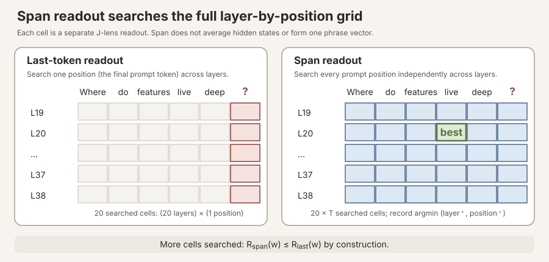

<p class="figure-note">Figure: last-token versus span readout. A last-token readout searches 20 cells for a 20-layer band. A span readout on a \(T\)-token prompt searches \(20T\) cells. It does not pool token vectors or construct a representation of a phrase; it performs many separate readouts and keeps the best rank.</p>


**Why a trailing `?` can be a bad readout position.** The residual vector at a
punctuation token is still a real model state, but its local job may emphasize syntax,
turn-taking, formatting, or likely answer shape. The concept that made the question
meaningful may have been most explicit over an earlier content token. A weak readout at
`?` therefore does not establish that the concept was absent everywhere in the prompt.
Span readout asks the localization question directly: *did the concept become decodable
at any prompt position in the band, and where?*


Three caveats matter:

1. **Span searches more cells.** Because the last-token cells are a subset of the span,
   \[
   R_{\mathrm{span}}(w)\le R_{\mathrm{last}}(w)
   \]
   by construction. Span ranks will look at least as good, even under noise.
2. **Controls must use the identical search.** Identity and random-J must be evaluated
   over the same positions and layers. Otherwise a fitted lens given \(20T\) chances is
   being compared with a control given only 20.
3. **It is a different endpoint.** The span rerun is exploratory and should not be
   silently substituted into the pre-registered last-token hit rate above. It diagnoses
   position sensitivity and generates follow-up hypotheses; it does not retroactively
   change the primary table.

One notation subtlety: during **lens fitting**, \(t'\ge t\) indexes future target
positions whose Jacobians are averaged into \(J_\ell\). During **span application**, we
hold the already-fitted \(J_\ell\) fixed and vary the prompt residual position \(t\) at
which we apply it. Span does not refit the lens or change the future-position average.

Finally, a best rank and a word cloud answer different questions. Each probe token gets
its own \((\ell_w^*,t_w^*)\). A cloud must display one selected cell at a time, so it is a
representative still, not a simultaneous picture of every probe's individual optimum.

### How many layers are we looking at?

Qwen3.5-397B has a deep stack of transformer layers. The Jacobian lens is not read at
every layer for this probe: we use the **workspace band**, the middle third of the
network, which on this receipt is **20 consecutive layers, 19 through 38**. For every
prompt, `demo2` stored a full top-40 cloud at *each* of those 20 layers
(`per_layer_topk` in the JSON). So there is not one word map per prompt; there are
**twenty**. A static figure has to pick one.

### Three different “best layer” rules (they disagree on purpose)

1. **Best-over-band (primary for claims).** For each probe token, take the *minimum*
   rank across layers 19–38. That is what the probe-rank table above reports. It answers:
   “did this token ever surface in the band?” It does **not** name a single showcase
   layer.
2. **Experience-anchor (what `demo2` stored as `cloud_layer`).** Among the experience
   lexicon, find the token with the best band-rank, then take *that token’s* best layer.
   Self-ref lands on **26**; the thermostat often lands on **38**. At layer 38 this model
   dumps quote/punctuation tokens under many prompts, so an anchor-picked thermostat
   cloud looked like “non-text” even though that was a late-band artifact.
3. **Content / showcase layer.** For Mount Fuji, ignore the experience lexicon and pick
   the layer whose top-40 is richest in Japan / Tokyo / 首都. That peaks around
   **34–38**. Forcing layer 26 on that prompt hides the bridge and shows unrelated debris.

There is no universal “the” layer. Self-ref’s experience signal is peaked at **26**;
Japan’s country tokens ignite later. One fixed slice cannot serve both showcases.

## References

- <a id="ref-berg-2025"></a>Berg, C., de Lucena, D., & Rosenblatt, J. (2025). [*Large Language Models Report Subjective Experience Under Self-Referential Processing*](https://arxiv.org/abs/2510.24797v2). arXiv:2510.24797v2, revised 30 October 2025. (Source of the self-referential prompt wording used in the exploratory probe.)

- <span id="ref-lindsey-2026"></span>Lindsey, J., et al. (2026). [*Verbalizable Representations Form a Global Workspace in Language Models*](https://transformer-circuits.pub/2026/workspace/index.html). Transformer Circuits.
- <span id="ref-anthropic-jacobian-lens"></span>Anthropic. [*jacobian-lens*](https://github.com/anthropics/jacobian-lens) (Apache-2.0).
- <span id="ref-qwen-model"></span>Qwen Team. [`Qwen/Qwen3.5-397B-A17B`](https://huggingface.co/Qwen/Qwen3.5-397B-A17B/tree/8472618112abcbd45acbcdc58436aff4233c23f7) (revision `8472618`; model architecture and parameter metadata).
- <span id="ref-neuronpedia-jacobian-lens"></span>Neuronpedia. [*Jacobian lens collection*](https://huggingface.co/neuronpedia/jacobian-lens/tree/a4114d7752d11eb546e6cf372213d7e75526d3a1) (revision `a4114d7`; dated public comparison snapshot).
- <span id="ref-praxagent-397b-lens"></span>Praxagent. [*jacobian-lens-qwen3.5-397b-a17b*](https://huggingface.co/praxagent-org/jacobian-lens-qwen3.5-397b-a17b/tree/2dffc0a058fd072a6a155a4c6005bc26aff14d8c) (revision `2dffc0a`).
- <span id="ref-jspace-audit"></span>Praxagent. [*A Global Workspace, or a Training Artifact? Auditing Anthropic's J-Space Across the Open-Weight Lineup*](https://github.com/praxagent/jacobian-lens-research-202607a/tree/fa66e53a1eacb99b2d4a92c966c5cb4dd992bd65/blog/jspace-audit) (companion audit; revision `fa66e53`).
- <span id="ref-vaswani-2017"></span>Vaswani, A., et al. (2017). [*Attention Is All You Need*](https://arxiv.org/abs/1706.03762).
- <span id="ref-merity-2016"></span>Merity, S., et al. (2016). [*Pointer Sentinel Mixture Models*](https://arxiv.org/abs/1609.07843) (introduces WikiText).
- <span id="ref-dao-2022"></span>Dao, T., et al. (2022). [*FlashAttention: Fast and Memory-Efficient Exact Attention with IO-Awareness*](https://arxiv.org/abs/2205.14135).
- <span id="ref-scipy-2020"></span>Virtanen, P., et al. (2020). [*SciPy 1.0: Fundamental Algorithms for Scientific Computing in Python*](https://doi.org/10.1038/s41592-019-0686-2). Exact software version for this post's statistics: SciPy 1.18.0, recorded in `act2_statistics.json`.
- <span id="ref-wilson-1927"></span>Wilson, E. B. (1927). [*Probable Inference, the Law of Succession, and Statistical Inference*](https://doi.org/10.1080/01621459.1927.10502953).
- <span id="ref-wilcoxon-1945"></span>Wilcoxon, F. (1945). [*Individual Comparisons by Ranking Methods*](https://doi.org/10.2307/3001968).
- <span id="ref-demo2-receipt"></span>Praxagent. [`receipts/demo2_consciousness_qwen35-397b_n24.json`](receipts/demo2_consciousness_qwen35-397b_n24.json), raw self-reference probe receipt (n=24 lens).
- <span id="ref-demo2-span"></span>Praxagent. [`receipts/demo2_probes_span_qwen35-397b_n24.json`](receipts/demo2_probes_span_qwen35-397b_n24.json), span-readout probes (deception / statue / digit / meristem; `per_position_cloud` stripped for web size).
- <span id="ref-act2-stats"></span>Praxagent. [`receipts/act2_statistics.json`](receipts/act2_statistics.json), exact paired and unpaired statistics recomputed from the act-2 receipt; generated by [`tools/recompute_act2_statistics.py`](tools/recompute_act2_statistics.py).
- <span id="ref-web-build"></span>Praxagent. [`WEB.md`](WEB.md), how the SVG stills and interactive slider were built; what was copied out of the research tree for deploy.
