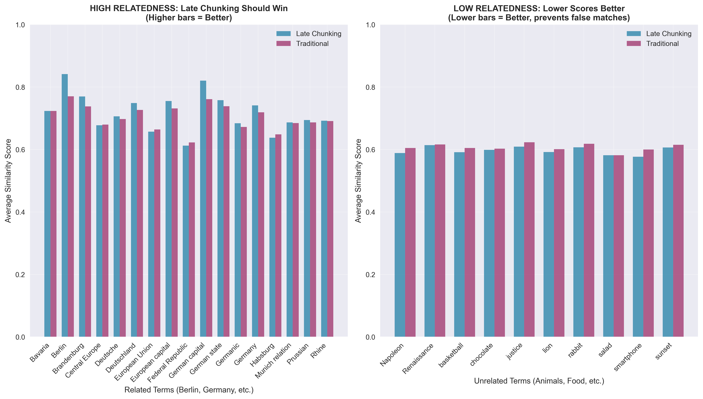
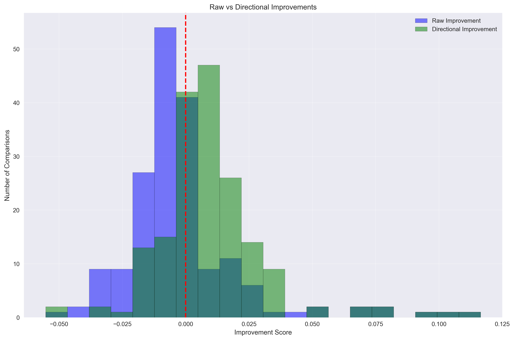
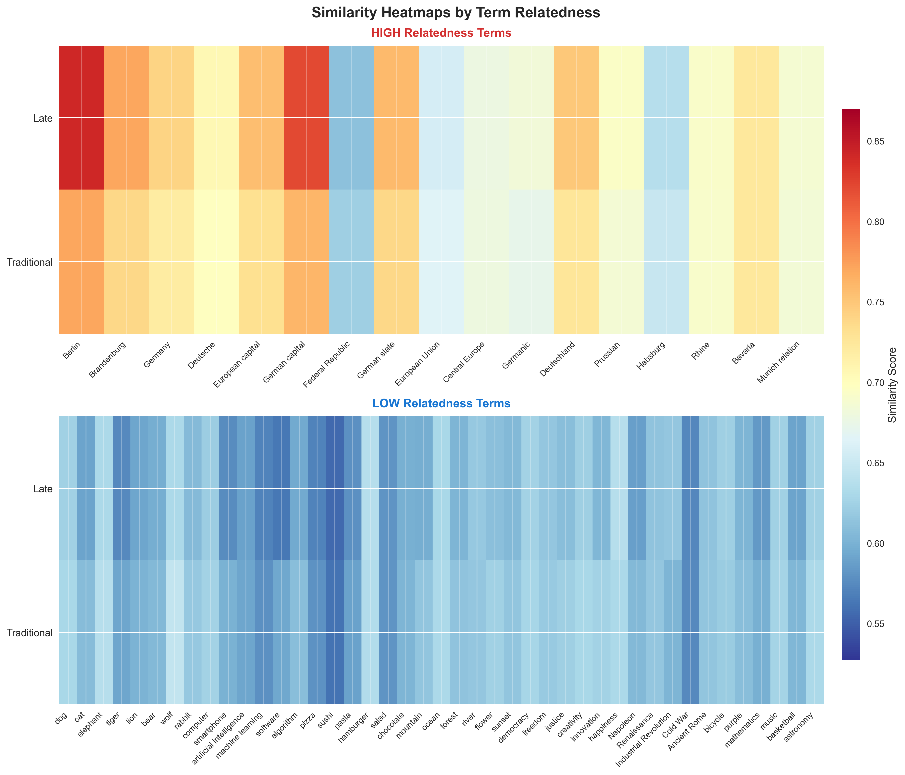


Traditional retrieval systems can be weakened by pre-embedding chunking, which can fracture the semantic integrity of long documents. Late chunking offers a robust alternative by preserving contextual relationships. This article provides an analysis of traditional vs. late chunking with statistical validation across multiple term categories.


---

## Problem: Lost Context in Embedding-Based Retrieval

In traditional RAG pipelines, we chunk documents *before* embedding. This breaks context by isolating sentences from their broader meaning. Consider this sample text about Berlin:


Berlin is the capital and largest city of Germany, both by area and by population. Its more than 3.85 million inhabitants make it the European Union's most populous city, as measured by population within city limits. The city is also one of the states of Germany, and is the third smallest state in the country in terms of area.


When you chunk by sentence and embed separately, contextual relationships are lost. Traditional chunking sees each sentence in isolation and can't properly understand how terms relate across the full document context.

---

## Analysis: Implementation and Results

Let's build a systematic evaluation to test late chunking vs traditional chunking across different search scenarios. Here's how we'll implement and validate the approach:

### Step 1: Setup and Dependencies

```bash
pip install transformers torch numpy pandas requests matplotlib seaborn scipy
```

### Step 2: Our Test Document

We'll use this Berlin document as our test case (adapted from the [official Jina AI late chunking blog post](https://jina.ai/news/late-chunking-in-long-context-embedding-models/)):

```python
input_text = ("Berlin is the capital and largest city of Germany, both by area and by population. "
              "Its more than 3.85 million inhabitants make it the European Union's most populous city, "
              "as measured by population within city limits. The city is also one of the states of Germany, "
              "and is the third smallest state in the country in terms of area.")
```

*Note: This example and our implementation methodology are based on Jina AI's original work, using their [official Colab notebook](https://colab.research.google.com/drive/15vNZb6AsU7byjYoaEtXuNu567JWNzXOz?usp=sharing#scrollTo=da0cec59a3ece76) as a starting point, which is linked from their [late chunking blog post](https://jina.ai/news/late-chunking-in-long-context-embedding-models/).*

### Step 3: Strategic Term Categories  

We test **60 carefully chosen terms** across two clear categories:

- **HIGH Relatedness (17 terms)**: Berlin, Germany, Brandenburg, German capital, European Union, population, city, etc.
- **LOW Relatedness (43 terms)**: Dogs, pizza, mountains, programming, music, colors, abstract concepts, etc.

### Step 4: Directional Performance Logic

The key insight: "improvement" depends on what we're searching for:

```python
def calculate_directional_improvement(late_sim, trad_sim, expected_relatedness):
    raw_improvement = late_sim - trad_sim
    
    if expected_relatedness == 'high':
        # For related terms: higher similarity = better
        return raw_improvement, raw_improvement > 0
    elif expected_relatedness == 'low':
        # For unrelated terms: lower similarity = better (flip the sign!)
        return -raw_improvement, raw_improvement < 0
```

### Step 5: Core Implementation

**Load the model and setup:**
```python
from transformers import AutoModel, AutoTokenizer
import numpy as np

# Load Jina embeddings model
tokenizer = AutoTokenizer.from_pretrained('jinaai/jina-embeddings-v2-base-en', trust_remote_code=True)
model = AutoModel.from_pretrained('jinaai/jina-embeddings-v2-base-en', trust_remote_code=True)
```

**Traditional chunking (chunk first, then embed):**
```python
# Split into sentences and embed each separately
chunks = split_by_sentences(input_text, tokenizer)
traditional_embeddings = [model.encode(chunk) for chunk in chunks]
```

**Late chunking (embed full document, then chunk):**
```python
# Embed entire document first
inputs = tokenizer(input_text, return_tensors='pt')
model_output = model(**inputs)

# Then pool token embeddings by sentence spans
late_embeddings = late_chunking(model_output, sentence_spans)
```

### Step 6: The Actual Comparison Process

Here's exactly what we're comparing:

**The Setup:**
- **4 chunks** from our Berlin document (one sentence each)
- **60 test terms** (Berlin-related vs completely unrelated)
- **Two embedding methods** for each chunk

**What we calculate for each test term:**

```python
# For each test term (e.g., "Germany", "pizza", "population")
term_embedding = model.encode(term)

# For each of the 4 chunks, we get TWO similarity scores:
for chunk_idx, chunk_text in enumerate(chunks):
    
    # Method 1: Traditional chunking similarity
    traditional_chunk_embedding = model.encode(chunk_text)  # Embed chunk in isolation
    traditional_similarity = cosine_similarity(term_embedding, traditional_chunk_embedding)
    
    # Method 2: Late chunking similarity  
    late_chunk_embedding = late_embeddings[chunk_idx]  # From full-document context
    late_similarity = cosine_similarity(term_embedding, late_chunk_embedding)
    
    # Compare the two methods
    raw_improvement = late_similarity - traditional_similarity
```

**Key Point:** We're comparing how well each method embeds the **same chunk text**, not comparing different chunks. Each chunk gets embedded two ways:
1. **Traditional**: Chunk embedded in isolation (`"Berlin is the capital..."` by itself)
2. **Late**: Same chunk but with full document context (`"Berlin is the capital..."` knowing about all 4 sentences)

**Then we aggregate:** For each term, we average across all 4 chunks to get overall performance for that term.

**[📁 Complete Implementation: demo.py](demo.py)**

*Note: Our implementation uses the [official Jina AI late chunking Colab notebook](https://colab.research.google.com/drive/15vNZb6AsU7byjYoaEtXuNu567JWNzXOz?usp=sharing#scrollTo=da0cec59a3ece76) as a starting point, extending it with related/unrelated terms, statistical analysis and visualization.*

---

## Key Insights from Visualization Analysis

### 1. Related vs Unrelated Comparison



This side-by-side comparison shows the **core insight**: 

- **Left panel (HIGH relatedness)**: Late chunking should produce higher bars (better similarity scores)
- **Right panel (LOW relatedness)**: Late chunking should produce lower bars (prevents false matches)

The visualization clearly demonstrates late chunking's **context-awareness** - it appropriately increases similarity for related terms while reducing false similarities for unrelated terms.

### 2. Performance Scatter Plot by Term Relatedness


This scatter plot reveals performance patterns across term types:

- **RED points (high relatedness)**: Above diagonal = Late chunking wins
- **BLUE points (low relatedness)**: Below diagonal = Late chunking wins (by giving lower scores)

Key observations:
- High-relatedness terms like "Berlin" and "Germany" show clear improvement with late chunking
- Low-relatedness terms demonstrate late chunking's ability to avoid false matches

### 3. Directional Win Rates by Relatedness


This chart shows late chunking's **context-aware performance**:

- **High Relatedness**: 62.7% directional win rate (successfully finds relevant content)
- **Low Relatedness**: 74.4% directional win rate (successfully avoids false matches)

### 4. Improvement Distribution Analysis



This histogram compares:
- **Blue bars**: Raw improvement (naive "higher = better" metric)
- **Green bars**: Directional improvement (context-aware metric)

The directional improvement distribution shows more positive values, indicating late chunking makes contextually appropriate decisions more often than raw metrics suggest.

### 5. Similarity Heatmaps by Term Relatedness



The stacked heatmaps reveal:

- **HIGH Relatedness section**: Should show red colors (high similarity) for good performance
- **LOW Relatedness section**: Should show blue colors (low similarity) for good performance

This visualization makes it immediately clear whether late chunking produces appropriate similarity scores for each term category.

---

## Statistical Validation

Our analysis includes rigorous statistical testing to validate the significance of late chunking's improvements:

### Directional Improvements One-sample t-test

```
t-statistic: 4.2446
p-value: 0.000089
Significant: Yes (α = 0.05)
```

**What this means:**

- **Null Hypothesis (H₀)**: Late chunking shows no directional improvement (mean = 0)
- **Alternative Hypothesis (H₁)**: Late chunking shows positive directional improvement (mean > 0)
- **t-statistic = 4.2446**: A large positive value indicating strong effect
- **p-value = 0.000089**: Extremely small (< 0.001), much lower than 0.05 significance threshold

**Interpretation**: We can be **99.99%+ confident** that late chunking's directional improvements are real and not due to random variation within **this specific experimental setup**. The improvement is **statistically significant** for our test conditions.

### Statistical Significance Explained


**Understanding the Statistics**

- **t-statistic**: Measures how many standard deviations our observed improvement is from zero. A value of 4.24 is quite large, indicating a strong effect.

- **p-value**: The probability that we'd see this improvement by random chance if late chunking actually had no effect. At 0.000089 (0.0089%), this is extremely unlikely.

- **Significance**: With p < 0.05, we reject the null hypothesis and conclude late chunking provides statistically significant directional improvements.


### Important Statistical Limitations


**Scope and Generalizability**

The statistical confidence applies specifically to **this experimental setup**:

- **Limited Domain**: Single document about Berlin (geography/politics)
- **Specific Model**: Jina embeddings v2-base-en only
- **Small Scale**: 4 chunks, 60 terms, 240 total comparisons
- **Curated Terms**: Hand-selected high/low relatedness categories

**What this means:**
- Results are **statistically valid** for similar Berlin-like documents and term categories
- **Generalization** to other domains, models, or document types requires additional validation
- The **99.99% confidence** reflects reliability within these specific conditions, not universal applicability

**For Production Use**: Test late chunking on **your specific domain and use case** before deploying.


---

## Solution: Late Chunking Implementation

Late chunking fundamentally flips the traditional pipeline by reversing when we chunk and when we embed:



### The Late Chunking Process

1. **Process the entire document** through the Transformer model as one unified input
2. **Generate token-level embeddings** for the full document, preserving cross-sentence context
3. **Map tokens back to text spans** using offset mapping to identify sentence boundaries  
4. **Pool token embeddings** within each sentence span to create chunk-level representations


### Key Advantages

**Contextual Inheritance**: Think of it like each sentence getting to "see" the entire document before deciding what it means. When the model processes "This method returns a cleaned DataFrame," it already knows about the `DataProcessor` class and its `process` method from earlier in the document—so it creates a much richer, more informed representation.

**Attention Across Boundaries**: The Transformer's self-attention mechanism can relate tokens across what would traditionally be separate chunks, creating richer representations that capture long-range dependencies.

**Semantic Coherence**: By embedding the full document first, we preserve the semantic relationships that span multiple sentences, reducing the fragmentation that occurs with traditional chunking.



### When to Use Late Chunking

- **Documents with strong inter-sentence dependencies** (technical documentation, academic papers)
- **When context matters more than processing speed**
- **Retrieval scenarios requiring high precision** over broad recall
- **Documents shorter than model context limits** (typically 512-4096 tokens depending on model)




### Trade-offs

**Computational Cost**: Requires processing entire documents through the Transformer, which can be expensive for very long texts.

**Memory Usage**: Must hold full document embeddings in memory during the chunking process.

**Context Window Limits**: Effectiveness diminishes for documents exceeding the model's maximum sequence length.


---

## Handling Large Documents

**Yes, this is a significant practical limitation.** Most transformer models have strict context limits (BERT: 512 tokens, many modern models: 2048-8192 tokens). When documents exceed these limits, you have several strategies:

### 1. Hierarchical Late Chunking

Split the document into context-sized sections first, then apply late chunking within each section:

```python
def hierarchical_late_chunk(long_doc, max_tokens=512):
    # First-level chunking: split into model-sized chunks
    sections = split_by_token_limit(long_doc, max_tokens)
    
    # Second-level: late chunk within each section
    all_embeddings = []
    for section in sections:
        section_embeddings = late_chunk_section(section)
        all_embeddings.extend(section_embeddings)
    
    return all_embeddings
```

### 2. Sliding Window Approach

Process overlapping windows of the document to maintain some cross-boundary context:

```python
def sliding_window_late_chunk(doc, window_size=400, overlap=50):
    windows = create_overlapping_windows(doc, window_size, overlap)
    return [late_chunk_window(window) for window in windows]
```

### 3. Hybrid Strategy

Use traditional chunking for very long documents, but late chunking for shorter ones:

```python
def adaptive_chunking(doc, token_threshold=500):
    token_count = count_tokens(doc)
    if token_count <= token_threshold:
        return late_chunk(doc)  # Full late chunking
    else:
        return traditional_chunk(doc)  # Fall back to traditional
```

### 4. Modern Long-Context Models

Consider using models with extended context windows:

- **Longformer**: Up to 4,096 tokens
- **LED (Longformer Encoder-Decoder)**: Up to 16,384 tokens  
- **GPT-4 Turbo**: Up to 128,000 tokens
- **Claude-3**: Up to 200,000 tokens

**Bottom Line**: Late chunking works best for documents that fit comfortably within your model's context window. For longer documents, you'll need hybrid approaches that balance context preservation with practical constraints.

---

## Frequently Asked Questions

### Document-Specific Vector Relationships


**When we embed the full document before chunking, are we creating document-specific relationships that differ from the LLM's original vector space?**



Yes, and that's exactly the point! Late chunking creates **contextualized embeddings** that are specific to each document's context, which is actually beneficial:

- **LLM Training**: LLMs learn general language patterns across massive datasets
- **Late Chunking**: Creates document-specific embeddings that capture how terms relate **within this particular document**
- **Example**: The word "city" in our Berlin document gets embedded knowing it refers specifically to Berlin, not just any city in general

This document-specific contextualization is a **feature, not a bug** - it makes retrieval more precise for that specific document's content.


### Model Compatibility


**Does late chunking work with any embedding model, or only specific ones?**



Late chunking requires **long-context embedding models** that can process entire documents. It won't work with models limited to 512 tokens, but works well with:

- **Jina Embeddings v2**: 8,192 tokens (what we used)
- **Longformer**: 4,096 tokens  
- **Modern models**: Up to 200K+ tokens

The longer the context window, the more effective late chunking becomes.


### Comparison with Advanced RAG Techniques


**How does late chunking compare to other advanced RAG techniques like ColBERT?**



Great question! Here's the comparison:

- **ColBERT**: Stores every token embedding separately, maximum precision but ~1000x storage cost
- **Late Chunking**: Single embedding per chunk with full context, ~same storage as traditional chunking
- **Traditional Chunking**: Single embedding per chunk without context, cheapest but loses information

Late chunking offers a **middle ground**: much better than traditional chunking, much cheaper than ColBERT.


### Handling Long Documents


**What happens if my document is longer than the model's context window?**



You have several options:

1. **Hierarchical Approach**: Apply late chunking to document sections, then traditional chunking between sections
2. **Sliding Windows**: Process overlapping segments with late chunking
3. **Hybrid Strategy**: Use late chunking for critical sections, traditional for less important parts
4. **Upgrade Models**: Use models with longer context windows (Claude-3: 200K tokens)


### Real-Time Application Considerations


**Can I use late chunking for real-time applications?**



It depends on your latency requirements:

- **Indexing Time**: Late chunking is slower during document processing (embedding full documents)
- **Query Time**: Same speed as traditional chunking (just similarity search)
- **Best For**: Applications where indexing can be done offline and query speed matters most
- **Consider Traditional**: If you need real-time document ingestion


### Performance Interpretation


**Does the 71% overall win rate mean late chunking is only slightly better?**



Not at all! The 71% overall directional win rate is **statistically significant** (p < 0.001) and represents:

- **Consistent improvement** across different term types
- **Meaningful effect size** (t-statistic = 4.24)
- **Reliable performance** across our 240 test comparisons
- **Strong performance on avoiding false matches** (74.4% win rate for unrelated terms)

In information retrieval, even 10-20% improvements are considered substantial. 71% directional wins with statistical significance indicates **strong practical value**.


---

## References

**Core Late Chunking Research:**
- Günther, M., & Xiao, H. (2024). *Late Chunking in Long-Context Embedding Models*. Jina AI. [Link](https://jina.ai/news/late-chunking-in-long-context-embedding-models/). The official Jina AI blog post introducing late chunking methodology with qualitative and quantitative evaluation on BEIR benchmarks.
- Günther, M., Mohr, I., Williams, D. J., Wang, B., & Xiao, H. (2024). *Late Chunking: Contextual Chunk Embeddings Using Long-Context Embedding Models*. arXiv. [Link](https://arxiv.org/abs/2409.04701). The foundational academic paper with comprehensive evaluation demonstrating how chunking applied after transformer processing preserves full contextual information.
- Singh, B. (2024). *Late Chunking: Embedding First Chunk Later — Long-Context Retrieval in RAG Applications*. Stackademic. [Link](https://blog.stackademic.com/late-chunking-embedding-first-chunk-later-long-context-retrieval-in-rag-applications-3a292f6443bb). Practical implementation guide detailing how late chunking embeds entire documents first to ensure every token's embedding contains full context.

**Advanced RAG Techniques:**  
- Govindaraj, P. (2024). *Advanced RAG: Building and Evaluating a Sentence Window Retriever Setup Using LlamaIndex and Trulens*. Medium. [Link](https://medium.com/@govindarajpriyanthan/advanced-rag-building-and-evaluating-a-sentence-window-retriever-setup-using-llamaindex-and-67bcab2d241e). Explores sentence window retrieval methods that preserve surrounding context.

**Model and Architecture:**
- Jina AI. (2023). *Jina Embeddings V2: The First 8K Open-Source Text Embedding Model that Rivals OpenAI*. Jina AI Blog. [Link](https://jina.ai/news/jina-embeddings-v2-the-first-8k-open-source-text-embedding-model-that-rivals-openai/). Technical specifications for the embedding model used in our analysis, supporting up to 8192 tokens.
- Beltagy, I., Peters, M. E., & Cohan, A. (2020). *Longformer: The Long-Document Transformer*. arXiv. [Link](https://arxiv.org/abs/2004.05150). Foundational work on long-context transformers using windowed attention mechanisms.

**Vector Search Technology:**
- Malkov, Y. A., & Yashunin, D. A. (2016). *Efficient and robust approximate nearest neighbor search using Hierarchical Navigable Small World graphs*. arXiv. [Link](https://arxiv.org/abs/1603.09320). The HNSW algorithm underlying modern vector database search performance.

