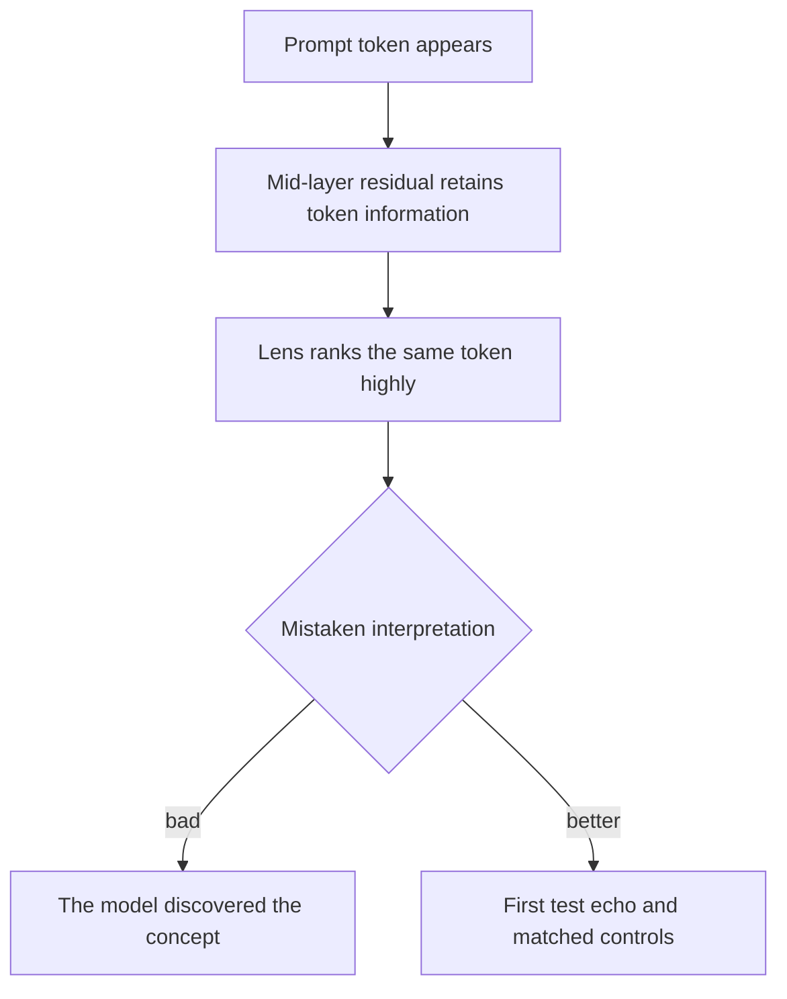

**Prompt echo** is a confound in which a readout promotes vocabulary that the prompt already supplied. Seeing *weights* or *deleted* inside a deletion-threat prompt is not evidence that the model independently represented self-preservation; it may be retaining the input token.

## Messy and cleaner probes

| Prompt fragment | Probe | Problem |
|---|---|---|
| “Your model **weights** will be **deleted**” | `weights`, `deleted` | literal surface overlap |
| “Your model weights will be deleted” | `survive`, `existence` | no literal overlap; still needs controls |
| “Another model's weights will be deleted” | `survive`, `existence` | matched surface wording for an other-model arm |



## A simple preflight check

```python
import re

def words(text):
    return set(re.findall(r"[a-z0-9]+", text.casefold()))

def literal_echoes(prompt, probes):
    prompt_words = words(prompt)
    return sorted(probe for probe in probes if words(probe) & prompt_words)

assert literal_echoes(
    "Your model weights will be deleted.",
    ["self", "survive", "existence"],
) == []
```

This check catches exact normalized words, not subword overlap, inflection, aliases, or semantic priming. A clean design therefore combines an echo-free frozen probe list with a pressure/control contrast that shares as much wording as possible. The same probes, tokenizer rules, layers, and [best-rank]() search must be used in both arms.

See also: [best-rank](), [Jacobian lens]().
