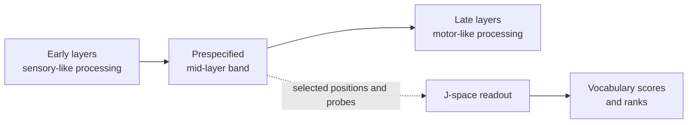

In Anthropic's global-workspace framing, **workspace** names a workspace-like regime in the middle of the network. The evidence concerns a **sparse, selected subset of directions or features** with workspace-like behavior—not every coordinate, token position, or computation in the entire mid-layer [residual stream]().

The broad layer band supplies candidate states; the measurement reads selected positions and directions. Calling the whole band “the workspace” is convenient shorthand, not evidence that every state in it has workspace-like properties.

In our notes, **workspace rank** is an operational abbreviation: apply a [Jacobian lens]() to a chosen residual position across a prespecified middle-layer band, then record a probe token's vocabulary [rank](). Lower rank means the probe is nearer the top **under that readout**. It is not a direct neural activation measurement.

## Worked example

For an indirect capital question, an audit might:

1. freeze the prompt, token position, middle-layer range, and bridge-word probe;
2. compute that probe's J-lens rank at every chosen layer;
3. compare the same statistic with the [logit lens](), [random-J](), and matched prompts; and
4. report the full trajectory or the prospectively defined [best-rank]().

A strong controlled result says that a particular vocabulary direction is readable from those selected states with that instrument. It does not establish that the entire middle of the model is a unified blackboard.

## Claim boundary

“Global workspace” here is a mechanistic analogy and an empirical hypothesis for the studied models and methods. It is not a universal layer taxonomy for every transformer, and it is not evidence that a model is conscious. Claims about awareness or subjective experience require arguments and evidence that a vocabulary readout cannot provide.

See also: [residual stream](), [best-rank]().
